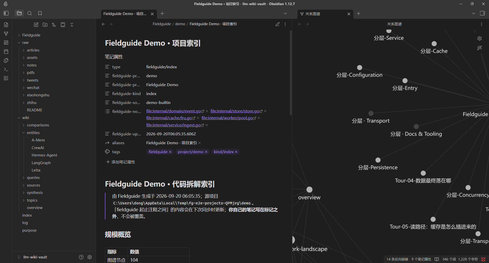

<div align="center">

# Fieldguide

**把陌生仓库读成自己的项目：知识图谱 + 问答教练的本地学习工作台**

*A local workbench for learning unfamiliar codebases — an interactive knowledge graph plus a Q&A coach that actually knows the project*

[](https://www.electronjs.org/)
[](https://react.dev/)
[](https://www.typescriptlang.org/)
[](https://pnpm.io/)
[](./NOTICE.md)
[](https://github.com/Egonex-AI/Understand-Anything)

[快速开始](#快速开始) · [功能预览](#功能预览) · [核心特性](#核心特性) · [连接-Obsidian](#连接-obsidian可选) · [架构](#架构概览) · [常用命令](#常用命令) · [给贡献者](#给贡献者)

</div>

## 10 秒看懂 Fieldguide

clone 一个热门仓库下来，打开后对着目录发呆——入口在哪、核心逻辑在哪、哪些文件可以直接忽略，全凭猜。Fieldguide 把这件事压成三件：

| 🗺️ 知识图谱 | 🧑‍🏫 问答教练 | 📚 项目学习 |
|---|---|---|
| 仓库 → 节点 / 边 / 架构层 / 引导 Tour，点节点能跳到源码，顺着依赖往前走 | 回答前先带上项目身份、当前焦点和图谱上下文，先给上下文、再按需查图，而不是空聊 | 多项目库、全量 / 增量索引、论文 RAG、论文段落 ↔ 代码节点的概念桥接 |

再往外还有一层**可选出口**：把拆解产物同步成 Obsidian 卡片与索引笔记，让阅读沉淀进你自己的知识库（[见下文](#连接-obsidian可选)）。

## 📸 功能预览

<table>
  <tr>
    <td align="center" colspan="2">
      <br/>
      <b>代码地图</b><br/>
      <sub>左侧文件树，右侧图谱与可分隔面板，点节点直接打开源码</sub>
    </td>
  </tr>
  <tr>
    <td align="center">
      <br/>
      <b>项目库</b><br/>
      <sub>多项目管理、索引状态与 stale 提示，首次启动向导三选一</sub>
    </td>
    <td align="center">
      <br/>
      <b>同步到 Obsidian</b><br/>
      <sub>左侧是同步生成的<code>项目索引</code>，右侧是 Obsidian 关系图谱 —— 卡片之间的 <code>[[wikilink]]</code> 自动连成一张图</sub>
    </td>
  </tr>
</table>

## ✨ 核心特性

- 🗺️ **知识图谱** —— 交互式代码地图、架构分层、引导 Tour、节点 ↔ 源码联动。没有 LLM Key 也能看结构图。
- 🧑‍🏫 **问答教练** —— 回答前注入项目身份、分层、Tour、当前焦点与图谱检索结果；工具可查邻居 / 层 / Tour / 调用路径 / 论文片段，绑定 vault 后还能读写 Obsidian 卡片。
- 📚 **理论与桥接** —— arXiv 搜索、PDF 导入与阅读、论文 RAG；论文段落 ↔ 代码节点的概念桥接，AI 推荐 + 一键生成「论文概念 → 代码实现」对照 Tour。
- 🎯 **学习闭环** —— 进度标记（未读 / 在读 / 已掌握）、逐行代码笔记、间隔复习卡、导师提问与评分、按目标生成学习路径。
- 🧠 **洞察面板** —— 图谱统计与类型分布、邻居浏览（1/2 跳）、两点路径查找（「A 怎么调到 B」）、技术债扫描（TODO/FIXME、超大文件、高扇入）、Git 演化时间轴、模块簇、AI 代码审查。
- 🔗 **Obsidian 联动** —— 把拆解产物同步成 vault 卡片 + 索引笔记；生成块之外的批注永不被覆盖，冲突由你决定（[用法](#连接-obsidian可选)）。
- 🧩 **分屏工作台** —— VS Code 风格布局：左文件树 + 右可分隔面板（总览 / 图谱 / 代码 / 问答 / 导览 / 知识 / 面试 / 探索 / 进度 / 笔记 / 导师 / Vault），布局可持久化，另有预设一键切换。
- 🔍 **搜索** —— `Ctrl+K` 命令面板（命令 / 文件 / 节点），`Ctrl+Shift+F` 全库内容搜索（跳过二进制与超大文件，命中直接跳行），代码面板内 `Ctrl+F` 搜当前文件。
- 📄 **学习报告导出** —— 一键把架构映射、知识卡片、面试题与论文桥接汇总成 Markdown。
- 🚀 **增量索引** —— 指纹合并，改一个文件不会把整张图重画；索引过程非阻塞，状态栏有进度、可取消。
- 🎨 **外观与语言** —— 5 套主题预设、50%–200% 缩放、界面与代码字体分开；简体中文 / 繁體中文 / English 即时切换。
- 💾 **本地优先** —— 应用数据在 `%APPDATA%/Fieldguide/`；图谱权威源在项目目录 `.understand-anything/` 就地生成，不复制源码、不改写项目。API Key 经系统钥匙串（`safeStorage`）加密落盘，也可只放在环境变量里（见下）。
- 📦 **Windows 安装包** —— NSIS 安装包与免安装版可构建。

## 🚀 快速开始

1. **环境** —— Windows 10/11、`node >= 20`、`pnpm >= 9`。
2. **克隆 + 准备图谱引擎** —— 图谱能力来自 [Understand-Anything](https://github.com/Egonex-AI/Understand-Anything)（MIT）；`bootstrap:ua` 会把它 clone 到 sibling 目录并构建 Dashboard：

   ```bash
   git clone https://github.com/Tangyd893/Fieldguide.git
   cd Fieldguide
   pnpm bootstrap:ua   # clone UA 到 sibling、构建 Dashboard -> resources/dashboard
   pnpm install
   ```

3. **启动** —— `pnpm dev`。
4. **首次向导** —— 欢迎 → 选语言 → 项目目录 → 用内置 Demo 还是本地项目（也可以跳过）。索引完成后进「代码地图」看图谱和 Tour，在聊天里问学习教练。

**没有 LLM Key 也能用**：图谱退化成纯结构图，节点和源码照样能看；配了 Key 之后摘要、架构分层和 Tour 会更完整（也有启发式兜底）。LLM Key 在设置页配，向导里不强制。

**已经导出过 API Key 的机器不用再填**：环境变量里有 `DEEPSEEK_API_KEY`（或 `OPENAI_API_KEY` / `MOONSHOT_API_KEY` / `SILICONFLOW_API_KEY` / `OPENROUTER_API_KEY`，按 Base URL 匹配；通用变量 `FIELDGUIDE_API_KEY` 兜底）时，Fieldguide 直接使用它，设置页会显示「已从环境变量 X 读取」。环境变量里的 Key **不会**写入 `config.json`；优先级是「设置页填的 > 环境变量」。

## 🔗 连接 Obsidian（可选）

把项目拆解同步进 Obsidian vault：读代码在 Fieldguide，读拆解、写批注在 Obsidian。**不绑定 vault 时，其余功能完全不受影响。**

**前置条件**（能力由官方 Obsidian CLI 承载；不满足时绑定入口会置灰并给出修复步骤）：

1. Obsidian **1.12.7+ 安装器**版本；
2. Obsidian 内「设置 → 通用」启用「命令行界面（Command line interface）」并完成注册；
3. 保持 Obsidian 在运行（CLI 是运行中应用的客户端）；状态异常时重启终端再点「重新检测」；
4. 特殊情况可在设置页手动指定 CLI 路径（带文件选择器）。

**绑定 vault** —— 「设置 → Obsidian」选择目录，或新建 vault（只创建目录 + `.obsidian/` 标记，随后引导你在 Obsidian 库管理器里确认；Fieldguide 不写 Obsidian 自身配置）。已登记的 vault 会列出来供一键选择。

**同步什么** —— 项目的拆解产物：架构总览、分层、模块、引导 Tour、知识卡片、面试题、论文桥接、学习路径、你的代码笔记，外加一份学习报告。**不是**每个图谱节点一张卡（那会把大仓库变成几千个文件）。产物落在 vault 内的项目子目录：

```
<vault>/Fieldguide/<项目>/
  <项目名> · 项目索引.md      # MOC：概览指标、建议阅读顺序、各类卡片链接、学习进度
  cards/…                     # 架构总览 / 分层 / 模块 / Tour / 知识卡 / 面试题 / 桥接 / 学习路径
  notes/…                     # 你在 Fieldguide 里写的代码笔记（可关）
  <slug>-学习报告.md
```

卡片带 frontmatter（`fieldguide-project` / `kind` / `node-ids` 等），互相用 `[[wikilink]]` 连回索引 —— 在 Obsidian 里直接就有关系图谱。

**所有权模型（同步不会吃掉你的笔记）**

- 生成内容包在 `%% fieldguide:begin %%` … `%% fieldguide:end %%` 托管块内；**块外你自己写的内容字节级保留**，frontmatter 里你的自定义属性也保留（只并入 tags）。
- 同步前先出 **dry-run 计划**（新建 / 更新 / 未变 / 冲突 / 删除计数 + 逐条动作），确认后写入的就是这份计划；无变更时二次同步 0 写入。
- **Vault 面板**逐卡显示状态：已同步 / 你已修改 / 需要处理 / 文件缺失。「需要处理」时三选一：保留我的版本 / 用 Fieldguide 版本覆盖（只重写托管块）/ 另存为副本。
- 「清理生成的卡片」只删除仍与上次写入完全一致的文件，你改过的一律保留并回报数量。

**Agent 集成** —— 绑定 vault 后，教练多出 5 个工具（列出卡片 / 读笔记 / 在项目子目录内检索 / 写入或更新卡片 / 查反链）；未绑定时这些工具不会出现在工具表里。读取只读文件系统（Obsidian 没开也能读上次同步的结果），检索与反链需要 CLI 可用；写入被限制在项目子目录内，并可在设置里整体关闭。

**边界** —— 只写 `<vault>/<folder>/<项目>/` 之内；不碰 vault 里其他笔记；不修改 Obsidian 自身配置；只做单向导出（你在 Obsidian 里的改动不会回写 Fieldguide，但会被 Agent 读取并在回答里引用）。

## 🏗️ 架构概览

图谱与索引能力来自 [Understand-Anything](https://github.com/Egonex-AI/Understand-Anything)（MIT），Fieldguide 在其上叠加学习壳与问答 Agent：

```
  用户（学项目 / 问问题）
   |
   v
+-------------------+     postMessage      +------------------+
|   Fieldguide 壳   | <------------------> |  UA Dashboard    |
|   (Electron +     |     iframe 桥接       |  (知识图谱渲染)  |
|    React UI)      |                       +------------------+
|                   |                              ^
|  - 项目库 / 学习  |        @understand-anything   |
|  - 问答 Agent     |           /core              |
|  - 论文 / 桥接    |        (索引引擎)             |
|  - 设置 / i18n    |                              |
+-------------------+                    +------------------+
        |                                |  .understand-anything/
        | 卡片 / 索引（可选）             |  knowledge-graph.json
        v                                +------------------+
   Obsidian vault（外部落点，直接写文件）
```

- **壳层** —— 项目管理、问答 Agent、理论学习、桥接、设置、主题与 i18n。图谱渲染不自研：iframe 嵌 UA Dashboard，经 postMessage 双向通信（节点选中、Tour 同步、跳转）。
- **图谱层（UA Dashboard）** —— 分层 / 力导向视图、缩放、节点选中、Tour 播放。
- **索引层（UA Core）** —— 解析 + LLM 摘要，产出 `knowledge-graph.json`；增量索引用指纹合并，改一个文件不会重画整张图。
- **数据层** —— 应用数据（项目、论文、桥接、笔记、复习、聊天）在 `%APPDATA%/Fieldguide/` 的 SQLite 与 `config.json`；图谱权威源在项目目录就地生成。`FIELDGUIDE_DATA_DIR` 可整体改数据目录（便携安装与端到端测试都用它）。
- **Obsidian（可选）** —— vault 是外部落点，Fieldguide 直接写文件系统（原子写），CLI 只负责探测 / 列库 / 打开笔记 / 检索。

几个写死在文档里的约束，避免重复造轮子：不自研 Tree-sitter parser、不把图谱节点写进 SQLite、不自建图谱画布。完整设计见 [docs/architecture.md](docs/architecture.md)。

## 🗂️ 项目结构

```
Fieldguide/
  docs/                       设计文档（入口：docs/doc-index.md）
  src/
    main/                     Electron 主进程
      ua/                     UA 集成层（client / dashboard / config-bridge / graph-reader / diff / cross-tour）
      obsidian/               Obsidian 联动（CLI 探测 / 卡片与索引同步 / Agent 工具）
      agent/                  学习教练（ReAct 循环 + 工具 + 上下文装配）
      understand/             渐进分析（架构 → 知识 → 面试）
      vector/                 论文分块 + 向量检索
      llm/                    统一 LLM 客户端与供应商目录
      ipc/                    IPC handler 聚合
      db/                     SQLite（projects / papers / concept_links / chat / 学习产物）
    preload/                  contextBridge 暴露的安全 API
    renderer/                 React UI（项目库 / 代码地图 / 理论 / 桥接 / 设置）
    shared/                   三端共用的类型与 IPC schema
  resources/                  图标、内置 Demo（104 节点 / 9 分层、预置图谱）、Dashboard 构建产物
  scripts/                    bootstrap / QA / 打包脚本
  tests/                      单元测试 fixture
  e2e/                        Playwright 端到端（驱动真实 Electron 二进制）
  picture/                    运行截图
```

## 🧰 常用命令

| 命令 | 作用 |
|------|------|
| `pnpm dev` | 开发模式启动（热更新） |
| `pnpm build` / `pnpm preview` | 构建 / 预览构建产物 |
| `pnpm typecheck` · `pnpm lint` · `pnpm test:unit` | 类型检查 · ESLint · 单元测试 |
| `pnpm test:e2e` | Playwright 端到端（先构建，再驱动本仓库的 Electron 二进制） |
| `pnpm qa:baseline` | 基线套件（typecheck + 单测 + fixture + 契约审计） |
| `pnpm qa:contracts` | 契约审计（IPC ↔ preload ↔ 渲染层类型、i18n 键、数据目录一致性） |
| `pnpm qa:scenario` · `pnpm qa:graph` | 场景冒烟 · 图谱闭环校验（含打包产物） |
| `pnpm eval:agent` | 离线检索评测（Recall / 路径解析） |
| `pnpm bootstrap:ua` | 准备 UA（clone 到 sibling 并构建 Dashboard） |
| `pnpm dist` · `pnpm pack` | 打 Windows 安装包 · 打包但不发布 |

打包产物：

| 产物 | 路径 |
|------|------|
| 安装包 | `dist\Fieldguide Setup <版本>.exe` |
| 免安装版 | `dist\win-unpacked\Fieldguide.exe` |

<details>
<summary>打包踩过的坑</summary>

> 工作目录始终是 Fieldguide 根目录；打包前建议先关掉正在运行的 Fieldguide。

| 现象 | 处理 |
|------|------|
| `Dashboard dist not found` | 先跑 `pnpm bootstrap:ua`（或 Dashboard 的 `npx vite build`） |
| `EBUSY` / asar 无法删除 | 关掉 Fieldguide 和资源管理器预览再打包 |
| `node-gyp` / Visual Studio 报错 | 走备用流程：输出到 `dist-build` 并跳过原生模块重编译 |

备用流程：

```powershell
node scripts\prepare-pack.mjs
pnpm exec electron-vite build
npx electron-builder --win --publish never --config.directories.output=dist-build --config.npmRebuild=false
```

</details>

## ⌨️ 快捷键

| 按键 | 作用 |
|------|------|
| `Ctrl+K` | 命令面板（命令 / 文件 / 节点） |
| `Ctrl+Shift+F` | 全库内容搜索 |
| `Ctrl+O` | 打开项目 |
| `Ctrl+=` / `Ctrl+-` / `Ctrl+0` / `Ctrl+滚轮` | 放大 / 缩小 / 重置 / 缩放 |
| `Tab` | 面板页签切换（页签栏聚焦时） |
| `← →`（分屏分隔条） | 调整分屏比例；`Shift+← →` 大步、`Home` / `End` 到两端、`Enter` 恢复均分 |
| `中键单击页签` | 关闭该文件页签 |
| `Ctrl+F` | 当前文件内搜索（`Enter` / `Shift+Enter` 切换命中，`Esc` 清除） |
| `Enter` / `Shift+Enter`（聊天） | 发送 / 换行 |

完整清单在应用内 `帮助 → 键盘快捷键`。

## 🤝 给贡献者

先看两份文档：

1. [docs/doc-index.md](docs/doc-index.md) —— 文档地图、一致性检查、动工门禁
2. [docs/understand-anything-integration.md](docs/understand-anything-integration.md) —— UA 集成边界与数据流，**改 UA 相关决策必须先改它**

**硬性约束**（踩过坑之后的决定）：

- **禁止**自研 Tree-sitter parser / FileAnalyzer / 独立图谱画布 —— UA 已有能力，重复实现只会让两边漂移。
- **禁止**把图谱节点 / 边写进 SQLite —— 权威源是 `.understand-anything/knowledge-graph.json`。
- 动工前先跑一遍 [docs/spike-ua.md](docs/spike-ua.md) 里的集成 Spike（硬门禁）。

提交前跑 `pnpm typecheck && pnpm lint && pnpm test:unit`，涉及交互的改动再跑 `pnpm test:e2e`；图谱相关改动用 `pnpm qa:graph` 验收「Demo 图谱 + Dashboard 加载 + 点节点开文件」闭环，`pnpm qa:his-go` 可对真实大项目（HIS-Go）跑无头冒烟。

## 许可与致谢

- **代码地图引擎**：[Understand-Anything](https://github.com/Egonex-AI/Understand-Anything) · MIT（上游归属保留在 [NOTICE.md](./NOTICE.md)）
- **Fieldguide**：MIT，与上游一致

---

<p align="center">
  <sub>如果你也在读别人的仓库时卡过壳，欢迎试用、提 issue 或 Star。</sub>
</p>
