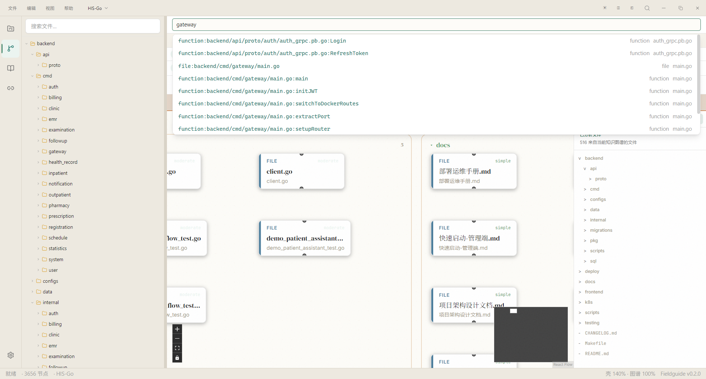
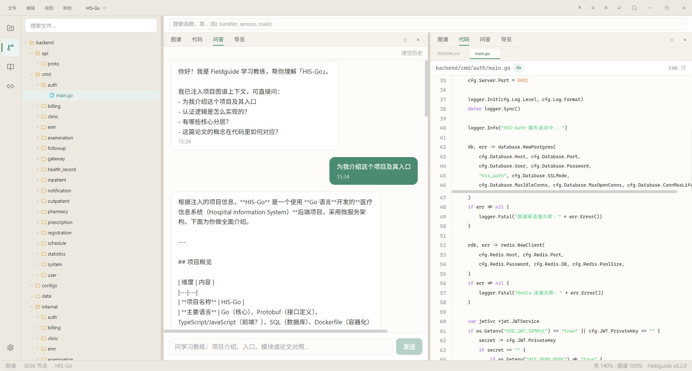

<div align="center">

# Fieldguide

**把陌生仓库读成自己的项目：知识图谱 + 问答 Agent 的本地学习工作台**

*A local workbench for learning unfamiliar codebases — an interactive knowledge graph plus a Q&A coach that actually knows the project*

[](https://www.electronjs.org/)
[](https://react.dev/)
[](https://www.typescriptlang.org/)
[](https://pnpm.io/)
[](./NOTICE.md)
[](https://github.com/Egonex-AI/Understand-Anything)

[快速开始](#快速开始) · [为什么](#为什么会有这个项目) · [功能预览](#功能预览) · [核心特性](#核心特性) · [架构概览](#架构概览) · [给贡献者](#给贡献者)

</div>

> ### 🆕 当前状态：v0.2.0
>
> 核心闭环已经通了：知识图谱、学习教练、论文桥接都能用；Phase 4 发布准备中（约 70%），干净机器实测还没做完。当前只支持 Windows 10/11。

## 10 秒看懂 Fieldguide

clone 一个热门仓库下来，打开后对着目录发呆——入口在哪、核心逻辑在哪、哪些文件可以直接忽略，全凭猜。Fieldguide 把学习压成三件事：

| 🗺️ 知识图谱 | 🧑‍🏫 问答教练 | 📚 项目学习 |
|---|---|---|
| 仓库 → 节点 / 边 / 架构层 / 引导 Tour，点节点能跳到源码，顺着依赖往前走 | 回答前先带上项目身份、当前焦点和图谱上下文，先给上下文、再按需查图，而不是空聊 | 多项目库、全量 / 增量索引、论文 RAG、论文段落 ↔ 代码节点的概念桥接 |

## 快速开始

普通用户和开发者都从源码跑（安装包在 `dist\`，还没正式发布）：

1. **准备环境** —— `node >= 20`、`pnpm >= 9`（Windows 10/11）。
2. **克隆 + 准备图谱引擎** —— 图谱能力来自 [Understand-Anything](https://github.com/Egonex-AI/Understand-Anything)（MIT），`bootstrap:ua` 会把它 clone 到 sibling 目录并构建 Dashboard：

   ```bash
   git clone https://github.com/Tangyd893/Fieldguide.git
   cd Fieldguide
   pnpm bootstrap:ua   # clone UA 到 sibling、构建 Dashboard -> resources/dashboard
   pnpm install
   ```

3. **启动** —— `pnpm dev`。
4. **首次向导** —— 欢迎 → 选语言 → 项目目录 → 用内置 Demo 还是本地项目（也可以直接跳过）。索引完成后，去「代码地图」看图谱和 Tour，在聊天里问学习教练。

**没有 LLM Key 也能用**：图谱退化成纯结构图，节点和源码照样能看；配了 Key 之后摘要、架构分层和 Tour 会更完整（也有启发式兜底）。LLM Key 在设置页配，向导里不强制。

**Obsidian 联动完全可选**：想把项目拆解导出成 Obsidian 卡片，需要官方的 **Obsidian CLI** —— Obsidian **1.12.7+**（安装器版本），在 Obsidian 里「设置 → 通用」启用「命令行界面（Command line interface）」，并保持 Obsidian 在运行（CLI 是运行中应用的客户端）。条件不满足时绑定入口会置灰并给出四步修复指引；不绑定 vault 的话，其余功能完全不受影响。

<details>
<summary>打包（Windows NSIS）</summary>

> 工作目录始终是 Fieldguide 根目录。

| 产物 | 路径 |
|------|------|
| 安装包 | `dist\Fieldguide Setup 0.2.0.exe` |
| 免安装版 | `dist\win-unpacked\Fieldguide.exe` |

标准流程（建议先关掉正在运行的 Fieldguide）：

```powershell
pnpm bootstrap:ua
pnpm dist
```

`pnpm dist` = `prepare-pack` -> `electron-vite build` -> `electron-builder --win --publish never`。

**备用流程**：`dist\` 被锁或 node-gyp 找不到 VS 时，用 `dist-build` 输出目录并跳过原生模块重编译：

```powershell
node scripts\prepare-pack.mjs
pnpm exec electron-vite build
npx electron-builder --win --publish never --config.directories.output=dist-build --config.npmRebuild=false
```

踩过的坑，列在这免得再踩：

| 现象 | 处理 |
|------|------|
| `Dashboard dist not found` | 先跑 Dashboard 的 `npx vite build` |
| `EBUSY` / asar 无法删除 | 关掉 Fieldguide 和资源管理器预览再打包 |
| `node-gyp` / Visual Studio 报错 | 走备用流程（`npmRebuild=false` + `dist-build`） |
| UA commit mismatch 警告 | 能继续跑；完整校验在 `scripts/prepare-pack.mjs` |

</details>

## 为什么会有这个项目

做这个项目的起因挺朴素：我经常 clone 一些热门仓库，打开之后对着目录发呆。入口在哪、核心逻辑在哪、哪些文件可以直接忽略，全凭猜。IDE 的跳转工具能告诉你「这个函数被谁调了」，但不会告诉你「这个项目到底在讲一个什么故事」。

市面上不是没有工具，但要么是 IDE 里的结构插件（给你一张静态架构图就完了），要么是通用聊天（它不知道你手里这个仓库的图谱、Tour 和当前焦点）：

| | IDE 结构插件 | 通用聊天 | Fieldguide |
|---|---|---|---|
| 项目上下文 | 没有，只看单个文件 | 没有，靠你临时粘贴 | 图谱 + Tour + 当前焦点 |
| 导航 | 静态跳转 | 无 | 可交互知识图谱，点节点进源码 |
| 学习路径 | 无 | 无 | 引导 Tour + 论文 ↔ 实现对照 |
| 数据 | 云端 / 本地 | 云端 | 100% 本地，图谱就地索引 |

所以就有了 Fieldguide。名字来自 field guide（野外指南）：打开一个陌生仓库，图谱告诉你入口和心脏在哪，卡住了问教练，缺理论了在同一应用里把论文桥接到实现。

图谱引擎我没有自己造轮子，直接集成 [Understand-Anything](https://github.com/Egonex-AI/Understand-Anything)（MIT）。它已经有成熟的索引管线和图谱 Dashboard，我在上面做桌面壳、项目学习场景，以及跨「论文 + 代码」的问答 Agent。

## 📸 功能预览

<table>
  <tr>
    <td align="center">
      <br/>
      <b>代码地图</b><br/>
      <sub>左侧文件树，右侧图谱与可分隔面板，点节点直接打开源码</sub>
    </td>
    <td align="center">
      <br/>
      <b>项目库</b><br/>
      <sub>多项目管理、索引状态与 stale 提示，首次启动向导三选一</sub>
    </td>
  </tr>
</table>

## ✨ 核心特性

- 🗺️ **知识图谱** —— 交互式代码地图、架构分层、引导 Tour、节点 ↔ 源码联动。没有 LLM Key 也能看结构图（[设计](docs/product-spec.md)）。
- 🧑‍🏫 **问答教练** —— 注入项目身份、layers、Tour、当前焦点和图谱检索结果；工具可查邻居、层、Tour 步骤；回答里能引用论文段落。图上点到哪，它就围着哪讲。
- 📚 **理论与桥接** —— arXiv 搜索、PDF 导入与阅读、论文 RAG；论文段落 ↔ 代码节点的概念桥接，AI 推荐 + 一键生成「论文概念 → 代码实现」对照 Tour。
- 🧩 **分屏工作台** —— VS Code 风格布局：左文件树 + 右可分隔面板（总览 / 图谱 / 代码 / 问答 / 导览 / 知识 / 面试 / 探索八种），布局可持久化（[界面规格](docs/ui-spec.md)）。
- 🔍 **全库内容搜索** —— `Ctrl+Shift+F` 搜文件内容（跳过二进制与超大文件），命中可直接跳到对应行；代码面板内 `Ctrl+F` 搜索当前文件。
- 🧠 **洞察面板** —— 图谱统计与类型分布、邻居浏览（1/2 跳）、**两点路径查找**（「A 怎么调到 B」）、**技术债扫描**（TODO/FIXME、超大文件、高扇入节点）。
- 📄 **学习报告导出** —— 一键把架构映射、知识卡片、面试题与论文桥接汇总成 Markdown。
- 🔗 **Obsidian 联动** —— 设置里绑定一个 vault，把架构、分层、Tour、知识卡片、面试题与论文桥接同步成卡片 + 索引笔记；生成块之外你自己的批注永不被覆盖，冲突会在 Vault 面板里让你决定。
- 🚀 **增量索引** —— 指纹合并，改一个文件不会把整张图重画；索引过程非阻塞，状态栏有进度。
- 🎨 **主题与外观** —— 5 套主题预设（parchment / forest / slate / midnight / paper-dark）、50%–200% 缩放、UI 与代码字体分开。
- 🌐 **三语界面** —— 简体中文 / 繁體中文 / English (US)，UI 和系统菜单即时切换。
- 💾 **本地优先** —— 应用数据在 `%APPDATA%/Fieldguide/`，图谱权威源在项目目录就地生成，不复制源码、默认不出本机。API Key 经系统钥匙串（`safeStorage`）加密后落盘；打开或浏览项目**不会改写**项目里的图谱文件。
- 📦 **Windows 安装包** —— NSIS 安装包与免安装版可构建。

macOS / Linux 暂时不做，我只有 Windows 开发机，先把自己平台的体验做扎实。

## 🏛️ 架构概览

图谱与索引能力来自 [Understand-Anything](https://github.com/Egonex-AI/Understand-Anything)（MIT），Fieldguide 在其上叠加项目学习壳与问答 Agent：

```
  用户（学项目 / 问问题）
   |
   v
+-------------------+     postMessage      +------------------+
|   Fieldguide 壳   | <------------------> |  UA Dashboard    |
|   (Electron +     |     iframe 桥接       |  (知识图谱渲染)  |
|    React UI)      |                       +------------------+
|                   |                              ^
|  - 项目库 / 学习  |        @understand-anything   |
|  - 问答 Agent     |           /core              |
|  - 理论 / 桥接    |        (索引引擎)             |
|  - 设置 / i18n    |                              |
+-------------------+                    +------------------+
                                         |  .understand-anything/
                                         |  knowledge-graph.json
                                         +------------------+
```

分四层：

- **壳层（Fieldguide）**：项目管理、问答 Agent、理论与桥接、设置、主题。图谱渲染不做，用 iframe 嵌 UA Dashboard，通过 postMessage 双向通信（节点选中、Tour 同步、Ctrl+K 跳转）。
- **图谱层（UA Dashboard）**：分层 / 力导向 / 业务域视图、缩放、节点选中、Tour 播放，都是 UA 的活。
- **索引层（UA Core）**：解析 + LLM 摘要，产出 `.understand-anything/knowledge-graph.json`。增量索引用指纹合并，不会因为改了一个文件就把整张图重画。
- **数据层**：本地优先。应用数据（项目、论文、桥接、聊天）在 `%APPDATA%/Fieldguide/` 的 SQLite 里；图谱权威源在**项目目录下**就地生成，不复制源码。

有几个设计约束是写死在文档里的，防止我哪天手痒重复造轮子：不自研 Tree-sitter parser、不把图谱节点写进 SQLite、不自己实现图谱画布。完整设计见 [docs/architecture.md](docs/architecture.md)。

## 当前状态与路线

Phase 0 设计 ✅ · Phase 1 桌面壳 + UA 集成 ✅ · Phase 2 智能层 ✅ · Phase 3 理论 + 桥接 ✅ · Phase 4 发布 🔵（约 70%）

- [x] 命名与设计文档全套（入口：docs/doc-index.md）
- [x] Electron 脚手架 + UA 集成层 + postMessage 双向通信
- [x] LLM 索引（摘要 / 架构层 / Tour / heuristic fallback）+ 增量合并
- [x] 学习教练 Agent（ReAct，工具：搜索节点 / 查论文 / 取源码 / 列桥接）
- [x] 理论 Tab（arXiv / PDF 阅读 / RAG）与概念桥接（AI 推荐 + 对照 Tour）
- [x] 七种面板 + 分屏布局 + 5 套主题 + 三语 i18n + NSIS 安装包
- [x] 单测与冒烟脚本全绿（`pnpm qa:graph` 含打包产物校验）
- [ ] Phase 4：干净机器实测 + 场景 A 用户自测（见 [docs/todos.md](docs/todos.md)）

明确延期的：业务域视图、完整六 Agent 管线、Dashboard 深度主题统一。这几个不影响主路径，等发布之后再说。

## 🏗️ 项目结构

```
Fieldguide/
  docs/                       设计文档（入口：docs/doc-index.md）
  src/
    main/                     Electron 主进程
      ua/                     UA 集成层（client / dashboard / config-bridge / graph-reader / diff / cross-tour）
      obsidian/               Obsidian 联动（CLI 探测 / 卡片与索引同步 / Agent 工具）
      agent/                  学习教练（ReAct 循环 + 工具）
      vector/                 PDF 分块 + 论文向量检索
      ipc/                    IPC handler 聚合
      db/                     SQLite（projects / papers / concept_links / chat）
    preload/                  contextBridge 暴露的安全 API
    renderer/                 React UI（项目库 / 代码地图 / 理论 / 桥接 / 设置）
    shared/                   三端共用的类型与 IPC schema
  resources/                  图标、内置 sample-project（Demo `pulsegate`，104 节点 / 9 分层 / 预置图谱）
  scripts/                    bootstrap / QA / 打包脚本
  tests/                      Vitest 单测 + fixture
  picture/                    运行截图
  out/ / dist/ / dist-build/  构建与打包产物（git ignored）
```

## 🤝 给贡献者

面向用户的部分到「快速开始」就结束了，想动代码的先看文档，尤其是这两个：

1. [docs/doc-index.md](docs/doc-index.md) —— 文档地图、一致性检查、动工门禁
2. [docs/understand-anything-integration.md](docs/understand-anything-integration.md) —— UA 集成边界和数据流，**改 UA 相关决策必须先改它**

**几个硬性约束**（都是踩过坑之后的决定）：

- **禁止**自研 Tree-sitter parser / FileAnalyzer / 独立图谱画布——UA 已有能力，重复实现只会让两边漂移。
- **禁止**把图谱节点 / 边写进 SQLite——权威源是 `.understand-anything/knowledge-graph.json`。
- 动工前请先跑完 [docs/spike-ua.md](docs/spike-ua.md) 里的集成 Spike（硬门禁）。

质量基线：`pnpm typecheck` + `pnpm lint` + `pnpm test:unit` 全绿；`pnpm qa:graph` 自动验收「Demo 图谱 + Dashboard 加载 + 点节点开文件」闭环；`pnpm qa:his-go` 是对一个真实 Go 项目（HIS-Go，3656 节点）的无头冒烟。说实话，图谱「点击节点 → 打开文件」这个闭环我修了两轮才通——UA Dashboard 内部用的是 Zustand，桥接脚本得直接调 `store.getState()` 而不是 hook，后来 `qa:graph` 里加了对 `__uaStore` 的自动检查，防止回归。

再往上还有一层真实交互回归：`pnpm test:e2e` 用 Playwright 直接驱动本仓库的 Electron 二进制（不下载浏览器），每次跑都在临时数据目录里装一遍内置 Demo，覆盖「装 Demo → 图谱 iframe 真的来自 `ua-dashboard://` → 搜节点并打开文件 → 7 个工作台面板逐个挂载 → 全库内容搜索跳行 → 命令面板」。8 例全绿、约 10 秒。它抓到的第一个真问题是：安装 Demo 本来就会直接切到代码地图，而我的 harness 在等一句**空态提示语**里的「104 个节点」，于是断言在安装完成前就通过了。

## 许可与致谢

- **代码地图引擎**：[Understand-Anything](https://github.com/Egonex-AI/Understand-Anything) · MIT（上游，归属保留在 [NOTICE.md](./NOTICE.md)）
- **Fieldguide**：MIT，与上游一致

---

<p align="center">
  <sub>如果你也在读别人的仓库时卡过壳，欢迎试用、提 issue 或 Star。</sub>
</p>
