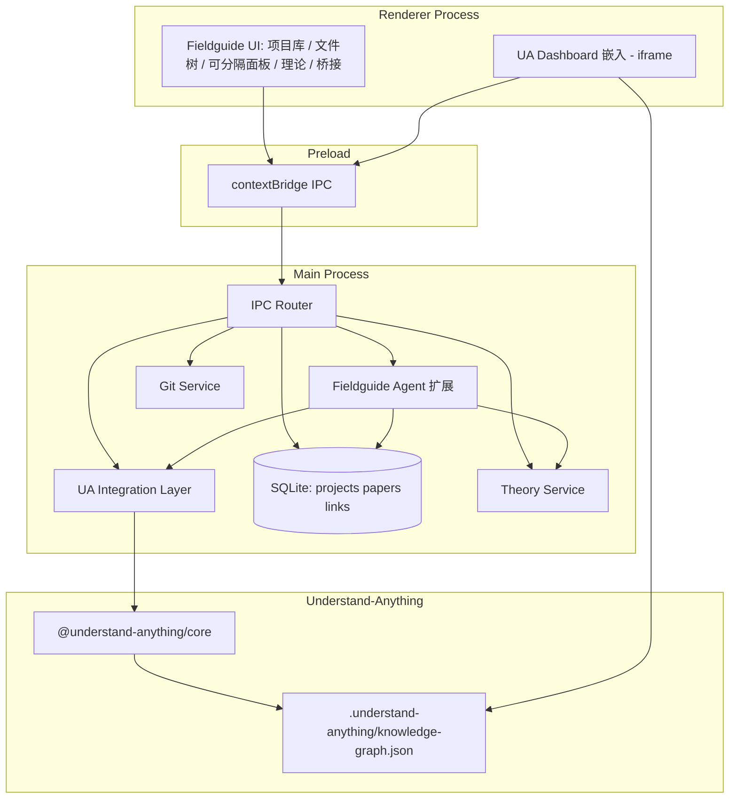
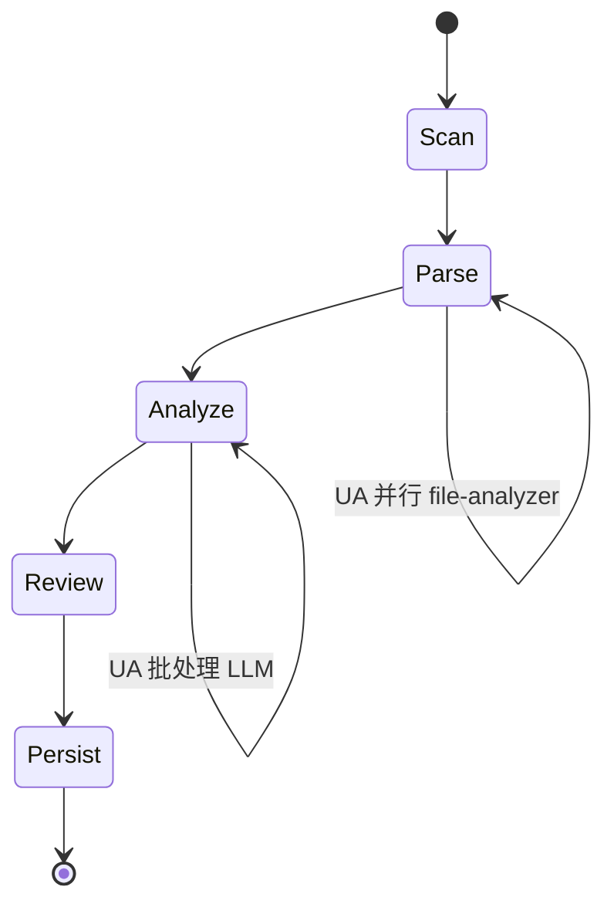

# Fieldguide 技术架构

> 版本：v0.4 | 状态：设计修订（Phase 1，VSCode/Obsidian 风格布局）  
> v0.4 变更：三栏布局 → 左文件树 + 右可分隔面板（2026-07-01）  
> 集成细节见 [understand-anything-integration.md](./understand-anything-integration.md)

---

## 一、架构总览

Fieldguide 是 **Electron 单体桌面应用**：在 **[Understand-Anything](https://github.com/Egonex-AI/Understand-Anything)（UA）** 之上构建学习工作台。UA 提供代码索引、知识图谱与 Dashboard；Fieldguide Main Process 负责 UA 集成、扩展数据（论文、桥接）、IPC 与 Agent 扩展；Renderer 为 React UI + 嵌入 UA Dashboard。



**刻意不采用**：微服务、gRPC、Redis、RabbitMQ、Docker、外部 Qdrant。  
**刻意不自研**：Tree-sitter 解析管线、UA 已有六类 Agent、独立图谱渲染引擎（复用 UA Dashboard）。

---

## 二、技术栈

| 层级 | 选型 | 说明 |
|------|------|------|
| **代码地图引擎** | **[@understand-anything/core](https://github.com/Egonex-AI/Understand-Anything)** | 索引流水线、多 Agent、图谱 JSON |
| **图谱 UI** | **UA Dashboard**（嵌入） | 结构/域视图、Tour、搜索；Phase 1 spike 验证 |
| 桌面框架 | Electron 33+ | Windows 首发 |
| 构建 | electron-vite + pnpm workspace | main / preload / renderer；可 vendor UA submodule |
| UI 壳 | React 18 + TypeScript | 项目库、理论、桥接、设置 |
| 样式 | Tailwind CSS + Radix/shadcn 风格组件（绑定 `--fg-*` token） | Fieldguide 壳；Dashboard 主题经 postMessage 同步 |
| i18n | i18next + react-i18next | 简中 / 繁中 / en-US；与 UA language 映射 |
| 主进程 | Node.js + TypeScript | |
| 关系库 | better-sqlite3 | **Fieldguide 扩展数据**（projects、papers、concept_links、chat） |
| 向量库 | LanceDB | 论文 chunk RAG（Phase 3）；代码语义搜索由 UA 负责 |
| Git | simple-git | clone、status、diff |
| LLM | OpenAI 兼容 HTTP | config 单一来源，桥接至 UA runtime |
| 打包 | electron-builder + NSIS | `.exe` 安装包 |

---

## 三、目录结构（实现期）

```
Fieldguide/
├── README.md
├── docs/
├── package.json
├── pnpm-workspace.yaml
├── vendor/
│   └── Understand-Anything/     # git submodule（若 core 未发布 npm）
├── electron.vite.config.ts
├── electron-builder.yml
├── src/
│   ├── shared/
│   │   ├── ipc.ts
│   │   ├── graph.ts             # re-export UA KnowledgeGraph + FG 扩展类型
│   │   └── errors.ts
│   ├── main/
│   │   ├── index.ts
│   │   ├── window.ts
│   │   ├── ipc/
│   │   │   ├── projects.ts
│   │   │   ├── graph.ts         # 读 UA knowledge-graph.json
│   │   │   ├── index.ts
│   │   │   ├── chat.ts
│   │   │   └── theory.ts
│   │   ├── ua/                  # ★ UA 集成层
│   │   │   ├── client.ts        # 调用 core pipeline
│   │   │   ├── config-bridge.ts # locale / LLM 同步
│   │   │   ├── graph-reader.ts  # 读 .understand-anything/
│   │   │   └── dashboard.ts     # Dashboard 静态资源路径
│   │   ├── db/
│   │   │   ├── schema.ts        # projects, papers, concept_links, chat
│   │   │   └── migrations/
│   │   ├── agent/               # Fieldguide 扩展 Agent（跨论文+代码）
│   │   ├── vector/              # 论文 LanceDB（Phase 3）
│   │   └── theory/
│   ├── preload/
│   └── renderer/
│       ├── App.tsx
│       ├── views/
│       │   ├── ProjectLibrary/
│       │   ├── CodeMap/         # 文件树 + 可分隔面板 + 图谱/代码/问答
│       │   ├── Theory/
│       │   └── Bridge/
│       └── locales/
└── resources/
```

**已移除**（相对 v0.2）：自研 `engine/parser/`、`llm/agents/*`——由 UA 提供。

---

## 四、用户数据布局

Windows 路径：`%APPDATA%/Fieldguide/`

**就地索引原则**：源码保留在用户指定路径；UA 图谱产物写在 **`{root_path}/.understand-anything/`**（与 UA 插件一致），Main Process 只读源码。

```
%APPDATA%/Fieldguide/
├── config.json           # llm, locale, theme, projectsRoot, ua.language
├── app.db                # SQLite（Fieldguide 扩展：projects, papers, concept_links, chat）
├── lance/                # 论文向量（Phase 3）
├── exports/              # 用户导出的图谱副本
├── logs/
└── papers/
    └── {paperId}/
        ├── original.pdf
        └── chunks.json

{project_root_path}/      # 用户源码目录（就地）
└── .understand-anything/
    ├── knowledge-graph.json   # ★ UA 图谱权威源
    ├── config.json            # UA 项目级配置（language 等）
    └── intermediate/          # UA 中间产物（不导出）
```

**Git clone 目标路径**：`{projectsRoot}/{slug}/`。

**graph 导出**：从 `{root_path}/.understand-anything/knowledge-graph.json` 复制到 `exports/`，或调用 `project:exportGraph`。

### config.json 示例

```json
{
  "llm": {
    "baseUrl": "https://api.deepseek.com/v1",
    "apiKey": "",
    "chatModel": "deepseek-chat",
    "embedModel": "..."
  },
  "locale": "zh-CN",
  "theme": "system",
  "projectsRoot": "D:/Projects/Fieldguide",
  "onboardingCompleted": true,
  "ua": {
    "language": "zh",
    "incremental": true
  }
}
```

| 字段 | 说明 |
|------|------|
| `locale` | `zh-CN`（默认）\| `zh-TW` \| `en-US` — Fieldguide UI |
| `ua.language` | UA pipeline 语言：`zh` \| `zh-TW` \| `en` 等 |
| `projectsRoot` | Git clone 与 demo 的默认父目录 |
| `onboardingCompleted` | 首次引导是否已完成 |

---

## 五、索引与 UA 集成层

Fieldguide **不实现** Index Engine，通过 `src/main/ua/client.ts` 调用 UA core。

### 5.1 流水线（UA 提供）



| UA Agent | 作用 |
|----------|------|
| `project-scanner` | 文件发现、语言/框架检测 |
| `file-analyzer` | 节点/边、Tree-sitter 结构 |
| `architecture-analyzer` | layer 分层 |
| `tour-builder` | 引导 Tour |
| `graph-reviewer` | 完整性校验 |
| `domain-analyzer` | 业务域视图 |

Fieldguide `project:index` → 设置 `root_path` 为 UA 工作目录 → 调用 pipeline → 转发 `index:progress` 事件。

### 5.2 Fieldguide 封装职责

| 职责 | 说明 |
|------|------|
| `config-bridge.ts` | Fieldguide config → UA runtime（LLM、language） |
| `graph-reader.ts` | 读取 `knowledge-graph.json` 供 IPC `graph:*` |
| `dashboard.ts` | 定位 Dashboard 构建产物，供 Renderer 嵌入 |
| 进度转发 | UA 进度回调 → `index:progress` IPC |
| 取消/重试 | 包装 UA job，映射 `IpcErrorCode` |

### 5.3 增量索引与新鲜度

- **增量**：UA 默认开启（指纹 hash）；Fieldguide 暴露「重新索引」与「增量更新」
- **新鲜度**：对比 `knowledge-graph.json` 的 `indexedAt` 与源码 mtime；stale 时项目卡片 badge
- **diff 分析**：Phase 2 集成 UA `/understand-diff` 等价 API

### 5.4 禁止重复实现

不得自研：Tree-sitter parser、UA 六类 Agent、独立 `@xyflow/react` 图谱（除非放弃 Dashboard 嵌入且经设计评审）。

---

## 六、数据模型

### 6.1 知识图谱类型

**运行时权威源**：`{root_path}/.understand-anything/knowledge-graph.json`（UA 格式）。

Fieldguide `src/shared/graph.ts` **re-export UA 类型**（从 `@understand-anything/core`），避免重复定义。以下结构与 UA 对齐，仅作文档参考：

```typescript
// 优先从 @understand-anything/core 导入；勿在 Fieldguide 重复维护
interface KnowledgeGraph {
  meta: GraphMeta;
  nodes: GraphNode[];
  edges: GraphEdge[];
  tours: Tour[];
  domains?: DomainFlow[];
  // ... UA 版本可能扩展字段，以 core 包为准
}
```

**节点 ID、边类型、confidence 规则**：遵循 UA 实现；Fieldguide 单测读取 UA fixture graph 断言，不自定规则。

### 6.2 SQLite 表（Fieldguide 扩展数据）

SQLite **不存储**图谱节点/边/Tour（由 UA `knowledge-graph.json` 负责）。仅存 Fieldguide 专有数据：

```sql
-- 项目
CREATE TABLE projects (
  id TEXT PRIMARY KEY,
  name TEXT NOT NULL,
  slug TEXT NOT NULL,
  source_type TEXT NOT NULL,  -- 'local' | 'git'
  source_uri TEXT NOT NULL,
  root_path TEXT NOT NULL,    -- 就地索引根；UA 图谱在 root_path/.understand-anything/
  status TEXT NOT NULL,       -- 'pending' | 'indexing' | 'ready' | 'failed' | 'stale'
  ua_graph_path TEXT,         -- 默认 root_path || '/.understand-anything/knowledge-graph.json'
  created_at TEXT NOT NULL,
  indexed_at TEXT
);

-- 索引任务（包装 UA pipeline）
CREATE TABLE index_jobs (
  id TEXT PRIMARY KEY,
  project_id TEXT NOT NULL,
  status TEXT NOT NULL,
  phase TEXT,
  progress REAL,
  error TEXT,
  started_at TEXT,
  finished_at TEXT,
  FOREIGN KEY (project_id) REFERENCES projects(id)
);

-- 论文
CREATE TABLE papers (
  id TEXT PRIMARY KEY,
  title TEXT,
  arxiv_id TEXT,
  file_path TEXT,
  created_at TEXT NOT NULL
);

CREATE TABLE paper_chunks (
  id TEXT PRIMARY KEY,
  paper_id TEXT NOT NULL,
  chunk_index INTEGER NOT NULL,
  content TEXT NOT NULL,
  page_start INTEGER
);

-- 概念桥接（Fieldguide 核心差异化）
CREATE TABLE concept_links (
  id TEXT PRIMARY KEY,
  paper_id TEXT NOT NULL,
  project_id TEXT NOT NULL,
  paper_anchor TEXT NOT NULL,
  node_id TEXT NOT NULL,      -- 引用 UA graph 中的 node id
  note TEXT,
  created_at TEXT NOT NULL
);

-- 聊天（跨论文+代码扩展会话）
CREATE TABLE chat_sessions (
  id TEXT PRIMARY KEY,
  context_type TEXT,            -- 'project' | 'paper' | 'bridge'
  context_id TEXT,
  created_at TEXT NOT NULL
);

CREATE TABLE chat_messages (
  id TEXT PRIMARY KEY,
  session_id TEXT NOT NULL,
  role TEXT NOT NULL,
  content TEXT NOT NULL,
  tool_trace JSON,
  created_at TEXT NOT NULL
);
```

---

## 七、IPC 接口

Renderer 仅通过 preload 暴露的类型安全 API 调用 Main。Channel 名、Request/Response 类型、错误码统一定义于 `src/shared/`，Main / Preload / Renderer 三端共用，避免漂移。

### 7.1 Projects

| Channel | 方向 | 说明 |
|---------|------|------|
| `project:list` | invoke | 列出项目 |
| `project:addLocal` | invoke | `{ path }` |
| `project:addGit` | invoke | `{ url, branch?, targetPath? }` — 默认 `{projectsRoot}/{slug}/` |
| `project:exportGraph` | invoke | `{ projectId }` → 写入 `exports/` |
| `project:remove` | invoke | `{ id, deleteFiles? }` |
| `project:index` | invoke | 触发索引，返回 jobId |
| `onboarding:complete` | invoke | `{ locale?, projectsRoot? }` — 首次引导完成标记 |
| `index:progress` | on | 进度事件 |

### 7.2 Graph

| Channel | 方向 | 说明 |
|---------|------|------|
| `graph:get` | invoke | `{ projectId }` → KnowledgeGraph |
| `graph:getNode` | invoke | `{ projectId, nodeId }` |
| `graph:neighbors` | invoke | `{ projectId, nodeId, depth? }` |
| `graph:search` | invoke | `{ projectId, query, mode: 'text'|'semantic' }` — **委托 UA**（读 JSON 或调 UA 搜索 API） |
| `graph:getSource` | invoke | `{ projectId, path, lineStart?, lineEnd? }` |

### 7.3 Chat

| Channel | 方向 | 说明 |
|---------|------|------|
| `chat:send` | invoke | `{ sessionId, message, context }` |
| `chat:stream` | on | 流式 StepEvent |
| `chat:cancel` | invoke | 取消当前 run |

### 7.4 Theory

| Channel | 方向 | 说明 |
|---------|------|------|
| `arxiv:search` | invoke | `{ query, maxResults }` |
| `paper:import` | invoke | PDF path |
| `paper:list` | invoke | |
| `paper:query` | invoke | RAG 问答 |

### 7.5 IPC 错误契约

所有 `invoke` 统一返回 `IpcResult<T>`（定义于 `src/shared/ipc.ts`）：

```typescript
type IpcResult<T> =
  | { ok: true; data: T }
  | { ok: false; error: IpcError };

interface IpcError {
  code: IpcErrorCode;
  message: string;      // 已本地化，可直接展示
  retryable: boolean;
}
```

**错误码**（`src/shared/errors.ts`）：

| Code | 场景 | retryable |
|------|------|-----------|
| `PROJECT_NOT_FOUND` | 项目 id 不存在 | false |
| `INDEX_IN_PROGRESS` | 重复触发索引 | true |
| `GIT_CLONE_FAILED` | clone 失败 | true |
| `LLM_RATE_LIMIT` | API 429 | true |
| `LLM_NOT_CONFIGURED` | 无 API Key 却请求 Analyze | false |
| `PARSE_ERROR` | Tree-sitter 解析失败 | false |
| `SOURCE_UNAVAILABLE` | root_path 不存在或不可读 | false |

流式事件（`index:progress`, `chat:stream`）保持 event 通道，payload 内嵌 `type` 字段；错误步在 `chat:stream` 中以 `{ type: 'error', error: IpcError }` 推送。

Renderer 侧统一 `unwrapIpc(result)` 辅助函数：失败时 toast + 可选重试按钮（当 `retryable === true`）。

---

## 八、Agent 层

### 8.1 代码问答（UA）

项目内代码结构问答、Tour、语义搜索：**优先调用 UA**（`/understand-chat` 等价 API 或 core 封装）。Fieldguide 不重复实现代码侧 ReAct 循环。

### 8.2 Fieldguide 扩展 Agent（Phase 3）

跨论文 + 代码 + 概念桥接的统一 Agent，在 UA 工具集之上扩展：

```typescript
interface ToolDefinition {
  name: string;
  description: string;
  parameters: JSONSchema;
  execute: (args: unknown, ctx: AgentContext) => Promise<string>;
}

interface AgentContext {
  projectId?: string;
  focusedNodeId?: string;
  tourId?: string;
  tourStepIndex?: number;
  paperId?: string;
  paperChunkId?: string;
}
```

| Tool | 来源 | 说明 |
|------|------|------|
| `get_graph_overview` | UA | 分层统计、Tour 列表 |
| `explain_node` | UA | 节点详情 |
| `search_code` | UA | 语义 + 关键词 |
| `find_call_path` | UA | 路径查找 |
| `analyze_diff` | UA | diff 影响 |
| `search_arxiv` | FG | arXiv 检索 |
| `query_paper` | FG | 论文 RAG |
| `link_concept` | FG | 创建 concept_link |
| `index_project` | FG→UA | 触发 UA pipeline |

### 8.3 System Prompt 要点

- 角色：学习教练，非代码生成器
- 先全局后局部：用户问细节时，先确认是否已理解所在模块
- 引用节点时使用 `path:line` 格式，便于 UI 跳转
- 输出语言跟随 `config.locale`（简中 / 繁中 / en-US），注入 system prompt：`Respond in {languageName}`

---

## 九、向量检索

- **代码语义搜索**：由 UA 负责（Fieldguide 不建代码 LanceDB collection）
- **论文 RAG**（Phase 3）：LanceDB collection 按 `paperId`；chunk 512 token 重叠 64
- **Embedding**：与 `config.llm` 共用 OpenAI 兼容 `/embeddings`

---

## 十、安全

| 项 | 措施 |
|----|------|
| Renderer 沙箱 | `nodeIntegration: false`, `contextIsolation: true` |
| API Key | 仅存 `%APPDATA%`，不出日志 |
| LLM 发送内容 | 仅发送必要 snippet，设置 max chars |
| Git clone | 禁止 `file://` 等危险 URL；深度 `--depth 1` 可选 |

---

## 十一、可观测性（轻量）

- Main Process 结构化日志（electron-log）→ `%APPDATA%/Fieldguide/logs/`
- 设置页展示：上次索引耗时、LLM token 估算（Phase 2）
- 不做 Prometheus / Grafana（桌面应用）
