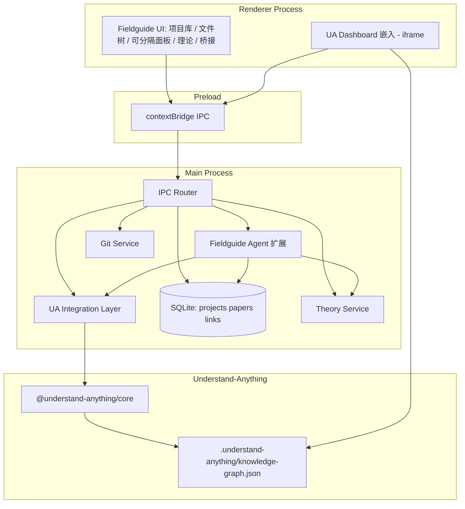
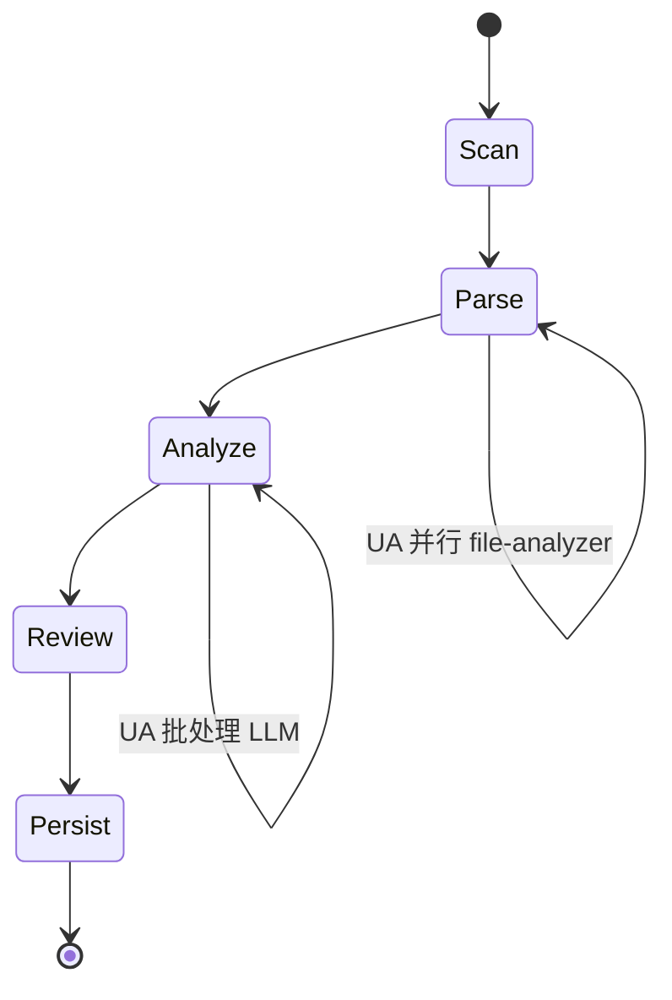

# Fieldguide 技术架构

> 版本：v0.5 | 状态：设计修订（Phase 1，VSCode/Obsidian 风格布局；外部笔记联动见 F-17）  
> v0.5 变更：新增 `obsidian` 配置块、`vault_notes` 表、`obsidian:*` IPC 契约与 9 个错误码（F-17 Obsidian vault 联动，2026-09-20）  
> v0.4 变更：三栏布局 → 左文件树 + 右可分隔面板（2026-07-01）  
> 集成细节见 [understand-anything-integration.md](./understand-anything-integration.md)

---

## 一、架构总览

Fieldguide 是 **Electron 单体桌面应用**：在 **[Understand-Anything](https://github.com/Egonex-AI/Understand-Anything)（UA）** 之上构建学习工作台。UA 提供代码索引、知识图谱与 Dashboard；Fieldguide Main Process 负责 UA 集成、扩展数据（论文、桥接）、IPC 与 Agent 扩展；Renderer 为 React UI + 嵌入 UA Dashboard。


```mermaid
flowchart TB
  subgraph renderer [Renderer Process]
    Shell[Fieldguide UI: 项目库 / 文件树 / 可分隔面板 / 理论 / 桥接]
    Dash[UA Dashboard 嵌入 - iframe]
  end

  subgraph preload [Preload]
    Bridge[contextBridge IPC]
  end

  subgraph main [Main Process]
    IPC[IPC Router]
    UAClient[UA Integration Layer]
    FGDB[(SQLite: projects papers links)]
    Theory[Theory Service]
    AgentFG[Fieldguide Agent 扩展]
    Git[Git Service]
  end

  subgraph ua [Understand-Anything]
    Core["@understand-anything/core"]
    UAGraph[".understand-anything/knowledge-graph.json"]
  end

  Shell --> Bridge --> IPC
  Dash --> Bridge
  IPC --> UAClient
  IPC --> FGDB
  IPC --> Theory
  IPC --> AgentFG
  IPC --> Git
  UAClient --> Core
  Core --> UAGraph
  Dash --> UAGraph
  AgentFG --> UAClient
  AgentFG --> Theory
  AgentFG --> FGDB
```

**刻意不采用**：微服务、gRPC、Redis、RabbitMQ、Docker、外部 Qdrant。  
**刻意不自研**：Tree-sitter 解析管线、UA 已有六类 Agent、独立图谱渲染引擎（复用 UA Dashboard）。

**外部笔记联动（F-17）**：Obsidian vault 在图里是**外部落点（external sink）**，不在 Main Process 的数据链路中间——Fieldguide 把它当普通目录**直接写文件系统**（`fs-atomic` 的 temp + rename 原子写），不经 IPC、不经 Obsidian 应用；官方 Obsidian CLI 只用于**探测 / 列 vault / 打开笔记 / 检索**这些只有应用本身才能做的事。Fieldguide **不写 Obsidian 自身的配置**（`obsidian.json`、workspace、插件、缓存），也不接管它的库管理；单向导出，不做双向同步。

---

## 二、技术栈

| 层级 | 选型 | 说明 |
|------|------|------|
| **代码地图引擎** | **[@understand-anything/core](https://github.com/Egonex-AI/Understand-Anything)** | 索引流水线、多 Agent、图谱 JSON |
| **图谱 UI** | **UA Dashboard**（嵌入） | 结构/域视图、Tour、搜索；Phase 1 spike 验证 |
| 桌面框架 | Electron 33+ | Windows 首发 |
| 构建 | electron-vite + pnpm workspace | main / preload / renderer；可 vendor UA submodule |
| UI 壳 | React 18 + TypeScript | 项目库、理论、桥接、设置 |
| 样式 | Tailwind CSS + Radix/shadcn 风格组件（绑定 `--fg-*` token） | Fieldguide 壳；Dashboard 主题经 postMessage 同步 |
| i18n | i18next + react-i18next | 简中 / 繁中 / en-US；与 UA language 映射 |
| 主进程 | Node.js + TypeScript | |
| 关系库 | better-sqlite3 | **Fieldguide 扩展数据**（projects、papers、concept_links、chat） |
| 向量库 | SQLite（`paper_chunks`，向量以 JSON 数组存、TS 内做余弦相似度） | 论文 chunk RAG（Phase 3）；代码语义搜索由 UA 负责 |
| Git | simple-git | clone、status、diff |
| LLM | OpenAI 兼容 HTTP | config 单一来源，桥接至 UA runtime |
| 打包 | electron-builder + NSIS | `.exe` 安装包 |

---

## 三、目录结构（实现期）

```
Fieldguide/
├── README.md
├── package.json                 # 亦承载 electron-builder 的 build 段（无独立 yml）
├── pnpm-workspace.yaml
├── electron.vite.config.ts
├── playwright.config.ts         # E2E（驱动本仓库 Electron 二进制）
├── vitest.config.ts / tsconfig{,.node,.vitest}.json
├── src/
│   ├── shared/                  # 三端共用类型与契约
│   │   ├── ipc.ts               # IpcResult / IpcErrorCode
│   │   ├── graph.ts             # re-export UA KnowledgeGraph + FG 扩展类型
│   │   ├── understand.ts        # 面板目录 / 分析阶段 / 架构·知识·面试模型
│   │   ├── obsidian.ts          # F-17 跨进程类型（状态 / 绑定 / 同步报告）
│   │   ├── llm-catalog.ts · llm-url.ts · index.ts
│   ├── main/                    # Electron 主进程
│   │   ├── index.ts · window.ts · menu.ts          # 启动 / 窗口 / 菜单
│   │   ├── config.ts · paths.ts · logger.ts · fs-atomic.ts
│   │   ├── file-tree.ts · content-search.ts · project-ignore.ts · git.ts
│   │   ├── insights.ts · evolution.ts · communities.ts · review-cards.ts · srs.ts · coach-plus.ts
│   │   ├── sample-project.ts    # 内置 Demo 安装
│   │   ├── ipc/                 # index.ts（全部 handler 聚合）+ uuid.ts
│   │   ├── ua/                  # ★ UA 集成层
│   │   │   ├── client.ts        # 调用 core pipeline / 索引
│   │   │   ├── config-bridge.ts # locale / LLM 同步
│   │   │   ├── graph-reader.ts · ensure-layers.ts · search.ts
│   │   │   ├── dashboard.ts     # Dashboard 静态资源 + 自定义协议
│   │   │   ├── diff.ts · cross-tour.ts · file-content.ts
│   │   ├── db/                  # index.ts（连接 + 全部查询）+ migrations.ts（纯迁移规则）
│   │   ├── agent/               # 学习教练：react.ts（ReAct 循环）· tools.ts · context-packer.ts · types.ts
│   │   ├── obsidian/            # F-17：cli/spawn-spec/parse（探测）· render/cards/plan/sync（同步）
│   │   │                        #       read（漂移状态）· agent（工具）· binding/status/launch/state
│   │   ├── understand/          # 渐进分析：pipeline.ts · architecture.ts · knowledge.ts · interview.ts
│   │   ├── vector/              # 论文分块与向量检索（SQLite 存储，非 LanceDB）：index/chunk/embed
│   │   ├── llm/                 # 统一 LLM 客户端（client.ts）+ 供应商目录（catalog.ts）
│   │   └── eval/                # 离线评测：harness.ts · metrics.ts · usability.ts
│   ├── preload/                 # contextBridge 暴露的 window.fieldguide
│   └── renderer/                # React UI
│       ├── App.tsx · main.tsx · i18n.ts · env.d.ts
│       ├── components/          # ActivityBar · AppTitleBar · ErrorBoundary · FolderPathField · SteppedSlider · icons/ · ui/
│       ├── hooks/               # useWorkspaceLayout · useIndexProgress · useDashboardThemeSync
│       ├── lib/                 # appearance · dashboard-bridge · dashboard-theme · llm-providers · markdown · resize-drag · utils
│       ├── theme/tokens.css     # 5 套主题预设的 CSS 变量
│       ├── locales/             # zh-CN · zh-TW · en-US（键集合由单测守卫）
│       └── views/
│           ├── ProjectLibrary/ · CodeMap/   # 文件树 + 可分隔面板（15 个面板组件）
│           ├── Theory/ · Bridge/
│           ├── SettingsPanel.tsx · OnboardingWizard.tsx · CommandPalette.tsx
│           └── ContentSearch.tsx · CostDialog.tsx · ShortcutsDialog.tsx · AboutDialog.tsx · Toast.tsx
├── resources/                   # icon · dashboard（UA 构建产物）· sample-project
├── scripts/                     # bootstrap-ua · prepare-pack · prepare-e2e · qa-baseline · scenario-smoke
│                                # · graph-e2e-smoke · his-go-smoke · clean-dist（+ vitest.tools.config.ts）
├── tests/fixtures/tiny-go/      # 单测 fixture 仓库
├── e2e/                         # Playwright：boot · codemap · obsidian（+ harness.ts）
├── eval/datasets/               # 离线评测数据集
└── picture/ · docs/
```

**已移除**（相对 v0.2）：自研 `engine/parser/`、`llm/agents/*`——由 UA 提供。

> v0.5 校正：本节早先是一份「实现期」草图，本次按仓库实际结构重写（原图里的
> `vendor/`、`shared/errors.ts`、`db/schema.ts`、`db/migrations/`、`main/ipc/{projects,graph,chat,theory}.ts`、
> `main/theory/`、`electron-builder.yml` 均不存在；`vector/` 用的是 SQLite 而非 LanceDB）。

---

## 四、用户数据布局

Windows 路径：`%APPDATA%/Fieldguide/`

**就地索引原则**：源码保留在用户指定路径；UA 图谱产物写在 **`{root_path}/.understand-anything/`**（与 UA 插件一致），Main Process 只读源码。

```
%APPDATA%/Fieldguide/
├── config.json           # llm, locale, theme, projectsRoot, ua.language
├── app.db                # SQLite（Fieldguide 扩展：projects, papers, concept_links, chat）
├── lance/                # 论文向量（Phase 3）
├── exports/              # 用户导出的图谱副本
├── logs/
└── papers/
    └── {paperId}/
        ├── original.pdf
        └── chunks.json

{project_root_path}/      # 用户源码目录（就地）
└── .understand-anything/
    ├── knowledge-graph.json   # ★ UA 图谱权威源
    ├── config.json            # UA 项目级配置（language 等）
    └── intermediate/          # UA 中间产物（不导出）
```

**Git clone 目标路径**：`{projectsRoot}/{slug}/`。

**graph 导出**：从 `{root_path}/.understand-anything/knowledge-graph.json` 复制到 `exports/`，或调用 `project:exportGraph`。

### config.json 示例

```json
{
  "llm": {
    "baseUrl": "https://api.deepseek.com/v1",
    "apiKey": "",
    "chatModel": "deepseek-chat",
    "embedModel": "..."
  },
  "locale": "zh-CN",
  "theme": "system",
  "projectsRoot": "D:/Projects/Fieldguide",
  "onboardingCompleted": true,
  "ua": {
    "language": "zh",
    "incremental": true
  },
  "obsidian": {
    "vaultPath": "",
    "vaultName": "",
    "cliPath": "",
    "folder": "Fieldguide",
    "autoSyncOnIndex": false,
    "mirrorNotes": true,
    "agentWrite": true,
    "openAfterSync": false
  }
}
```

| 字段 | 说明 |
|------|------|
| `locale` | `zh-CN`（默认）\| `zh-TW` \| `en-US` — Fieldguide UI |
| `ua.language` | UA pipeline 语言：`zh` \| `zh-TW` \| `en` 等 |
| `projectsRoot` | Git clone 与 demo 的默认父目录 |
| `onboardingCompleted` | 首次引导是否已完成 |

**`obsidian` 块（F-17，默认关闭）**：`vaultPath` 为空即整体停用——`src/main/obsidian/` 之外没有任何代码会去碰 vault 目录（取值与默认值以 `src/main/config.ts` 的 `ObsidianConfig` / `DEFAULT_CONFIG.obsidian` 为准）。

| 字段 | 默认值 | 说明 |
|------|--------|------|
| `obsidian.vaultPath` | `""` | vault 绝对目录；`""` = 集成关闭（不绑定任何目录） |
| `obsidian.vaultName` | `""` | Obsidian 侧的 vault 名（CLI 的 `vault=`）；未登记时可为空 |
| `obsidian.cliPath` | `""` | CLI 路径覆盖；`""` = 自动探测（覆盖值 → PATH×PATHEXT → 常见安装目录） |
| `obsidian.folder` | `"Fieldguide"` | Fieldguide 在 vault 内独占的根目录，每个项目一个子目录 |
| `obsidian.autoSyncOnIndex` | `false` | 索引完成后自动同步该项目（否则只在 Vault 面板手动触发） |
| `obsidian.mirrorNotes` | `true` | 把应用内代码笔记一起镜像成 vault 卡片 |
| `obsidian.agentWrite` | `true` | 允许教练 Agent 在项目子目录内新建/更新卡片 |
| `obsidian.openAfterSync` | `false` | 同步完成后在 Obsidian 打开索引笔记（需要 CLI 可用） |

---

## 五、索引与 UA 集成层

Fieldguide **不实现** Index Engine，通过 `src/main/ua/client.ts` 调用 UA core。

### 5.1 流水线（UA 提供）


```mermaid
stateDiagram-v2
  [*] --> Scan
  Scan --> Parse
  Parse --> Analyze
  Analyze --> Review
  Review --> Persist
  Persist --> [*]

  Parse --> Parse: UA 并行 file-analyzer
  Analyze --> Analyze: UA 批处理 LLM
```

| UA Agent | 作用 |
|----------|------|
| `project-scanner` | 文件发现、语言/框架检测 |
| `file-analyzer` | 节点/边、Tree-sitter 结构 |
| `architecture-analyzer` | layer 分层 |
| `tour-builder` | 引导 Tour |
| `graph-reviewer` | 完整性校验 |
| `domain-analyzer` | 业务域视图 |

Fieldguide `project:index` → 设置 `root_path` 为 UA 工作目录 → 调用 pipeline → 转发 `index:progress` 事件。

### 5.2 Fieldguide 封装职责

| 职责 | 说明 |
|------|------|
| `config-bridge.ts` | Fieldguide config → UA runtime（LLM、language） |
| `graph-reader.ts` | 读取 `knowledge-graph.json` 供 IPC `graph:*` |
| `dashboard.ts` | 定位 Dashboard 构建产物，供 Renderer 嵌入 |
| 进度转发 | UA 进度回调 → `index:progress` IPC |
| 取消/重试 | 包装 UA job，映射 `IpcErrorCode` |

### 5.3 增量索引与新鲜度

- **增量**：UA 默认开启（指纹 hash）；Fieldguide 暴露「重新索引」与「增量更新」
- **新鲜度**：对比 `knowledge-graph.json` 的 `indexedAt` 与源码 mtime；stale 时项目卡片 badge
- **diff 分析**：Phase 2 集成 UA `/understand-diff` 等价 API

### 5.4 禁止重复实现

不得自研：Tree-sitter parser、UA 六类 Agent、独立 `@xyflow/react` 图谱（除非放弃 Dashboard 嵌入且经设计评审）。

---

## 六、数据模型

### 6.1 知识图谱类型

**运行时权威源**：`{root_path}/.understand-anything/knowledge-graph.json`（UA 格式）。

Fieldguide `src/shared/graph.ts` **re-export UA 类型**（从 `@understand-anything/core`），避免重复定义。以下结构与 UA 对齐，仅作文档参考：

```typescript
// 优先从 @understand-anything/core 导入；勿在 Fieldguide 重复维护
interface KnowledgeGraph {
  meta: GraphMeta;
  nodes: GraphNode[];
  edges: GraphEdge[];
  tours: Tour[];
  domains?: DomainFlow[];
  // ... UA 版本可能扩展字段，以 core 包为准
}
```

**节点 ID、边类型、confidence 规则**：遵循 UA 实现；Fieldguide 单测读取 UA fixture graph 断言，不自定规则。

### 6.2 SQLite 表（Fieldguide 扩展数据）

SQLite **不存储**图谱节点/边/Tour（由 UA `knowledge-graph.json` 负责）。仅存 Fieldguide 专有数据：

```sql
-- 项目
CREATE TABLE projects (
  id TEXT PRIMARY KEY,
  name TEXT NOT NULL,
  slug TEXT NOT NULL,
  source_type TEXT NOT NULL,  -- 'local' | 'git'
  source_uri TEXT NOT NULL,
  root_path TEXT NOT NULL,    -- 就地索引根；UA 图谱在 root_path/.understand-anything/
  status TEXT NOT NULL,       -- 'pending' | 'indexing' | 'ready' | 'failed' | 'stale'
  ua_graph_path TEXT,         -- 默认 root_path || '/.understand-anything/knowledge-graph.json'
  created_at TEXT NOT NULL,
  indexed_at TEXT
);

-- 索引任务（包装 UA pipeline）
CREATE TABLE index_jobs (
  id TEXT PRIMARY KEY,
  project_id TEXT NOT NULL,
  status TEXT NOT NULL,
  phase TEXT,
  progress REAL,
  error TEXT,
  started_at TEXT,
  finished_at TEXT,
  FOREIGN KEY (project_id) REFERENCES projects(id)
);

-- 论文
CREATE TABLE papers (
  id TEXT PRIMARY KEY,
  title TEXT,
  arxiv_id TEXT,
  file_path TEXT,
  created_at TEXT NOT NULL
);

CREATE TABLE paper_chunks (
  id TEXT PRIMARY KEY,
  paper_id TEXT NOT NULL,
  chunk_index INTEGER NOT NULL,
  content TEXT NOT NULL,
  page_start INTEGER
);

-- 概念桥接（Fieldguide 核心差异化）
CREATE TABLE concept_links (
  id TEXT PRIMARY KEY,
  paper_id TEXT NOT NULL,
  project_id TEXT NOT NULL,
  paper_anchor TEXT NOT NULL,
  node_id TEXT NOT NULL,      -- 引用 UA graph 中的 node id
  note TEXT,
  created_at TEXT NOT NULL
);

-- 聊天（跨论文+代码扩展会话）
CREATE TABLE chat_sessions (
  id TEXT PRIMARY KEY,
  context_type TEXT,            -- 'project' | 'paper' | 'bridge'
  context_id TEXT,
  created_at TEXT NOT NULL
);

CREATE TABLE chat_messages (
  id TEXT PRIMARY KEY,
  session_id TEXT NOT NULL,
  role TEXT NOT NULL,
  content TEXT NOT NULL,
  tool_trace JSON,
  created_at TEXT NOT NULL
);

-- F-17：Obsidian vault 生成笔记的记账表（不含笔记正文）
CREATE TABLE vault_notes (
  id TEXT PRIMARY KEY,
  project_id TEXT NOT NULL,
  note_path TEXT NOT NULL,              -- vault 相对路径（posix）
  vault_path TEXT NOT NULL DEFAULT '',  -- 写入时的 vault 根；换绑后据此识别孤儿
  kind TEXT NOT NULL,                   -- index | architecture | layer | module | tour | knowledge | interview | bridge | path | note | report
  source_id TEXT NOT NULL DEFAULT '',
  title TEXT NOT NULL,
  content_hash TEXT NOT NULL,           -- 上次写入时的内容哈希（判「用户是否改过」）
  synced_at TEXT NOT NULL,
  FOREIGN KEY (project_id) REFERENCES projects(id)
);
```

**`vault_notes`（F-17）**：只记「笔记路径 / kind / 来源 id / 内容哈希 / 上次同步时间」，**不存笔记正文**，也不存图谱节点与边；API 为 `listVaultNotes` / `getVaultNote` / `upsertVaultNote` / `removeVaultNote` / `removeVaultNotesForProject`（索引 `idx_vault_notes_project`），`removeProject()` 随项目级联删除。

---

## 七、IPC 接口

Renderer 仅通过 preload 暴露的类型安全 API 调用 Main。Channel 名、Request/Response 类型、错误码统一定义于 `src/shared/`，Main / Preload / Renderer 三端共用，避免漂移。

### 7.1 Projects

| Channel | 方向 | 说明 |
|---------|------|------|
| `project:list` | invoke | 列出项目 |
| `project:addLocal` | invoke | `{ path }` |
| `project:addGit` | invoke | `{ url, branch?, targetPath? }` — 默认 `{projectsRoot}/{slug}/` |
| `project:exportGraph` | invoke | `{ projectId }` → 写入 `exports/` |
| `project:remove` | invoke | `{ id, deleteFiles? }` |
| `project:index` | invoke | 触发索引，返回 jobId |
| `onboarding:complete` | invoke | `{ locale?, projectsRoot? }` — 首次引导完成标记 |
| `index:progress` | on | 进度事件 |

### 7.2 Graph

| Channel | 方向 | 说明 |
|---------|------|------|
| `graph:get` | invoke | `{ projectId }` → KnowledgeGraph |
| `graph:getNode` | invoke | `{ projectId, nodeId }` |
| `graph:neighbors` | invoke | `{ projectId, nodeId, depth? }` |
| `graph:search` | invoke | `{ projectId, query, mode: 'text'|'semantic' }` — **委托 UA**（读 JSON 或调 UA 搜索 API） |
| `graph:getSource` | invoke | `{ projectId, path, lineStart?, lineEnd? }` |

### 7.3 Chat

| Channel | 方向 | 说明 |
|---------|------|------|
| `chat:send` | invoke | `{ sessionId, message, context }` |
| `chat:stream` | on | 流式 StepEvent |
| `chat:cancel` | invoke | 取消当前 run |

### 7.4 Theory

| Channel | 方向 | 说明 |
|---------|------|------|
| `arxiv:search` | invoke | `{ query, maxResults }` |
| `paper:import` | invoke | PDF path |
| `paper:list` | invoke | |
| `paper:query` | invoke | RAG 问答 |

### 7.5 IPC 错误契约

所有 `invoke` 统一返回 `IpcResult<T>`（定义于 `src/shared/ipc.ts`）：

```typescript
type IpcResult<T> =
  | { ok: true; data: T }
  | { ok: false; error: IpcError };

interface IpcError {
  code: IpcErrorCode;
  message: string;      // 已本地化，可直接展示
  retryable: boolean;
}
```

**错误码**（`src/shared/ipc.ts` 的 `IpcErrorCode`）：

| Code | 场景 | retryable |
|------|------|-----------|
| `PROJECT_NOT_FOUND` | 项目 id 不存在 | false |
| `INDEX_IN_PROGRESS` | 重复触发索引 | true |
| `GIT_CLONE_FAILED` | clone 失败 | true |
| `LLM_RATE_LIMIT` | API 429 | true |
| `LLM_NOT_CONFIGURED` | 无 API Key 却请求 Analyze | false |
| `PARSE_ERROR` | Tree-sitter 解析失败 | false |
| `SOURCE_UNAVAILABLE` | root_path 不存在或不可读 | false |
| `OBSIDIAN_CLI_MISSING` | 未检测到可用的 Obsidian CLI（或安装器版本低于 1.12.7） | true |
| `OBSIDIAN_APP_NOT_RUNNING` | CLI 在，但 Obsidian 未运行（CLI 是运行中应用的客户端） | true |
| `OBSIDIAN_CLI_ERROR` | CLI 调用失败（超时 / 异常退出码 / 应用无法启动） | true |
| `VAULT_NOT_BOUND` | 尚未绑定 vault（`config.obsidian.vaultPath` 为空） | false |
| `VAULT_NOT_FOUND` | vault 目录、笔记文件或笔记来源已不存在 | false |
| `VAULT_NOT_REGISTERED` | 目录未被 Obsidian 登记为库（UI 侧以绑定类型 `unregistered` + 登记引导呈现） | false |
| `VAULT_PATH_INVALID` | vault 路径非法（不存在 / 与项目根重叠 / 笔记路径越界） | false |
| `VAULT_SYNC_IN_PROGRESS` | 已有同步任务在进行（同步与 Agent 写卡片不可交错） | true |
| `VAULT_WRITE_CONFLICT` | 目标文件不属于 Fieldguide（无托管块 / 属其他项目），或 Agent 写入已被设置关闭 | false |

流式事件（`index:progress`, `chat:stream`）保持 event 通道，payload 内嵌 `type` 字段；错误步在 `chat:stream` 中以 `{ type: 'error', error: IpcError }` 推送。

Renderer 侧统一 `unwrapIpc(result)` 辅助函数：失败时 toast + 可选重试按钮（当 `retryable === true`）。

### 7.6 Obsidian vault 联动（F-17）

Channel / payload 与 `src/main/ipc/index.ts` 的实现一致，Renderer 侧经 preload 的 `obsidian*` 方法调用（`src/preload/index.ts`）。写卡片**不需要 CLI**：vault 是普通目录，Fieldguide 直接写文件系统（`fs-atomic` 的 temp + rename 原子写，写入前先出计划、用户确认的计划就是实际执行的计划）；CLI 只用于探测 / 列 vault / 打开笔记 / 检索。

| Channel | 方向 | 请求 → 响应 |
|---------|------|-------------|
| `obsidian:status` | invoke | `{ projectId? }` → `ObsidianStatus`（`cli` / `binding` / `folder` / `notesCount` / `lastSyncAt` / `syncInFlight`） |
| `obsidian:detectCli` | invoke | `{ cliPath? }` → `VaultCliStatus`（强制重探并刷新探测缓存） |
| `obsidian:launchApp` | invoke | — → `VaultCliStatus`（先试 CLI 同级的 GUI 二进制，再试 `obsidian://` URI，随后有界等待复探） |
| `obsidian:listVaults` | invoke | — → `{ cli, vaults }`（`obsidian vaults verbose` 的解析结果） |
| `obsidian:chooseVault` | invoke | — → `VaultBinding \| null`（目录选择器 + 校验；用户取消返回 `null`） |
| `obsidian:createVault` | invoke | `{ parentDir, name }` → `VaultBinding & { created }`（只建目录 + 空 `.obsidian/` 标记，库登记留给用户） |
| `obsidian:openVaultManager` | invoke | — → `null`（打开 `obsidian://choose-vault` 让用户确认登记） |
| `obsidian:sync` | invoke | `{ projectId, dryRun?, openAfter? }` → `VaultSyncReport`（`dryRun` 只出计划不落盘；`openAfter` 同步后在 Obsidian 打开索引） |
| `obsidian:notes` | invoke | `{ projectId }` → `{ notes, folder, vaultPath }`（每张卡片的漂移状态） |
| `obsidian:readNote` | invoke | `{ projectId, notePath }` → 笔记正文 + 状态（面板预览） |
| `obsidian:openNote` | invoke | `{ projectId, notePath }` → `{ via: 'cli' \| 'system' }`（CLI 不可用时回退交给系统打开） |
| `obsidian:resolveNote` | invoke | `{ projectId, notePath, action }`（`keep-user` \| `overwrite` \| `save-copy`）→ `{ notePath, status }` |
| `obsidian:cleanup` | invoke | `{ projectId }` → `{ removed, kept }`（用户改过的笔记只保留、不删除） |
| `obsidian:adoptNote` | invoke | `{ projectId, notePath }` → 新建的 `code_notes` 行（卡片「采纳为代码笔记」） |
| `obsidian:unbind` | invoke | `{ mode }`（`keep` \| `cleanup`）→ `{ removed, kept }`，并清空 `vaultPath` / `vaultName` |

---

## 八、Agent 层

### 8.1 代码问答（UA）

项目内代码结构问答、Tour、语义搜索：**优先调用 UA**（`/understand-chat` 等价 API 或 core 封装）。Fieldguide 不重复实现代码侧 ReAct 循环。

### 8.2 Fieldguide 扩展 Agent（Phase 3）

跨论文 + 代码 + 概念桥接的统一 Agent。工具集由 `src/main/agent/tools.ts` 的 `buildAgentTools()` 产出，**每轮会话构建一次**（中途改工具列表会让缓存前缀失效）；导出的 `AGENT_TOOLS` 是不含 vault 工具的默认集合。

```typescript
interface AgentContext {
  projectId: string;
  projectName: string;
  projectRoot: string;
  locale: string;
  focusedNodeId?: string | null;   // Dashboard 当前选中节点
  tourStepIndex?: number | null;   // 当前 Tour 步骤
}
```

| Tool | 来源 | 说明 |
|------|------|------|
| `search_nodes` | FG→UA | 模糊/语义检索图谱节点（名称、标签、摘要） |
| `get_neighbors` | FG | N 跳邻居（默认 1，上限 2） |
| `list_layers` | FG | 架构分层 + 每层样例节点 |
| `get_tour_step` | FG | 按 0 基序号（缺省用当前步骤）取 Tour 步骤 |
| `query_paper` | FG | 论文 RAG 片段检索 |
| `get_node_source` | FG | 读取节点源码片段 |
| `find_call_path` | FG | 两节点间最短路径（imports / calls / contains） |
| `list_concept_links` | FG | 当前项目的论文段落 ↔ 代码节点桥接 |
| `vault_list_cards` | FG（F-17） | 本项目已同步的 vault 卡片（路径 / kind / 漂移状态 / 用户批注量） |
| `vault_read_note` | FG（F-17） | 读单张卡片，含托管块之外用户自己写的内容 |
| `vault_search` | FG（F-17） | 项目 vault 子目录内全文检索（需 Obsidian 在运行） |
| `vault_upsert_card` | FG（F-17） | 新建/更新一张卡片（受 `agentWrite` 与项目子目录约束） |
| `vault_backlinks` | FG（F-17） | 指向某张卡片的反链（需 Obsidian 在运行） |

**vault 工具的条件注入（F-17）**：仅当 `config.obsidian.vaultPath` 非空且目录存在时，5 个 `vault_*` 工具才进入 tool schema——模型看不到就用不到，避免围绕不存在的能力编排。读取只依赖文件系统（Obsidian 没开也能读上次同步的结果）；`vault_search` / `vault_backlinks` 依赖 CLI，不可用时返回结构化错误并提示改用 `vault_list_cards` + `vault_read_note`；写入经 `upsertAgentCard()`，路径钉在 `<vault>/<folder>/<项目>/` 内，目标文件不属于本项目或 `agentWrite=false` 时拒绝。

### 8.3 System Prompt 要点

- 角色：学习教练，非代码生成器
- 先全局后局部：用户问细节时，先确认是否已理解所在模块
- 引用节点时使用 `path:line` 格式，便于 UI 跳转
- 输出语言跟随 `config.locale`（简中 / 繁中 / en-US），注入 system prompt：`Respond in {languageName}`

---

## 九、向量检索

- **代码语义搜索**：由 UA 负责（Fieldguide 不建自己的代码向量库）
- **论文 RAG**（Phase 3，已实现）：SQLite `paper_chunks` 表按 `paperId` 组织；chunk 512 token、重叠 64；向量以 JSON 数组落库，查询时在 TS 内算余弦相似度（单机规模足够，避免引入外部向量库）
- **Embedding**：与 `config.llm` 共用 OpenAI 兼容 `/embeddings`

---

## 十、安全

| 项 | 措施 |
|----|------|
| Renderer 沙箱 | `nodeIntegration: false`, `contextIsolation: true` |
| API Key | 仅存 `%APPDATA%`，不出日志 |
| LLM 发送内容 | 仅发送必要 snippet，设置 max chars |
| Git clone | 禁止 `file://` 等危险 URL；深度 `--depth 1` 可选 |

---

## 十一、可观测性（轻量）

- Main Process 结构化日志（electron-log）→ `%APPDATA%/Fieldguide/logs/`
- 设置页展示：上次索引耗时、LLM token 估算（Phase 2）
- 不做 Prometheus / Grafana（桌面应用）
