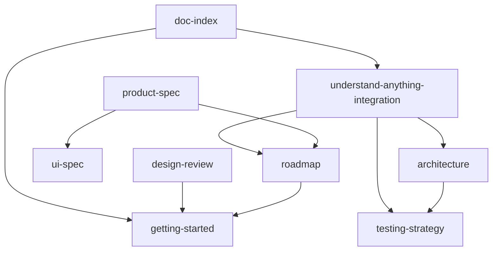

# Fieldguide 文档索引与一致性检查表

> 版本：v0.1 | 状态：设计定稿（Phase 0）  
> 用途：动工前与每次改设计时对照，确保各文档仍指向**同一产品**。

---

## 一、产品一句话（不可漂移）

**Fieldguide** = **[Understand-Anything](https://github.com/Egonex-AI/Understand-Anything)** 代码地图引擎 + **Electron 桌面学习工作台**（多项目、理论、概念桥接、跨源 Agent）。

| 问题 | 标准答案 |
|------|----------|
| 代码地图谁做？ | UA（core + Dashboard 嵌入） |
| Fieldguide 差异化？ | 独立桌面、论文/PDF、概念桥接、跨论文+代码 Agent |
| 图谱存在哪？ | `{projectRoot}/.understand-anything/knowledge-graph.json` |
| SQLite 存什么？ | projects、papers、concept_links、chat（**不存** graph nodes/edges） |
| 纯代码问答在哪？ | UA Dashboard 内 |
| 跨论文+代码问答在哪？ | Fieldguide 右栏 Agent（Phase 3） |

---

## 二、文档地图

### 2.1 阅读顺序（新人 / 动工前）

```
doc-index（本文）
    → understand-anything-integration（集成边界）
    → getting-started（动工清单）
    → product-spec（做什么）
    → architecture（怎么做）
    → ui-spec（长什么样）
    → onboarding-spec（首次启动）
    → testing-strategy（怎么测）
    → roadmap（分阶段）
    → design-review（风险与验收）
```

### 2.2 文档职责（单一事实来源）

| 文档 | 权威内容 | 不重复定义 |
|------|----------|------------|
| [product-spec.md](./product-spec.md) | 愿景、用户场景、功能 F-01–F-15、非目标 | IPC 字段、SQL schema |
| [understand-anything-integration.md](./understand-anything-integration.md) | UA/FG 边界、数据流、Spike、禁止重复实现 | UI 像素级规格 |
| [architecture.md](./architecture.md) | 进程模型、目录结构、IPC、SQLite 表、Agent 工具表 | Phase 排期 |
| [ui-spec.md](./ui-spec.md) | 布局、壳层 vs Dashboard 分工、视觉 token | graph schema |
| [roadmap.md](./roadmap.md) | Phase 任务 ID、验收、周期 | 架构细节 |
| [onboarding-spec.md](./onboarding-spec.md) | 引导四步、Demo 仓库约定 | — |
| [testing-strategy.md](./testing-strategy.md) | 测试金字塔、fixture | 产品愿景 |
| [design-review.md](./design-review.md) | 最终验收 §3.5、风险、已决项 | 任务拆解 |
| [getting-started.md](./getting-started.md) | 动工清单、陷阱、第一周节奏 | 全文架构 |

**枢纽文档**：改 UA 相关决策时，**必须先改** `understand-anything-integration.md`，再同步 architecture / product-spec / ui-spec / roadmap。

### 2.3 依赖关系



---

## 三、功能归属矩阵（改功能前先查表）

| 能力 | UA | Fieldguide | Phase |
|------|:--:|:----------:|-------|
| Tree-sitter / 多 Agent 索引 | ✅ | 集成 | 1 |
| knowledge-graph.json | ✅ | 读 | 1 |
| Dashboard 图谱/Tour/源码/代码问答 | ✅ | 嵌入 | 1–2 |
| 语义代码搜索 | ✅ | 包装 IPC（可选） | 2 |
| diff 影响分析 | ✅ | 集成 | 2 |
| 增量索引 | ✅ | UI 暴露 | 2 |
| 项目库 / Git clone | | ✅ | 1 |
| 首次引导 | | ✅ | 1 |
| Electron 打包 | | ✅ | 4 |
| arXiv / PDF / 论文 RAG | | ✅ | 3 |
| concept_links / 概念桥接 | | ✅ | 3 |
| 跨论文+代码 Agent | | ✅ | 3 |
| LanceDB（论文向量） | | ✅ | 3 |

**禁止**：Fieldguide 自研 parser、FileAnalyzer、独立 `@xyflow/react` 全图画布（除非放弃 Dashboard 嵌入且经设计评审）。

---

## 四、核心决策登记表（已定稿，勿重开讨论）

| ID | 决策 | 出处 |
|----|------|------|
| D-01 | 基于 Understand-Anything，MIT 上游 | integration §一 |
| D-02 | 图谱权威源 = `.understand-anything/knowledge-graph.json` | architecture §四、§六 |
| D-03 | SQLite 仅存 Fieldguide 扩展数据 | architecture §6.2 |
| D-04 | 就地索引，不复制源码到 APPDATA | product-spec §九 |
| D-05 | Git clone → `{projectsRoot}/{slug}/` | onboarding §三 |
| D-06 | Demo 按需 clone `fieldguide-demo`，不内嵌 | onboarding §五 |
| D-07 | locale 映射：zh-CN→zh, zh-TW→zh-TW, en-US→en | integration §4.4 |
| D-08 | Dashboard 嵌入为 Phase 1 默认方案 | integration §4.3 |
| D-09 | EPUB/Markdown Phase 3 不做 | product-spec §九 |
| D-10 | Fieldguide MIT + [NOTICE.md](../NOTICE.md) 保留 UA 归属 | README、NOTICE |

---

## 五、动工前门禁清单（全部 ✅ 后再写业务代码）

### 5.1 环境与仓库

- [ ] Node.js LTS + pnpm
- [ ] Windows 10/11 开发机
- [ ] Fieldguide 目录 `git init`
- [ ] 阅读本文 + integration + getting-started

### 5.2 UA 集成 Spike（**硬门禁**）

见 [understand-anything-integration.md §九](./understand-anything-integration.md)。

- [ ] clone `Egonex-AI/Understand-Anything`
- [ ] `pnpm install && pnpm --filter @understand-anything/core test` 通过
- [ ] Node 脚本调用 pipeline → 生成 `knowledge-graph.json`
- [ ] Dashboard 静态资源在 Electron `BrowserWindow` 可加载
- [ ] `--language zh` 输出中文摘要（抽样验证）
- [ ] 记录 UA 版本 / commit 至 `package.json` 或 `vendor/` README
- [ ] Spike 结论写入 `docs/spike-ua.md`（见 §5.4 模板）

### 5.3 外部仓库准备（可与 Spike 并行）

- [ ] 创建 [fieldguide-demo](https://github.com/fieldguide-app/fieldguide-demo)（规格见 [onboarding-spec.md §五](./onboarding-spec.md)）
- [ ] 创建 `tests/fixtures/tiny-go/`（规格见 [testing-strategy.md §4.1](./testing-strategy.md)）

### 5.4 Spike 记录模板（动工时创建 `docs/spike-ua.md`）

```markdown
# UA 集成 Spike 记录

- 日期：
- UA commit / 版本：
- 依赖方式：npm | submodule（路径：）
- pipeline 调用方式：（API 函数名或 CLI 包装）
- Dashboard 嵌入方式：BrowserView | iframe | 其他
- 已知问题：
- 结论：通过 / 需 fallback（说明）
```

### 5.5 设计审视门禁

- [ ] [design-review.md §六](./design-review.md) 动工清单 Spike 项打勾
- [ ] 本节 §五全部打勾

---

## 六、最终产品验收（Done 定义，全 Phase 共同目标）

来源：[design-review.md §3.5](./design-review.md)

- [ ] 新用户 **15 分钟内**：添加项目 → 跟完 Tour → 口述主链路
- [ ] 论文段落 ↔ 代码节点 **≤3 次点击** + 对照 Tour
- [ ] 搜索/聊天能答「X 在哪」并 **一键跳节点**
- [ ] 无网络 / 无 API Key 时静态浏览流畅
- [ ] 索引失败、LLM 限流有 **可操作** 错误文案
- [ ] 图谱、笔记、桥接 **重启不丢**，默认不出本机

---

## 七、改文档时的一致性检查表

每次修改任一设计文档后，勾选本节 relevant 项：

### 7.1 若改了 UA 集成 / 架构

- [ ] `understand-anything-integration.md` 已更新
- [ ] `architecture.md` 架构图、§五、§六 与集成文一致
- [ ] `product-spec.md` F-xx 来源列未矛盾
- [ ] `ui-spec.md` §3.2 仍写「Dashboard 嵌入」而非自研画布
- [ ] `roadmap.md` Phase 任务未要求自研 parser/Agent
- [ ] `testing-strategy.md` 未要求 Fieldguide 单测 parser
- [ ] `getting-started.md` 禁止列表仍有效

### 7.2 若改了功能 / 优先级

- [ ] `product-spec.md` F 表与 `roadmap.md` Phase 对齐
- [ ] 非目标 §七 未误加 UA 已有能力
- [ ] `design-review.md` Jobs to be Done 仍可满足

### 7.3 若改了 UI

- [ ] `ui-spec.md` 壳层 vs Dashboard 分工清晰
- [ ] 未引入 Monaco/xyflow 作为 Fieldguide 自建画布（除非 D-08 变更）
- [ ] 双聊天入口：代码→Dashboard，跨源→右栏 Agent

### 7.4 若改了数据模型

- [ ] 图谱 **不** 写入 SQLite nodes/edges
- [ ] `concept_links.node_id` 引用 UA graph 中的 id
- [ ] 路径：就地 `.understand-anything/` 未改为 APPDATA 复制

### 7.5 元数据

- [ ] 涉及架构变更的文档版本号递增（当前基线 **v0.3**）
- [ ] README 设计文档表仍完整
- [ ] 本文 §四 决策表无需新增行时，在 PR/提交说明中注明

---

## 八、已知张力（文档已接受，实现时处理）

| 张力 | 文档约定 | 处理阶段 |
|------|----------|----------|
| Dashboard 与三栏视觉割裂 | ui-spec §3.2 | Phase 2 主题统一 |
| Phase 1 右栏可折叠 | ui-spec §3.2 | Phase 1 允许 |
| 全局 Ctrl+K 跳节点 | ui-spec §4.3；roadmap **2.11** | Phase 2 |
| 索引进度阶段名 | ui-spec §4.2 映射 UA | 实现时 |
| Demo / fixture 未创建 | fieldguide-demo-spec、fixtures-tiny-go-spec | Phase 1 第 0 周 |

---

## 九、版本对齐表（维护时更新）

| 文档 | 当前版本 |
|------|----------|
| README | Phase 0 v0.3 叙述 |
| product-spec | v0.3 |
| architecture | v0.3 |
| ui-spec | v0.3 |
| roadmap | v0.3 |
| design-review | v0.3 |
| getting-started | v0.3 |
| testing-strategy | v0.3 |
| onboarding-spec | v0.2 |
| understand-anything-integration | v0.1 |
| doc-index | v0.1 |
| spike-ua | 模板（Spike 后填写） |
| fieldguide-demo-spec | v0.1 |
| fixtures-tiny-go-spec | v0.1 |
| NOTICE.md | v0.1 |

---

## 十、相关链接

| 资源 | URL |
|------|-----|
| UA 上游 | https://github.com/Egonex-AI/Understand-Anything |
| UA 官网 / Demo | https://understand-anything.com/ |
| fieldguide-demo（待建） | https://github.com/fieldguide-app/fieldguide-demo |
