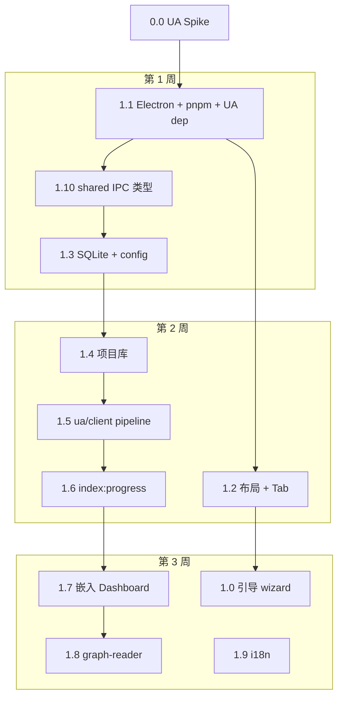

# Fieldguide 动工前引导

> 版本：v0.3 | 状态：设计定稿（Phase 0，已纳入 Understand-Anything 集成）  
> 目的：在正式写代码之前，把方向、边界、顺序和验收标准说清楚，避免做着做着偏离产品目标。

---

## 一、这份文档怎么用

动工前请完整阅读本文，并按 **第二节清单** 逐项确认。实现过程中遇到「要不要现在做」的犹豫时，回到：

1. **第三节** — 最终验收标准（Done 定义）
2. **第四节** — 四条不可违背的原则
3. **第五节** — 当前 Phase 边界（禁止提前实现的内容）
4. **第六节** — 推荐实施顺序

详细规格仍以专项文档为准；本文是 **执行层面的导航图**，不重复 architecture 全文。

动工前请完整阅读 **[understand-anything-integration.md](./understand-anything-integration.md)** 与本文，并按 **第二节清单** 逐项确认。

| 何时查阅 | 去看 |
|----------|------|
| 文档地图与改稿检查 | [doc-index.md](./doc-index.md) |
| UA 复用边界 | [understand-anything-integration.md](./understand-anything-integration.md) |
| Spike 记录 | [spike-ua.md](./spike-ua.md) |
| 功能该不该做 | [product-spec.md](./product-spec.md) §五、§七 |
| 接口怎么定义 | [architecture.md](./architecture.md) §六、§七 |
| UI 长什么样 | [ui-spec.md](./ui-spec.md) |
| 本阶段任务与验收 | [roadmap.md](./roadmap.md) |
| 测试写什么 | [testing-strategy.md](./testing-strategy.md) |
| 首次启动流程 | [onboarding-spec.md](./onboarding-spec.md) |
| 风险与易用性 | [design-review.md](./design-review.md) |

---

## 二、动工前清单

在创建 `package.json` 或写第一行业务代码之前，确认以下事项。

### 2.1 环境与工具

- [ ] **Node.js LTS**（建议 20.x）已安装
- [ ] **Git** 已安装，可正常 clone
- [ ] **pnpm** 已安装（UA 为 pnpm monorepo）
- [ ] **Windows 10/11** 作为首发开发与测试环境
- [ ] 运行 **`pnpm bootstrap:ua`**（clone 锁定 commit 的 [Understand-Anything](https://github.com/Egonex-AI/Understand-Anything)、构建 Dashboard → `resources/dashboard`）并完成 **Spike**（integration §九）
- [ ] 图谱冒烟：`pnpm qa:graph`（须 sibling UA + Dashboard；打包后还应有 `dist/win-unpacked/resources/dashboard` 的 `__uaStore`）
- [ ] Electron native 依赖（`better-sqlite3` 等）需 **electron-rebuild**；Tree-sitter 由 UA 带入，勿在 Fieldguide 重复引入
- [ ] 编辑器已配置 TypeScript；后续统一用 **Prettier + ESLint**（Phase 1.1 脚手架时一并加入）

> **交付口径**：结构图谱 + Dashboard 嵌入为已交付；完整 UA 六 Agent / 业务域视图为延期。见 [understand-anything-integration.md](./understand-anything-integration.md) §交付边界。

### 2.2 仓库与协作

- [ ] 在 `Fieldguide/` 目录 **初始化 git 仓库**
- [ ] 确定许可证：MIT + [NOTICE.md](../NOTICE.md)（见 [README.md](../README.md)）
- [ ] 约定 commit 粒度：一个 roadmap 任务或子任务一条 commit，便于回溯
- [ ] 主分支保护：合并前至少 `npm run test:unit` 通过

### 2.3 外部依赖（动工第一周）

- [ ] **UA 集成 Spike 通过**（硬门禁）→ 填写 [spike-ua.md](./spike-ua.md)
- [x] **内置 Demo**：`resources/sample-project/`（应用内「安装内置 Demo」）
- [ ] 按 [fixtures-tiny-go-spec.md](./fixtures-tiny-go-spec.md) 维护 `tests/fixtures/tiny-go/`
- [ ] 锁定 UA 版本：记录 commit hash 或 npm 版本至 `package.json`（见 spike-ua.md）
- [ ] 准备 **LLM API Key**（Phase 2 起；Phase 1 结构图可无 Key）

### 2.4 心智准备

- [ ] **不自研** UA 已有 parser / Dashboard；**不接**完整六 Agent 运行时（见 integration §交付边界）
- [ ] Fieldguide 价值在 **桌面壳 + 理论 + 概念桥接**，结构图谱复用 UA core + Dashboard
- [ ] 接受 Phase 1 Dashboard 嵌入可能与壳层视觉有割裂（Phase 2 统一主题）
- [ ] 接受 **打磨优先于速度**

---

## 三、最终验收标准（全项目 Done 定义）

不以 Phase 拆分，以 **最终交付** 为准。做任何功能前问自己：是否朝下列目标靠近？

来源：[design-review.md](./design-review.md) §3.5

- [ ] 新用户 **15 分钟内**完成：添加项目 → 跟完一条 Tour → 能口述主链路
- [ ] 论文段落 ↔ 代码节点关联 **≤3 次点击**，并可生成对照 Tour
- [ ] 全局搜索 / 聊天能回答「X 功能在哪」，并 **一键跳到节点**
- [ ] **无网络 / 无 API Key** 时，静态结构浏览仍流畅可用
- [ ] 索引失败、LLM 限流时有 **可操作** 的错误文案（含重试）
- [ ] 学习数据（图谱、笔记、桥接）**重启不丢**，默认不出本机

**差异化核心**（见 [design-review.md](./design-review.md) §5.3）：

> 代码地图靠 **UA**；差异化靠 **概念桥接 + 跨源 Agent**。

Phase 1 的目标是「UA 索引 + Dashboard 嵌入 + 项目库」，不要自研 parser 或 `@xyflow/react` 图谱。

---

## 四、四条不可违背的原则

实现中遇到架构或优先级冲突时，以这四条为最高优先级。

### 4.1 教，而非炫

- 节点少而精；Tour 有叙事顺序
- 大图谱用 **LOD 三级展开**（目录 → 文件 → symbol），不做一次性全量渲染
- call 边标注「静态推断」；低置信边不用于 Tour 主路径

### 4.2 本地优先

- 源码 **就地索引**，只读用户路径，**不复制**到 `%APPDATA%`
- 配置、DB、向量、论文存 `%APPDATA%/Fieldguide/`
- LLM 只发送用户配置的 API 所需 **代码片段**，不上传整库

### 4.3 理论 + 代码并重

- 顶栏 Tab：**项目库 | 代码地图 | 理论 | 桥接** 地位平等
- 「概念桥接」是产品差异化，Phase 3 必须认真做，不能做成两个 App 硬拼

### 4.4 复用 UA，不重复造轮子

| 层 | Fieldguide | UA |
|----|------------|-----|
| 索引 / 图谱 / Tour / 代码问答 | 集成调用 | **实现** |
| 项目库 / 理论 / 桥接 / Electron | **实现** | — |
| Renderer 嵌入 Dashboard | **壳层** | Dashboard 本体 |

**禁止**：在 `src/main/engine/parser/` 自写 Tree-sitter；禁止复制 UA Agent 逻辑到 Fieldguide。

### 4.5 进程边界（不变）

| 层 | 可以做 | 禁止 |
|----|--------|------|
| Renderer | UI、嵌入 Dashboard、IPC | 读文件系统、调 LLM、访问 DB |
| Preload | contextBridge 窄 API | 业务逻辑 |
| Main | UA 集成、DB、Git、Agent 扩展 | 阻塞 UI 的 UA pipeline（需 Worker） |

---

## 五、Phase 边界：现在做什么、不做什么

严格按 Phase 推进。范围蔓延是最大延期风险（见 [roadmap.md](./roadmap.md) 风险表）。

### Phase 1 — 桌面壳 + UA 集成（当前目标）

**要做：**

| 类别 | 内容 |
|------|------|
| Spike | UA core pipeline + Dashboard 在 Electron 可加载 |
| 脚手架 | Electron + pnpm workspace + UA 依赖 |
| 布局 | 顶栏 Tab + 项目库 + Dashboard 嵌入区 |
| 数据 | SQLite（projects）+ config + `src/shared/` |
| UA 集成 | `ua/client.ts`、`config-bridge.ts`、`graph-reader.ts` |
| 项目 | 添加本地 / Git clone |
| 引导 | 首次 wizard |
| i18n | Fieldguide shell 三语 |

**不要做：**

- 自研 Tree-sitter / FileAnalyzer 等
- 自研 `@xyflow/react` 图谱（用 UA Dashboard）
- arXiv、PDF、概念桥接（Phase 3）
- electron-builder（Phase 4）

**Phase 1 验收：**

- 索引生成 `{root}/.understand-anything/knowledge-graph.json`
- Dashboard 可浏览节点
- 无 Key 时仍可看结构图

### Phase 2 — 智能层桌面化

UA 深度分析、Tour、代码问答、diff、增量索引；Fieldguide 做 LLM/locale 桥接与壳层联动。**不自研 Agent。**

### Phase 3 — 理论 + 桥接（Fieldguide 核心自建）

arXiv、PDF RAG、concept_links、跨源 Agent。

### Phase 4 — 发布打磨

安装包、UA 版本 pin、主题统一。

---

## 六、推荐实施顺序（Phase 1）

**第 0 周必须先完成 UA Spike**，再搭 Electron。



### 6.1 `src/shared/graph.ts`

**re-export `@understand-anything/core` 类型**，勿复制粘贴 UA schema。

### 6.2 IPC 实施顺序

1. `project:*` + `index:progress`（包装 UA pipeline）
2. `graph:get`（读 `knowledge-graph.json`）
3. Phase 2：`chat:*`（桥接 UA 问答）
4. Phase 3：`arxiv:*` / `paper:*`（Fieldguide 自建）

---

## 七、测试：从 Phase 1 第一天开始

不要「先写功能后补测试」。以下与功能同步落地。

| 优先级 | 测什么 | 工具 |
|--------|--------|------|
| P0 | `ua/client`、config-bridge、graph-reader | Vitest |
| P0 | fixture → UA 索引 → `knowledge-graph.json` 断言 | Vitest 集成 |
| P0 | IPC `IpcResult` 形状 | Vitest |
| P1 | 添加项目 → Dashboard 可见 | Playwright + Electron |

**Fixture 仓库**（规格见 [fixtures-tiny-go-spec.md](./fixtures-tiny-go-spec.md)）：

```
tests/fixtures/tiny-go/
├── go.mod
├── cmd/main.go
├── internal/service/handler.go
└── internal/store/db.go
```

目标：索引后存在 `file:cmd/main.go`，import 边连接 main → service → store，无 orphan 边。

CI：Windows runner 必跑（native 依赖）。见 [testing-strategy.md](./testing-strategy.md) §七。

---

目标：索引后生成 `knowledge-graph.json`，节点数 ≥ 下限。

---

## 八、常见陷阱与纠偏

| 陷阱 | 表现 | 纠偏 |
|------|------|------|
| **重复造轮子** | 自写 Tree-sitter parser | 必须用 UA core |
| **重复造轮子** | 自研 xyflow 图谱 | 嵌入 UA Dashboard |
| Dashboard 割裂 | 像两个 App | Phase 2 主题统一；接受 Phase 1 嵌入 |
| Renderer 越权 | 直接读 FS/DB | 全部 IPC |
| 图谱路径错误 | 写到 APPDATA | 必须在 `{root}/.understand-anything/` |
| 复制源码到 APPDATA | 方便管理 | 违反就地索引 |
| 忽视 UA 版本 | 上游 breaking | pin 版本 + 集成测试 |
| 范围蔓延 | 自研 Zotero | 查非目标清单 |
| 阻塞 Main | 同步跑 UA pipeline | Worker + progress IPC |

---

## 九、已定稿决策速查

动工中不必重新讨论以下事项（来源：各设计文档汇总）。

| 项 | 决策 |
|----|------|
| **代码地图** | **Understand-Anything**（MIT） |
| 平台 | Windows 首发 Electron 桌面 |
| 图谱权威源 | `{root}/.understand-anything/knowledge-graph.json` |
| SQLite | 仅 projects、papers、concept_links、chat |
| Git clone | `{projectsRoot}/{slug}/` |
| Demo | 按需 clone `fieldguide-demo` |
| LLM | OpenAI 兼容；桥接至 UA |
| locale | Fieldguide UI + UA `language` 映射 |
| 禁止 | 自研 UA 已有 parser/Agent/Dashboard |

---

## 十、每个 Phase 结束的交付仪式

每完成一个 Phase，不要直接进入下一 Phase，先完成：

1. **跑通 Demo 用户路径**（[roadmap.md](./roadmap.md) 各 Phase「用户路径（Demo）」）
2. **对照 Phase 验收标准**打勾
3. **人工走一遍** [design-review.md](./design-review.md) §3.5 中已适用的条目
4. **记录已知限制**（写入 CHANGELOG 或 roadmap 备注），避免下一 Phase 重复踩坑
5. **Dogfood**：用 Fieldguide 索引 Fieldguide 自身或 `fieldguide-demo`，记录体验问题

Phase 1 结束时的理想状态：

> 新装应用 → 引导 → 添加项目 → UA 索引 → Dashboard 浏览图谱。**UA Spike 是动工门禁。**

---

## 十一、建议的第一周任务分解

| 天 | 任务 | 完成标志 |
|----|------|----------|
| D0 | **0.0 UA Spike** | pipeline + Dashboard 在 Electron 可加载 |
| D1 | 1.1 脚手架 + UA 依赖 | `pnpm dev` 弹窗 |
| D2 | 1.10 shared + 1.3 config/SQLite | config 持久化 |
| D3 | 1.2 布局 + 1.4 项目库 | 可添加本地路径 |
| D4 | 1.5 ua/client 索引 | 生成 knowledge-graph.json |
| D5 | 1.7 嵌入 Dashboard | 节点可点击 |
| D6 | 1.0 引导 + 1.9 i18n | 首次启动走通 |

---

## 十二、与 IDE / 其它工具的关系

Fieldguide **不替代** IDE。定位是：

```
用户在 Fieldguide 建立认知（地图、Tour、论文对照）
        ↓
跳转到 IDE / 资源管理器精读、修改、调试
```

因此：

- Monaco 只读预览由 **UA Dashboard** 提供；Fieldguide 不自建代码编辑器组件
- 「在 IDE 中打开」是比「在应用内编辑」更高优先级的跳转动作（Phase 2+ 可加）

---

## 十三、相关文档索引

| 文档 | 何时读 |
|------|--------|
| [doc-index.md](./doc-index.md) | 文档地图、改稿检查、动工门禁 |
| [spike-ua.md](./spike-ua.md) | UA Spike 记录（动工前必填） |
| [README.md](../README.md) | 项目概览 |
| [understand-anything-integration.md](./understand-anything-integration.md) | UA 集成 |
| [fixtures-tiny-go-spec.md](./fixtures-tiny-go-spec.md) | 测试 fixture |
| [product-spec.md](./product-spec.md) | 功能边界、用户场景 |
| [architecture.md](./architecture.md) | 技术架构、IPC、数据模型 |
| [ui-spec.md](./ui-spec.md) | 布局、壳层 vs Dashboard |
| [roadmap.md](./roadmap.md) | 分阶段任务与验收 |
| [design-review.md](./design-review.md) | 风险、最终验收 |
| [onboarding-spec.md](./onboarding-spec.md) | 首次引导 |
| [testing-strategy.md](./testing-strategy.md) | 测试策略 |
| [NOTICE.md](../NOTICE.md) | 上游许可与归属 |

---

## 十四、确认后下一步

当 **第二节清单** 与 **UA Spike** 全部打勾后：

1. 执行 [roadmap.md](./roadmap.md) **1.1 脚手架**
2. 创建 `tests/fixtures/tiny-go/`
3. 在 `package.json` 锁定 UA 版本

> **记住**：Fieldguide 的价值是 **桌面学习工作台 + 理论 + 概念桥接**；代码地图交给 UA，不要重复造轮子。
