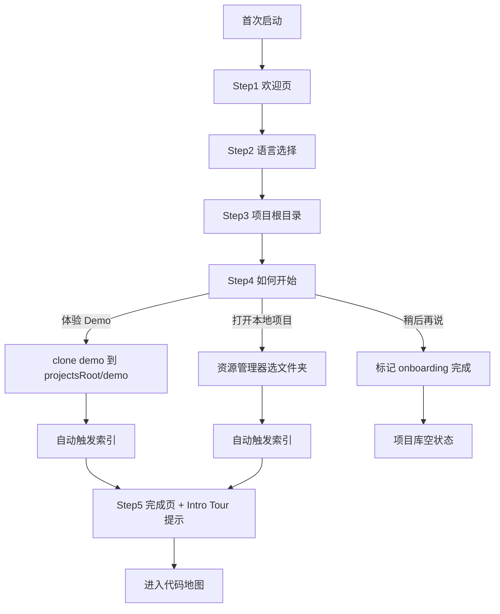

# Fieldguide 首次启动引导规格

> 版本：v0.2 | 状态：设计定稿（Phase 0，已纳入 Understand-Anything 集成）

---

## 一、目标

安装后首次打开应用时，通过向导完成：**语言选择 → 项目根目录 → 首个学习对象**，避免空白冷启动，并统一 Git clone 的默认落盘路径。

详见 [design-review.md](./design-review.md) §3.4「首次无项目」风险应对。

---

## 二、触发条件

| 条件 | 行为 |
|------|------|
| `config.onboardingCompleted !== true` | 全屏居中 wizard，阻塞主界面 |
| 已完成引导 | 直接进入项目库 |
| 设置页「重新运行引导」 | 可选，Phase 2+ |

---

## 三、流程

---

## 四、步骤详情

### Step 1 — 欢迎

- 标题：「欢迎使用 Fieldguide」
- 副文案：一句话说明产品（野外手册式代码/论文学习）
- 按钮：「开始设置」

### Step 2 — 语言

| 选项 | locale 值 | 默认 |
|------|-----------|------|
| 简体中文 | `zh-CN` | ✓ |
| 繁體中文 | `zh-TW` | |
| English (US) | `en-US` | |

- 选择后立即切换 wizard 文案（i18n 热切换验证）
- 写入 `config.locale`

### Step 3 — 项目根目录

- 说明：Git 克隆与 Demo 将默认保存在此目录；本地项目仍可选任意路径
- 默认建议：`%USERPROFILE%/Projects/Fieldguide`（Windows）
- 操作：
  - 「选择目录」→ 系统文件夹对话框
  - 「跳过」→ `projectsRoot` 留空，后续 Git 添加时每次询问
- 写入 `config.projectsRoot`

### Step 4 — 如何开始（三选一）

| 选项 | 行为 |
|------|------|
| **体验 Demo** | clone `fieldguide-demo` 到 `{projectsRoot}/demo/`（见 §五） |
| **打开本地项目** | 资源管理器选文件夹 → `project:addLocal` |
| **稍后再说** | 不添加项目，进入空状态 |

### Step 5 — 完成（仅 Demo / 本地项目路径）

- 索引进度条（非模态，可看到后台索引）
- 文案：「索引完成后，建议跟随 Intro Tour 了解主链路」
- 按钮：「打开代码地图」/ 「留在项目库」

完成后调用 `onboarding:complete`，设置 `config.onboardingCompleted = true`。

---

## 五、Demo 项目

| 项 | 值 |
|----|-----|
| 仓库 | `https://github.com/fieldguide-app/fieldguide-demo`（Phase 1 创建，见 [fieldguide-demo-spec.md](./fieldguide-demo-spec.md)） |
| slug | `demo` |
| 落盘路径 | `{projectsRoot}/demo/` |
| 体量 | Go + TypeScript 混合，~500 行，含 HTTP 入口 → service → 数据层 |
| 分发 | **按需 clone**，不内嵌安装包 |
| 失败降级 | clone 失败 → toast + 提供「打开本地项目」 |

索引完成后自动生成 Intro Tour（UA + LLM；无 Key 时仅结构图）。

---

## 六、UI 规格

- **布局**：全屏半透明遮罩 + 居中卡片（宽 480px，圆角 12px）
- **导航**：步骤指示器（1/4 … 4/4）；「上一步」「下一步」；最后一步无「下一步」
- **不可关闭**：首次引导无 ✕ 按钮；Esc 无效
- **与 ui-spec 关系**：详见 [ui-spec.md](./ui-spec.md) §2.4

---

## 七、IPC 与持久化

| 操作 | 通道 / 字段 |
|------|-------------|
| 完成引导 | `onboarding:complete` → `{ locale?, projectsRoot? }` |
| 添加 Demo | `project:addGit` → `{ url: DEMO_REPO_URL, targetPath: '{projectsRoot}/demo' }` |
| 添加本地 | `project:addLocal` → `{ path }` |
| 持久化 | `config.json`: `locale`, `projectsRoot`, `onboardingCompleted` |

---

## 八、设置页关联

引导完成后，用户可在设置页修改：

- **语言**：简中 / 繁中 / en-US（即时生效）
- **项目根目录**：更改后仅影响后续 Git clone 默认路径，不迁移已有项目

---

## 九、验收标准

- [ ] 首次启动必现 wizard，完成后不再出现
- [ ] 三语 wizard 文案完整
- [ ] Demo clone 失败有降级路径
- [ ] `projectsRoot` 写入 config 并在 Git 添加对话框中作为默认值
- [ ] 「稍后再说」可进入空状态且无阻塞
