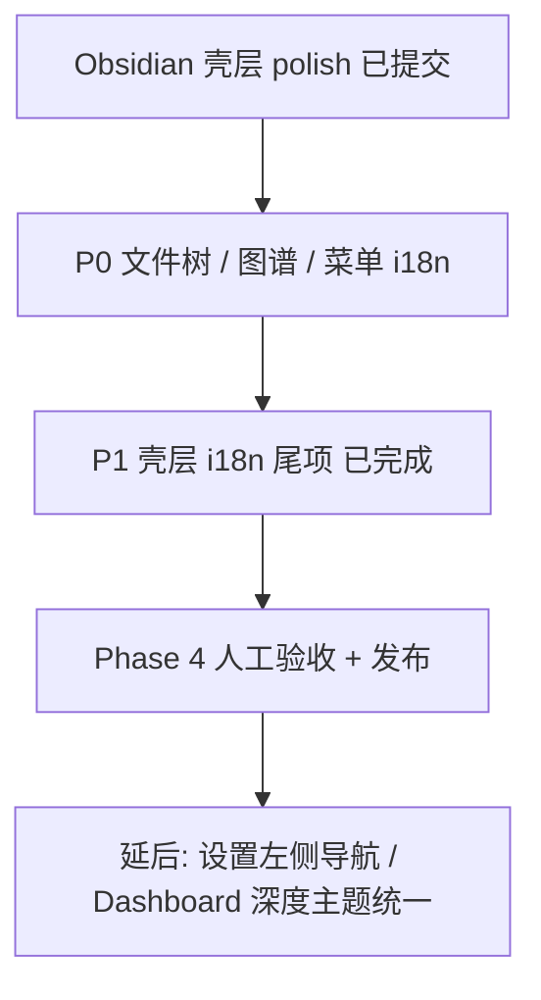

# Fieldguide 待办清单

> 最后更新：2026-07-13（Obsidian 壳层已提交 + P0 核心体验修复）  
> 来源：用户反馈（his-go 文件树 / 图谱桥接 / 系统菜单 i18n）+ Obsidian 壳层 polish  
> 相对完整路线图约 **96–98%**；用户可感知闭环约 **94%**；**视觉/交互质感 ~96%**；Phase 4 可发布约 **55%**（差人工验收）  
> 产品分阶段任务见 [roadmap.md](./roadmap.md)；界面规格见 [ui-spec.md](./ui-spec.md)；本文跟踪**下一步工程待办**。

---

## 当前快照（2026-07-13）

| Phase | 完成度 | 备注 |
|-------|--------|------|
| 0 设计 + Spike | 100% | 文档与 UA 集成 Spike 已通过 |
| 1 桌面壳 + UA | ~100% | 文件树深度/gitignore 对齐；图谱桥接补全；Electron 菜单三语 |
| 2 智能层 | ~95% | diff overlay 已转发至 Dashboard iframe |
| 3 理论 + 桥接 | ~90% | 桥接 + RAG + 对照 Tour + PDF 阅读器均已接线 |
| 4 发布 | ~55% | 安装包可构建；**待人工验收**（`ux-visual-regression` + `p4-release`） |
| **UX 质感** | **~96%** | Obsidian 壳层 polish 已提交（`f353d6a`）；P0 体验修复已落地 |

**基线验证**（2026-07-13）：`pnpm typecheck` ✅ · `pnpm test:unit` ✅（53 passed / 2 skipped）

**最近提交**：`f353d6a` — Obsidian 壳层 polish（modal scrim、设置布局、统一 Dialog、`clean:dist`）

### 用户场景完成度（相对 product-spec）

| 场景 | 完成度 | 主要缺口 |
|------|--------|----------|
| A 读懂新项目 | ~94% | his-go 等深层 `.go` 文件树已修复；30 分钟用户自测未验收 |
| B 论文↔实现 | ~92% | 功能齐；用户自测未做 |
| C 影响评估 | ~93% | diff 高亮已接线至 Dashboard；需 his-go 实测 |
| 可发布产品 | ~55% | 干净机器安装包 + 30 分钟用户自测待做 |

---

## 推进顺序（总览）



---

## P0 — 核心体验修复（2026-07-13 用户反馈 · ✅ 已完成）

> **背景**：his-go `backend-api-auth` 及同级 `.go` 不可见；图谱点击无跳转；Electron 顶部 File/Edit 菜单不随语言切换。

- [x] **p0-filetree** · 文件树与 UA 扫描对齐  
  - [`src/main/file-tree.ts`](../src/main/file-tree.ts)：`maxDepth` 8、节点上限 2000  
  - 新建 [`src/main/project-ignore.ts`](../src/main/project-ignore.ts)：共享 `IGNORE_DIRS` + UA `createIgnoreFilter` / `.gitignore` 回退  
  - [`FileTree.tsx`](../src/renderer/views/CodeMap/FileTree.tsx)：IPC 错误提示；`cmd`/`internal`/`services` 等自动展开  
  - 单测：[`src/main/__tests__/file-tree.test.ts`](../src/main/__tests__/file-tree.test.ts)  
  - 验收：以 his-go 为项目根 → `backend-api-auth` 及深层 `.go` 可见

- [x] **p0-graph-bridge** · 图谱桥接补全  
  - [`src/main/ua/dashboard.ts`](../src/main/ua/dashboard.ts)：`setTheme` / `setChromeless`；`nodeSelected` 携带 `nodeId`（store 轮询）  
  - [`App.tsx`](../src/renderer/App.tsx)：`diff:result` → `postToDashboard(setDiffOverlay)`  
  - [`GraphPanel.tsx`](../src/renderer/views/CodeMap/GraphPanel.tsx)：空图 / 索引中 / Dashboard 不可用三态占位  
  - 验收：点击图谱节点 → 左侧打开对应文件；diff 分析后节点高亮

- [x] **p0-menu-i18n** · Electron 系统菜单三语  
  - 新建 [`src/main/menu.ts`](../src/main/menu.ts)；[`index.ts`](../src/main/index.ts) 启动时应用；`config:set` 切换语言时重建  
  - 验收：设置 zh-CN / en-US 后顶部 **文件/编辑/视图** 同步切换

- [x] **p1-shell-i18n** · 壳层 i18n 尾项（同批完成）  
  - [`SplitPanel.tsx`](../src/renderer/views/CodeMap/SplitPanel.tsx) 分屏控件 + Tour Tab  
  - [`App.tsx`](../src/renderer/App.tsx) 命令面板 + 状态栏 `project.status.*`  
  - locale：`split.*` `commandPalette.*` `panels.tour` `fileTree.loadError` `codeMap.graphEmpty*`

### 下一步（P1 → Phase 4）

- [ ] **p4-manual-qa** · 按 [`ux-visual-regression.md`](./ux-visual-regression.md) + [`p4-release-checklist.md`](./p4-release-checklist.md) 人工验收  
- [ ] **p4-his-go-smoke** · his-go 全链路：索引 → 文件树 → 图谱点击 → diff 高亮  
- [ ] **p4-packaged-dashboard** · `pnpm dist` 前确认 UA Dashboard `dist` 已构建并打入 `extraResources`  
- [ ] **ux-settings-left-nav** · Obsidian 式设置左侧导航（延后，非阻断发布）  
- [ ] **ux-dashboard-theme-deep** · Dashboard 与壳层 CSS 变量深度统一（延后）

---

## 历史快照（2026-07-12）

| Phase | 完成度 | 备注 |
|-------|--------|------|
| 0 设计 + Spike | 100% | 文档与 UA 集成 Spike 已通过 |
| 1 桌面壳 + UA | ~100% | 活动面板、分屏持久化、文件 Tab、左码右图默认均已接线 |
| 2 智能层 | ~95% | diff/增量/全量 UI 已接线；仅增量/全量无 LLM cost dialog 集成 |
| 3 理论 + 桥接 | ~90% | 桥接 + RAG + 对照 Tour + PDF 阅读器 + AI 推荐桥接均已接线 |
| 4 发布 | ~55% | 安装包可构建；**待人工验收**（`ux-visual-regression` + `p4-release`） |
| **UX 质感** | **~95%** | 主题 v2 + token 化 + Lucide + 三语 i18n 接线完成 |

**基线验证**（2026-07-12）：`pnpm typecheck` ✅ · `pnpm test:unit` ✅（47 passed / 2 skipped）

**状态**：Obsidian Phase A–D 已于 `f353d6a` 提交

### 用户场景完成度（2026-07-12）

| 场景 | 完成度 | 主要缺口 |
|------|--------|----------|
| A 读懂新项目 | ~92% | 内置 demo + 索引进度条/骨架已接线；30 分钟用户自测未验收 |
| B 论文↔实现 | ~92% | 功能齐 + 视觉/i18n 已收尾；用户自测未做 |
| C 影响评估 | ~90% | diff 一键分析 + 增量/全量选择已接线；Dashboard 高亮需实测 |
| 可发布产品 | ~55% | 功能与文档齐；干净机器安装包 + 30 分钟用户自测待做 |

---

## 待办（按优先级）

### P0 — Obsidian 对齐 UX（2026-07-10 方案 · Phase A–D ✅ 2026-07-10）

> **目标**：默认羊皮纸质感、精致侧栏与滚动条、界面缩放、活动面板文件路由、IDE 式索引进度。  
> **状态**：Phase A–D + 主题 v2 + Obsidian 壳层 polish **已提交**（`f353d6a`）；P0 核心体验修复见文首 **2026-07-13** 区块。
> **分屏策略（已定）**：见 **ux-split-policy** — 双栏默认**左代码 / 右图谱**，可配置且持久化，不写死。

#### Phase A — 设计系统与默认主题（Week 1）

- [x] **ux-tokens** · 语义化 CSS 令牌层  
  - 新建 [`src/renderer/theme/tokens.css`](../src/renderer/theme/tokens.css)，从 [`index.css`](../src/renderer/index.css) 迁出并扩展  
  - 令牌：`--fg-bg` `--fg-card` `--fg-border` `--fg-text-*` `--fg-accent` `--fg-accent-muted` `--fg-tree-selected` `--fg-tree-hover` `--fg-tab-active` `--fg-scrollbar-thumb` `--fg-scrollbar-track`  
  - 验收：`index.css` 仅 `@import` tokens；壳层组件不再新增硬编码 `#E4E6F1` / `gray-*`（存量逐步替换）

- [x] **ux-parchment-default** · 默认「羊皮纸」主题（v1 · 2026-07-10）  
  - v1 色板：主背景 `#F5F0E1`，卡片 `#FAF6EB`，强调 `#6B8F71`  
  - 修改 [`config.ts`](../src/main/config.ts)：`appearance.themePreset` 默认 `parchment`；[`App.tsx`](../src/renderer/App.tsx) `applyTheme` 按 preset 注入 `data-theme-preset`  
  - **后续**：v2 色板升级见 **ux-parchment-v2**（2026-07-12，工作区 WIP）

- [x] **ux-theme-presets** · 设置页 5 套主题预设  
  - 预设：`parchment`（默认）· `forest` · `slate` · `midnight` · `paper-dark`  
  - 扩展 [`SettingsPanel.tsx`](../src/renderer/views/SettingsPanel.tsx)「外观」分组：色块预览卡片 + 点击即时预览 + 保存持久化  
  - i18n：`appearance.themePreset.*`（zh-CN / zh-TW / en-US）  
  - 验收：切换预设后顶栏/侧栏/面板 Tab/状态栏同步变色；重启后保持

- [x] **ux-scrollbar** · 细滚动条（主题感知）  
  - 在 `tokens.css` 增加 `::-webkit-scrollbar` 规则（宽 8px、圆角 thumb、track 随主题）  
  - 验收：文件树、代码区、设置弹窗内滚动条风格一致，暗色/羊皮纸均可读

- [x] **ux-icons** · Lucide 图标 + 文件类型图标  
  - 依赖：`lucide-react`  
  - 新建 [`src/renderer/components/icons/FileIcon.tsx`](../src/renderer/components/icons/FileIcon.tsx)（按扩展名映射 10–15 种，参考 Seti 简化）  
  - 替换 [`FileTree.tsx`](../src/renderer/views/CodeMap/FileTree.tsx)、[`App.tsx`](../src/renderer/App.tsx) 顶栏、[`SettingsPanel.tsx`](../src/renderer/views/SettingsPanel.tsx) 中的 emoji  
  - 验收：目录树文件夹开/合图标；`.go` `.ts` `.md` 等有区分色图标

- [x] **ux-filetree-visual** · 文件树视觉与主题对齐  
  - 文件：[`FileTree.tsx`](../src/renderer/views/CodeMap/FileTree.tsx)  
  - 选中/悬停改用 `--fg-tree-selected` / `--fg-tree-hover`；单行 ellipsis；16px 缩进  
  - 验收：深色/羊皮纸下选中项对比度达标（WCAG AA）；与 ui-spec §3.2 一致

- [x] **ux-modal-theme** · 弹窗/引导全主题适配  
  - 文件：[`SettingsPanel.tsx`](../src/renderer/views/SettingsPanel.tsx)、[`OnboardingWizard.tsx`](../src/renderer/views/OnboardingWizard.tsx)、[`ProjectLibrary`](../src/renderer/views/ProjectLibrary/) 各 Dialog、[`CostDialog.tsx`](../src/renderer/views/CostDialog.tsx)  
  - 将 `bg-white` / 硬编码输入样式改为 `var(--fg-card)` + 主题感知 `.fg-input`  
  - 验收：系统暗色 + 应用羊皮纸时，设置/onboarding 文字与背景均可读

#### Phase B — 缩放与布局舒适度（Week 2，可与 A 尾部并行）

- [x] **ux-zoom** · 界面缩放 50%–200%（默认 100%）  
  - 配置：[`config.ts`](../src/main/config.ts) `appearance.zoom: number`（默认 100）  
  - 实现：[`App.tsx`](../src/renderer/App.tsx) 挂载时 `document.documentElement.style.fontSize` 或 `#root` zoom；代码区可选独立 `--fg-code-font-size`  
  - 设置页：滑块 + 数字输入，步进 10%  
  - 快捷键：`Ctrl+=` / `Ctrl+-` / `Ctrl+0`（[`App.tsx`](../src/renderer/App.tsx) 或全局 hotkey）；toast 显示当前比例  
  - 命令面板「切换主题」同步改为持久化写入 config（修现有不落盘问题）  
  - 验收：缩放后布局不破；重启保持；代码区行号仍对齐

- [x] **ux-font-settings** · UI / 代码字体分开（Obsidian 式）  
  - 设置页：UI 字体、代码字体下拉（Segoe UI / Inter / Cascadia Code / Consolas 等）  
  - 写入 config + CSS 变量 `--fg-font-ui` `--fg-font-mono`  
  - 验收：仅代码面板字体变化，顶栏/侧栏跟随 UI 字体

- [x] **ux-sidebar-persist** · 侧栏宽度持久化  
  - [`App.tsx`](../src/renderer/App.tsx) 文件树拖拽宽度写入 `config.appearance.sidebarWidth`（160–400，默认 260）  
  - 验收：重启后侧栏宽度保持

#### Phase C — 活动面板与分割窗口（Week 2–3）

- [x] **ux-split-policy** · 分屏策略定稿 (2026-07-10)  
  - **单面板**：默认「图谱」Tab（进入代码地图先看全景，与 ui-spec §2.2 一致）  
  - **双面板默认布局**：**左 = 代码，右 = 图谱**（与当前实现左图右码相反，实现时以 config 默认值驱动，禁止写死在组件内）  
  - **打开文件**：不自动分屏（对齐 Obsidian）；仅更新**活动面板**的 `filePath`  
  - **可更改（不写死）**：  
    - 顶栏布局按钮：单栏 / 左右 / 上下（`ux-split-controls`）  
    - 每面板 Tab 可自由切换图谱/代码/问答/Tour  
    - **交换左右面板**（按钮或拖拽，纳入 `ux-split-controls`）  
    - 分屏比例 `splitPos`、面板顺序与 `activeTab` 写入 `workspaceLayout` 并持久化（`ux-layout-persist`）  
  - **实现约束**：默认布局仅从 `config.workspaceLayout` 或 store 初始值读取；禁止在 `SplitPanel` `useEffect` 里硬编码左右内容  
  - 下游：`ux-panel-model` → `ux-open-routing` 按此策略实现

- [x] **ux-panel-model** · 每面板独立状态  
  - 重构 [`SplitPanel.tsx`](../src/renderer/views/CodeMap/SplitPanel.tsx)：`PanelState { id, tabs, activeTab, filePath? }`  
  - 实现：[`useWorkspaceLayout.ts`](../src/renderer/hooks/useWorkspaceLayout.ts)：`panels[]` `activePanelIndex` `splitPos` `splitDirection`  
  - **默认双栏初始值**（`ux-split-policy`）：`panels[0].activeTab='code'`，`panels[1].activeTab='graph'`；单栏时 `activeTab='graph'`  
  - 移除 [`App.tsx`](../src/renderer/App.tsx) 全局 `activeFilePath` 作为唯一真相；改为 layout store  
  - 验收：双面板时两栏可显示不同内容与文件；新建双栏为左代码右图谱

- [x] **ux-active-panel** · 活动面板焦点  
  - 点击面板标题栏/内容区 → `setActivePanel(id)`；活动面板 `ring-1 ring-[var(--fg-accent)]` 或底边高亮  
  - 验收：用户能明确看到当前哪个面板接收「打开文件」

- [x] **ux-open-routing** · 文件打开路由到活动面板  
  - 文件树、命令面板跳文件、节点搜索 → 更新 `activePanel.filePath`；若 activePanel 非 code 则切到 code tab  
  - 删除 `SplitPanel` 中 `useEffect` 强制分屏/右栏切 code 的逻辑（见当前 L22–28）  
  - 验收：双栏（左代码右图谱）时，活动面板在右侧图谱、点文件 → **仅右栏**切代码并打开；左栏代码文件不变

- [x] **ux-graph-node-routing** · 图谱节点 → 活动面板  
  - [`App.tsx`](../src/renderer/App.tsx) `dashboard nodeSelected` 回调写入 activePanel.filePath（非全局）  
  - 验收：图谱点节点后，仅活动面板跳转代码；另一面板保持

- [x] **ux-split-controls** · 顶栏分屏布局按钮 + 面板交换  
  - ui-spec §2.3：单面板 / 左右 / 上下（[`App.tsx`](../src/renderer/App.tsx) 代码地图 Tab 内）  
  - 扩展 `SplitPanel` 支持 `flex-col` 纵向分割；面板最小宽 280px  
  - **交换左右面板**：一键互换 `panels[0]`/`panels[1]` 顺序（满足「默认左码右图但可改」）  
  - 验收：三种布局可切换；交换后左右内容对调且可持久化；比例可拖拽

- [x] **ux-layout-persist** · 工作区布局持久化  
  - config：`workspaceLayout`（`panels` 顺序与各 `activeTab`/`filePath`、`activePanelId`、`splitPos`、`splitDirection`）  
  - 用户交换左右栏或改 Tab 后写入 config；**默认值**左代码右图谱，用户改动覆盖默认  
  - 按 `projectId` 或全局存储（先全局，后续可 per-project）  
  - 验收：重启应用恢复上次布局（含左右顺序）；重置布局可回到默认左码右图

- [x] **ux-file-tabs** · 每面板文件 Tab 栏（Obsidian 多文件）  
  - 每 panel：`openFiles: { path, id }[]` `activeFileId`；Tab 可关闭、切换  
  - 验收：同面板打开 3 个文件可 Tab 切换；关闭 Tab 不关闭面板

- [x] **ux-panel-maximize** · 面板最大化  
  - 快捷键 `Ctrl+Shift+M`（ui-spec）；临时隐藏另一面板  
  - 验收：最大化后还原比例

#### Phase D — 索引进度与图谱体验（Week 3–4）

- [x] **ux-index-phase-i18n** · 索引阶段文案本地化  
  - 主进程 [`client.ts`](../src/main/ua/client.ts) / IPC 输出 phase key（`scan` `parse` `embed` …）  
  - i18n：`index.phase.*`；状态栏显示「正在解析文件…」而非 `parse 45/100`  
  - 验收：三语阶段名正确；保留 `current/total` 数字

- [x] **ux-progress-store** · 索引进度全局状态  
  - 实现：[`useIndexProgress.ts`](../src/renderer/hooks/useIndexProgress.ts)：订阅 `index:progress` / `complete` / `error`  
  - 验收：App / Onboarding / ProjectLibrary 可共享同一进度源

- [x] **ux-statusbar-progress** · 状态栏 IDE 式进度条  
  - 扩展 [`App.tsx`](../src/renderer/App.tsx) 状态栏：3px determinate 条 + 阶段标签 + `current/total`  
  - 非阻塞：索引中仍可切换 Tab（ui-spec 已有要求）  
  - 验收：打开项目 reindex 时底部可见连续进度；完成后淡出

- [x] **ux-onboarding-progress** · 引导 Step 5 真实进度  
  - [`OnboardingWizard.tsx`](../src/renderer/views/OnboardingWizard.tsx) 替换固定 60% 假条，接入 `ux-progress-store`  
  - 验收：demo/本地项目索引时进度条与状态栏一致

- [x] **ux-projectlib-progress** · 项目库索引进度环  
  - [`ProjectLibrary.tsx`](../src/renderer/views/ProjectLibrary/ProjectLibrary.tsx) `indexing` 状态显示环形进度（非仅文字 badge）  
  - 订阅 `index:progress` 实时更新，无需手动刷新列表  
  - 验收：索引中项目卡片可见旋转/百分比

- [x] **ux-graph-skeleton** · 图谱加载骨架与空态  
  - [`GraphPanel.tsx`](../src/renderer/views/CodeMap/GraphPanel.tsx)：iframe `onLoad` 前骨架屏；无 graph JSON 时说明「索引完成后显示图谱」  
  - 索引失败时错误态 + 重试  
  - 验收：首次打开项目不再长时间白屏；用户能理解「图谱未就绪」≠「功能缺失」

- [x] **ux-graph-refresh** · 索引完成后自动刷新图谱  
  - `index:complete` → 通知 GraphPanel reload iframe 或 postMessage `reloadGraph`  
  - 验收：无需手动切换项目即可看到新节点

- [x] **ux-dashboard-theme** · Dashboard iframe 主题与壳层统一  
  - 合并原 **p4-theme-unify**；postMessage 或 URL 参数传递 `--fg-accent` / 背景色  
  - 依赖 UA Dashboard 是否支持主题注入；不支持则文档记录限制  
  - 验收：羊皮纸主题下图谱背景不刺眼割裂

- [ ] **ux-tree-index-dots** · 文件树索引状态点（可选）  
  - ui-spec：已索引绿点 / 未索引灰点（按文件或目录聚合）  
  - 验收：reindex 后绿点更新

#### 主题 v2 刷新（2026-07-12 · 参考 sampleTheme.png）

> **设计意图**：从 v1「暖黄旧纸」改为「现代笔记本 / 软科学」质感 — 米白网格底、白卡片、中性灰边框、鼠尾草绿强调（`#4A8B71`），对齐 [`sampleTheme.png`](../sampleTheme.png)。  
> **状态**：工作区已实现，**待 commit**；`pnpm typecheck` + `pnpm test:unit` 已通过。
> **依赖**：`ux-parchment-v2` → `ux-parchment-grid` → `ux-theme-components-batch1` → **ux-spec-sync**（已同步 ui-spec §5.1 新色值）。

- [x] **ux-parchment-v2** · 羊皮纸 preset 色板升级  
  - 文件：[`tokens.css`](../src/renderer/theme/tokens.css) parchment 块、[`SettingsPanel.tsx`](../src/renderer/views/SettingsPanel.tsx) 预览色块  
  - 色值对照（v1 → v2）：  
    | 令牌 | v1 | v2 |
    |------|----|----|
    | `--fg-bg` | `#F5F0E1` | `#FDFCF8` |
    | `--fg-card` | `#FAF6EB` | `#FFFFFF` |
    | `--fg-border` | `#D4C9A8` | `#E0E0E0` |
    | `--fg-text-primary` | `#3D3529` | `#222222` |
    | `--fg-accent` | `#6B8F71` | `#4A8B71` |
    | `--fg-accent-muted` / tree-selected | `#E8F0E4` | `#EBF4F0` |
  - 新增 parchment 专用：`--fg-sidebar-bg: #F8F7F4`；`--fg-status-info` / `--fg-status-info-bg`；`--fg-status-warning` / `--fg-status-warning-bg`  
  - 验收：设置页 parchment 预览与首屏一致；强调色与 sampleTheme 绿系接近

- [x] **ux-parchment-grid** · 网格纸背景纹理  
  - 文件：[`index.css`](../src/renderer/index.css)  
  - 实现：`:root[data-theme-preset="parchment"] body` 叠加 20×20px、`rgba(0,0,0,0.035)` 细线网格  
  - 验收：仅 parchment preset 生效；forest/slate/midnight/paper-dark 无网格；正文区可读性不降

- [x] **ux-theme-sidebar** · 侧栏与分割条主题化  
  - 文件：[`App.tsx`](../src/renderer/App.tsx)  
  - 文件树容器：`bg-[var(--fg-sidebar-bg,var(--fg-bg))]`  
  - 宽度拖拽条 hover：`hover:bg-blue-400` → `hover:bg-[var(--fg-accent)]`  
  - 验收：侧栏与主区有轻微层次差；拖拽条 hover 跟随当前 preset 强调色

- [x] **ux-theme-chat-tour** · 问答 / Tour 面板 token 化  
  - 文件：[`ChatPanel.tsx`](../src/renderer/views/CodeMap/ChatPanel.tsx)、[`TourPanel.tsx`](../src/renderer/views/CodeMap/TourPanel.tsx)  
  - 清除：`bg-blue-600` `bg-blue-500` `bg-blue-100` `text-gray-*` `border-yellow-*` `bg-red-50` 等  
  - 替换为：`--fg-accent`（用户气泡/发送/播放按钮）、`--fg-status-warning-*`（system 消息）、`--fg-tree-hover` / `--fg-accent-muted`（Tour 步骤高亮）  
  - 验收：切换 parchment / midnight 后聊天气泡与 Tour 高亮均随主题变化

- [x] **ux-theme-projectlib** · 项目库 token 化  
  - 文件：[`ProjectLibrary.tsx`](../src/renderer/views/ProjectLibrary/ProjectLibrary.tsx)  
  - 卡片 hover：`hover:border-blue-300` → `hover:border-[var(--fg-accent)]`  
  - StatusBadge：`bg-green-100` / `bg-yellow-100` 等 → `--fg-status-*` 令牌  
  - AddDialog / DiffResultDialog：`bg-white` `bg-black/25` `text-gray-*` `ring-blue-500` → card / overlay / fg-input / accent tokens  
  - 验收：项目库在 parchment v2 下无白底弹窗、无 Tailwind 原色残留（操作按钮 emoji 另见 **p4-i18n-emoji-tail**）

- [x] **ux-theme-tail** · 次级视图 **颜色 token 化**（工作区完成，未提交）  
  - 已改：`TheoryView` / `ConceptBridge` / `PdfReader` / `BridgeView` / `CostDialog` / `OnboardingWizard` / `GraphPanel` / `CodeViewer` / `syntax.tsx` / `Toast` / `FolderPathField`  
  - 验收（颜色）：`src/renderer/**/*.tsx` 无 `gray-*` / `bg-white` / `blue-*` 残留 ✅  
  - **未达验收（图标）**：emoji 仍在 locale 键与 `GraphPanel` 层栏等；Lucide 替换见 **p4-i18n-emoji-tail**

#### Phase E — 文档与验收（贯穿）

- [x] **ux-spec-sync** · 同步 ui-spec / README / roadmap（2026-07-12）  
  - [x] ui-spec §5.1 parchment v2 + 网格纹理  
  - [x] README 外观/缩放/主题预设说明  
  - [x] roadmap Phase 4 状态更新  
  - 验收：文档与 `tokens.css` 一致

- [x] **ux-visual-regression** · 关键界面人工验收清单  
  - 清单见 [`ux-visual-regression.md`](./ux-visual-regression.md)；截图基线目录 `docs/screenshots/ux-baseline/`  
  - 自动化：`src/renderer/theme/__tests__/theme-tokens.test.ts` 校验 preset token  
  - 人工勾选与干净机器安装见 [`p4-release-checklist.md`](./p4-release-checklist.md)

---

### P0 — 解锁核心学习体验（后端已有，补 UI 接线）

- [x] **p2-diff-ui** · 变更影响分析 UI 接线  
  - Phase 2.6 / 场景 C  
  - 后端已完成：[`diff.ts`](../src/main/ua/diff.ts) + IPC `diff:analyze` + Dashboard `setDiffOverlay`  
  - 待做：在 [`ProjectLibrary.tsx`](../src/renderer/views/ProjectLibrary/ProjectLibrary.tsx) 或代码地图工具栏增加「分析变更影响」按钮，调用 `window.fieldguide.diffAnalyze(projectId)`，展示 changed/affected 节点摘要  
  - 验收：修改源码后 stale 项目可一键触发，Dashboard 高亮受影响节点

- [x] **p3-cross-tour-ui** · 对照 Tour 生成 UI 接线  
  - Phase 3.6 / 场景 B  
  - 后端已完成：[`cross-tour.ts`](../src/main/ua/cross-tour.ts) + IPC `bridge:generateTour`  
  - 待做：在 [`ConceptBridge.tsx`](../src/renderer/views/Theory/ConceptBridge.tsx) 或 [`BridgeView.tsx`](../src/renderer/views/Bridge/BridgeView.tsx) 增加「生成对照 Tour」按钮，生成后通知 Dashboard 播放  
  - 验收：≥3 条 concept_links 可一键生成 paper↔code 交替 Tour

- [x] **p1-bundled-demo** · 内嵌示例项目 + onboarding 复制安装 (2026-07-08)  
  - `resources/sample-project/` + `project:installDemo` IPC + electron-builder extraResources  
  - 预置 `knowledge-graph.json`，引导可离线秒开图谱  
  - 取代原 `fieldguide-demo` 独立 GitHub 仓库方案

- [x] ~~**p1-demo-push**~~ · ~~推送 `fieldguide-demo` 至 GitHub org~~（已取消，改用内嵌 sample）

### P0 — 已完成

- [x] **p2-ua-llm** · 接入 UA LLM 索引（摘要、Tour、架构分析），扩展 [`src/main/ua/client.ts`](../src/main/ua/client.ts)  
  - 已完成：LLM 文件摘要、架构层检测（layers）、Tour 生成（含 heuristic fallback），batch 3 文件/120s 超时/15KB 截断

- [x] **p2-postmessage** · Dashboard ↔ 壳层 postMessage（节点高亮、Tour 同步、Ctrl+K 跳转）  
  - 已完成：双向 postMessage 协议，通过 dashboard.ts HTML 注入 bridge 脚本

- [x] **p3-lancedb** · PDF 分块 + SQLite 向量检索 + `query_paper`  
  - 已完成：`src/main/vector/` 三模块 + IPC `paper:index`/`paper:query`/`paper:indexStatus`；chat:send 自动 RAG top-3

- [x] **p2-diff-ui** · 变更影响分析 UI 接线 (2026-07-07)  
  - 已完成：`preload` 新增 `onDiffResult` 事件桥接；`ProjectLibrary.tsx` 添加 📊 分析按钮 + DiffResultDialog；stale/ready 可一键触发变更影响

- [x] **p3-cross-tour-ui** · 对照 Tour 生成 UI 接线 (2026-07-07)  
  - 已完成：`preload` 新增 `onBridgeTourGenerated` 事件桥接；`BridgeView.tsx` 添加 🔮 生成对照 Tour 按钮 + TourResultDialog；≥1 条 concept_links 即可生成

### P1 — Phase 1 收尾 + 冷启动

- [x] **p1-onboarding-ui** · Onboarding Demo 三选一 UI 接线  
  - 已完成：[`OnboardingWizard.tsx`](../src/renderer/views/OnboardingWizard.tsx) demo clone / 本地文件夹 / skip

- [x] **p1-onboarding-step5** · 引导完成页 + Tour 提示 (2026-07-07)  
  - 已完成：`OnboardingWizard` 新增 Step 5（索引进度 → 完成页 + 「打开代码地图/留在项目库」按钮）；`App.tsx` 新增 `handleOnboardingSetup`（项目创建+索引，不关闭向导）  
  - 原 `handleOnboardingStart` 简化为 `skip` 的直接完成路径

- [x] **p1-fieldguide-demo** · ~~创建 `fieldguide-demo` 仓库~~ → 已合并为 `resources/sample-project/`

- [x] **p1-phase1-tail** · Phase 1 收尾：本地文件夹选择器、抽取 `graph-reader.ts`  
  - 已完成：`dialog:openFolder` IPC + graph-reader + graph:* IPC

### P1 — 差异化体验

- [x] **p2-incremental-ui** · 增量 / 全量索引显式选择 (2026-07-07)  
  - 已完成：`ProjectLibrary` 新增「🔁 全量」按钮（带确认对话框）+ `onFullReindex` prop；`App.tsx` 接入全量重建

- [x] **p3-pdf-reader** · 应用内 PDF 阅读器 + 高亮笔记 (2026-07-07)  
  - 已完成：`PdfReader.tsx`（react-pdf 分页阅读 + 文本选择 + 浮窗「🔗 桥接」按钮）；`TheoryView` 接入应用内阅读器；`ConceptBridge` 支持 `initialAnchorText` 预填；选中文本一键关联代码节点

- [x] **p3-bridge-ai-suggest** · AI 推荐桥接节点 (2026-07-07)  
  - 已完成：`ConceptBridge` 新增「🤖 AI 推荐」按钮；调用 `chat:send` 传入论文摘要+候选节点列表，LLM 返回编号后解析为推荐节点，紫色列表展示可点击选择

### P2 — 已完成（工程基线）

- [x] **p3-bridge-tab** · 顶栏「桥接」Tab 接入 [`BridgeView.tsx`](../src/renderer/views/Bridge/BridgeView.tsx)

- [x] **p2-cost-dialog** · LLM 索引成本确认对话框 [`CostDialog.tsx`](../src/renderer/views/CostDialog.tsx)

- [x] **p2-incremental-partial** · 增量索引后端 + stale badge「更新索引」  
  - UI 显式选择见 **p2-incremental-ui**

- [x] **eng-vitest** · Vitest 单测基线  
  - 49 passed / 2 skipped（config-bridge 10 + graph-reader 16 + IPC 8 + vector 15）

- [x] **eng-tsconfig** · TypeScript 三份 tsconfig 分层，`pnpm typecheck` 通过

- [x] **eng-workspace** · pnpm workspace 与 UA sibling 对齐

- [x] **eng-docs-sync** · 同步 README/roadmap/doc-index（2026-07-05 批次）

- [x] **p2-diff-backend** · 变更影响分析后端 + Dashboard overlay  
  - 实现：[`diff.ts`](../src/main/ua/diff.ts) + IPC `diff:analyze` + `setDiffOverlay` postMessage  
  - UI 接线见 **p2-diff-ui**

- [x] **p2-domain-view** · 领域视图（层导航栏 + Dashboard `drillIntoLayer`）

- [x] **p3-cross-tour-backend** · 对照 Tour 生成 + 跨源 Agent 上下文  
  - 实现：[`cross-tour.ts`](../src/main/ua/cross-tour.ts) + IPC `bridge:generateTour` + chat:send Concept Links 段  
  - UI 接线见 **p3-cross-tour-ui**

### P3 — Phase 4 发布与打磨

- [x] **p4-release** · NSIS 安装包干净机器实测  
  - 验收清单见 [`p4-release-checklist.md`](./p4-release-checklist.md)  
  - `pnpm dist` 可构建；干净 Win10/11 人工验收待勾选  
  - 已完成（2026-07-10）：`pnpm dist` 产出 `dist/Fieldguide Setup 0.2.0.exe` + `dist/win-unpacked/Fieldguide.exe`  
  - 待做：干净 Win10/11 机器安装验收；免安装版从非项目目录启动验收；Obsidian UX 后首屏羊皮纸与分屏默认值验收  
  - 与 **ux-visual-regression** 合并执行

- [x] **p4-about** · 关于页 + UA 归属说明（MIT） (2026-07-08)  
  - 已完成：[`AboutDialog.tsx`](../src/renderer/views/AboutDialog.tsx) + 三语 i18n `about.*` 键；设置面板底部 ℹ️ 链接打开

- [x] **eng-docs-sync-2** · 同步 README 与 todos 至实际状态 (2026-07-08)  
  - README：diff 标记 ✅，测试数 47→49，Phase 完成度更新，已完成列表补全

- [ ] ~~**p4-theme-unify**~~ · 已并入 **ux-dashboard-theme**（Obsidian UX Phase D）

- [x] **p4-i18n-polish** · OnboardingWizard i18n 化 (2026-07-08)  
  - 已完成：[`OnboardingWizard.tsx`](../src/renderer/views/OnboardingWizard.tsx) 全部硬编码中文替换为 `t()` 调用；三语添加 `onboarding.*` 翻译键（25 个键覆盖全部步骤）  
  - 待续：其他组件（ChatPanel、BridgeView、CostDialog 等）仍有少量硬编码

- [ ] **eng-user-test** · 场景 A「30 分钟口述主链路」用户自测  
  - roadmap Phase 2 验收；功能齐但未经真实用户路径验证；建议在 **ux-visual-regression** 后执行

- [x] **p4-i18n-emoji-tail** · 次级组件 i18n 接线 + Lucide 图标（2026-07-12）  
  - ChatPanel / TourPanel / GraphPanel / ProjectLibrary / CommandPalette / Theory / Bridge / PdfReader / Onboarding / Settings / CostDialog  
  - 三语 locale 去 emoji；`src/renderer/**/*.tsx` 无 emoji 残留  
  - 验收：`pnpm typecheck` ✅

---

## 目录与配置索引（维护参考）

```
Fieldguide/
├── docs/                    设计文档（入口：doc-index.md）
├── sampleTheme.png          主题 v2 视觉参考（米白网格 + 鼠尾草绿强调）
├── resources/               应用图标、内置 sample-project（demo）
├── scripts/                 Spike 脚本（spike-electron.mjs 等）
├── src/
│   ├── main/                Electron 主进程
│   │   ├── ua/              UA 集成层（client / dashboard / config-bridge / graph-reader / diff / cross-tour）
│   │   ├── ipc/             IPC handler 聚合（index.ts）
│   │   ├── vector/          PDF 分块 + 向量检索
│   │   └── db/              SQLite 接入
│   ├── preload/             contextBridge API
│   ├── renderer/            React UI
│   │   ├── theme/           CSS 令牌与主题预设（tokens.css）
│   │   ├── hooks/           useWorkspaceLayout / useIndexProgress
│   │   └── components/icons/  FileIcon + Lucide 文件类型图标
│   └── shared/              三端共用类型与 IPC schema
├── tests/fixtures/tiny-go/  测试 fixture（graph JSON + 样例 Go 项目）
├── tsconfig.json            renderer 类型检查
├── tsconfig.node.json       main / preload / shared 类型检查
└── tsconfig.vitest.json     单测类型检查
```

| 命令 | 检查范围 |
|------|----------|
| `pnpm typecheck` | renderer + main/preload/shared + 测试文件 |
| `pnpm test:unit` | `src/**/__tests__/**/*.test.ts` |
| `pnpm dev` | electron-vite 开发（依赖 sibling UA workspace） |
| `pnpm dist` | NSIS 安装包（需 `resources/icon.ico`） |

---

## 维护说明

- 完成一项后，将 `- [ ]` 改为 `- [x]`，并在提交说明中注明 id（如 `ux-tokens`）。
- **Obsidian UX 批次**：Phase A–D（`837c4a8`）+ 主题 v2 **工作区完成未提交**；收尾：`ux-spec-sync`（README/roadmap）→ `p4-i18n-emoji-tail` → `ux-visual-regression` → `p4-release`。
- **后端与 UI 分拆**：后端已通但 renderer 未接线时，用 `*-backend`（已完成）+ `*-ui`（待办）两条跟踪，避免误标完成。
- 新增待办请标明优先级（P0–P3）与对应 roadmap / ui-spec 章节。
- 大范围优先级调整时，同步更新本文件与 Cursor 计划中的 todos。
- 改 tsconfig / workspace / 目录结构后，跑 `pnpm typecheck && pnpm test:unit` 验证。

### Obsidian UX 推荐实施顺序（速查 · Phase A–D 已完成）

| 顺序 | ID | 状态 |
|------|-----|------|
| 1 | ux-tokens → ux-parchment-default | ✅ |
| 2 | ux-scrollbar → ux-icons → ux-filetree-visual | ✅ |
| 3 | ux-theme-presets → ux-modal-theme | ✅ |
| 4 | ux-zoom → ux-font-settings → ux-sidebar-persist | ✅ |
| 5 | ux-panel-model → ux-active-panel → ux-open-routing | ✅ |
| 6 | useIndexProgress → ux-statusbar-progress → ux-onboarding-progress | ✅ |
| 7 | ux-graph-skeleton → ux-graph-refresh → ux-dashboard-theme | ✅ |
| 8 | ux-split-controls → ux-layout-persist → ux-file-tabs → ux-panel-maximize | ✅ |
| 9a | ux-parchment-v2 → ux-theme-tail | ✅ |
| 9b | ux-spec-sync + p4-i18n-emoji-tail | ✅ |
| 9c | ux-visual-regression → p4-release → eng-user-test | ⬜ **请你验收** |
| — | ux-tree-index-dots | ⬜ 可选 |
