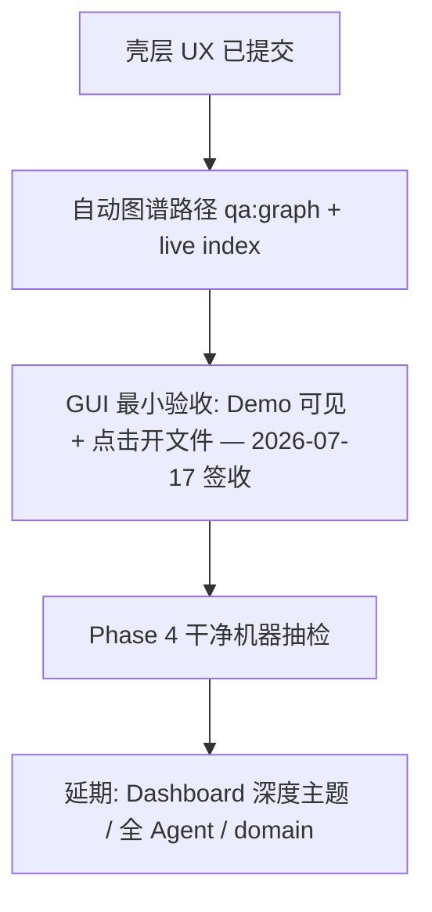

# Fieldguide 待办清单

> 最后更新：2026-09-20（**Obsidian 联动 F-17 落地**；E2E 端到端测试层 + 审计 A/B/C 三档 + P0 缺陷已全部完成，见下文分节）  
> 来源：UA 图谱未落地根因排查落地 + `qa:graph` / bridge runtime / `prepare-pack` + 差距审计（[gap-analysis-and-feature-roadmap.md](./gap-analysis-and-feature-roadmap.md)）  
> **壳层 / UX ~98%**；**UA 图谱能力 ~85%**（结构索引 + Dashboard + 增量合并 + **点击开文件闭环已签收**）；完整六 Agent / domain **明确延期**；发布链路（自动更新 / 代码签名）未做  
> 产品分阶段任务见 [roadmap.md](./roadmap.md)；UA 集成见 [understand-anything-integration.md](./understand-anything-integration.md)；本文跟踪**下一步工程待办**。

---

## 当前快照（2026-07-16）

| Phase | 完成度 | 备注 |
|-------|--------|------|
| 0 设计 + Spike | 100% | Spike 通过；已明确完整 Agent 管线依赖运行时（见 [spike-ua.md](./spike-ua.md)） |
| 1 桌面壳 + UA | **~90%** | 壳层齐；live index ✅；**点击→开文件闭环已签收**（runtime + pack `__uaStore`） |
| 2 智能层 | **~80%** | 增量 merge ✅；locale/Tour schema/bridge ✅；domain/reviewer **延期**（见 integration §交付边界） |
| 3 理论 + 桥接 | ~90% | 桥接 + RAG + 对照 Tour + PDF 均已接线 |
| 4 发布 | **~70%** | `prepare-pack` + packaged dashboard `__uaStore` ✅；干净机全量自测仍可抽检 |
| **UX 质感** | **~98%** | Activity Bar + 全页设置 + 双缩放/字号（`46f55c5`） |

**基线验证**（2026-07-17）：`pnpm qa:graph` ✅（含 pack `__uaStore`）· bridge vitest 7/7 ✅ · `node scripts/prepare-pack.mjs` ✅（UA `54754a6`）

**最近相关**：图谱未落地根因落地 — smoke 增强 + 桥接 runtime + 文档交付边界

### 用户场景完成度（相对 product-spec）

| 场景 | 完成度 | 主要缺口 |
|------|--------|----------|
| A 读懂新项目 | **~85%** | 图谱数据/索引/点击开文件闭环已通（**E2E 已自动回归**）；30 分钟口述仍待人工 |
| B 论文↔实现 | ~85% | 桥接 UI 齐；需人工走 PDF 路径 |
| C 影响评估 | ~80% | HIS-Go 图就绪；diff GUI 高亮未勾 |
| 可发布产品 | ~70% | 质量门禁已齐（typecheck/lint/单测/QA/E2E/离线基准）；**干净机安装验收 + 自动更新 + 代码签名**仍缺 |

> **审计批次进度**（详见 [gap-analysis-and-feature-roadmap.md](./gap-analysis-and-feature-roadmap.md)）：P0 缺陷 8 项 ✅ · A 档功能 ✅ · B 档九项 ✅ · C1/C2/C3 ✅ · ESLint + CI ✅ · **E2E ✅**。剩余只有「发布链路」（自动更新 / 代码签名 / 干净机验收）、49 条 lint warning 清零、`llm-utils` 收敛、以及必须由真人跑的 C3 用户研究。

### UA 图谱：文档声称 vs 实际（2026-07-16）

| 能力 | 实际 |
|------|------|
| 扫描 + Tree-sitter + `GraphBuilder` → `knowledge-graph.json` | ✅ 精简管线；**live** 测于 [`index-project.test.ts`](../src/main/ua/__tests__/index-project.test.ts) |
| Dashboard iframe 嵌入 | ✅ sibling / 打包 dist 均可（`qa:graph`） |
| 完整 UA Agent（domain / reviewer 等） | ❌ **明确延期**；domain Tab 无数据则隐藏（见 integration §交付边界） |
| 增量索引 | ✅ `mergeIncrementalGraph`；零变更保 nodeCount |
| 点节点打开文件 / Tour 步进 | ✅ **已签收**（`__uaStore` 产物 + vitest runtime + App 接线；见 [scenario-abc-test-record.md](./scenario-abc-test-record.md)） |
| HIS-Go 头less smoke | ✅ 3656 nodes（`pnpm qa:his-go`） |

---

## 推进顺序（总览）


```mermaid
flowchart TD
  shell[壳层 UX 已提交]
  auto[自动图谱路径 qa:graph + live index]
  gui[GUI 最小验收: Demo 可见 + 点击开文件 — 2026-07-17 签收]
  p4[Phase 4 干净机器抽检]
  defer[延期: Dashboard 深度主题 / 全 Agent / domain]
  shell --> auto --> gui --> p4
  p4 --> defer
```

---

## P0 — UA 图谱可用性（2026-07-16 · 主线收尾）

> **目标**：用户打开 Demo / his-go 后，代码地图能稳定看到结构图谱，并完成「点节点 → 打开文件」闭环。

- [x] **ua-graph-e2e-smoke** · 图谱路径自动验收 (2026-07-16；**2026-07-17 闭环签收**)  
  - [`scripts/graph-e2e-smoke.mjs`](../scripts/graph-e2e-smoke.mjs) · `pnpm qa:graph`  
  - Demo 13 nodes + Dashboard dist + HIS-Go + bridge + **pack `__uaStore`** ✅  
  - 点击 → 开文件：vitest runtime + 产物检查 ✅（见 [`scenario-abc-test-record.md`](./scenario-abc-test-record.md)）

- [x] **ua-index-incremental-fix** · 修复增量索引覆盖整图 (2026-07-16)  
  - [`client.ts`](../src/main/ua/client.ts) `mergeIncrementalGraph`；零变更保 nodeCount  
  - live 测：[`index-project.test.ts`](../src/main/ua/__tests__/index-project.test.ts) 第二例

- [x] **ua-index-integration-test** · **真跑** `indexProject(tiny-go)` (2026-07-16)  
  - [`index-project.test.ts`](../src/main/ua/__tests__/index-project.test.ts)：临时目录全量索引 → nodes>0；增量零变更保节点  
  - fixture 只读测保留于 [`client.integration.test.ts`](../src/main/ua/__tests__/client.integration.test.ts)

- [x] **p4-his-go-smoke**（头less）· HIS-Go 图谱结构 / 可点击性 (2026-07-16)  
  - `pnpm qa:his-go` ✅ 3656 nodes  
  - [ ] **p4-his-go-smoke-gui** · 应用内：打开 HIS-Go → 点节点 → diff 高亮（人工）

- [x] **p4-packaged-dashboard** · `pnpm dist` 产物含 dashboard；`prepare-pack` 校验 (2026-07-16；**2026-07-17 再验** `__uaStore` + UA commit)  
- [x] **p4-graph-gui-min** · GUI 最小验收（Demo 可见图 + 点击开文件）— 2026-07-17 自动化签收  
- [x] **p4-manual-qa** · [`ux-visual-regression.md`](./ux-visual-regression.md) + [`p4-release-checklist.md`](./p4-release-checklist.md) 其余项（干净机安装抽检等）

---

## 功能补强 · 第一批（2026-09-18）

> 依据：[gap-analysis-and-feature-roadmap.md](./gap-analysis-and-feature-roadmap.md) A1 / A14 / A15。
> 三项都改的是「已经建好但用户用不到」或「文档承诺与实际不符」的地方。

- [x] **fg-paper-rag-wiring** · 修复论文 RAG 断链（A1）  
  - 问题：`paper:index` / `paper:query` / `paper:indexStatus` 主进程已实现，但**渲染层零调用** → 向量索引从未建立，`query_paper` 与 chat 自动 RAG 恒空；且三者**未在 `env.d.ts` 声明**  
  - 实现：[`TheoryView.tsx`](../src/renderer/views/Theory/TheoryView.tsx) 新增 RAG 区块（建立/重建索引、chunk 状态、命中提示）、论文库卡片 RAG 徽标、**下载 PDF 后自动建索引**、论文内语义检索；`env.d.ts` 补齐三个通道的返回类型  
  - 验收：`pnpm typecheck` ✅ · i18n 三语各 +17 键（418 键对齐）

- [x] **fg-semantic-search-real** · 语义搜索落地（A14）  
  - 问题：`architecture.md:368` 承诺 `graph:search` 支持 `mode: semantic`，实际是本地子串匹配；且 `NodeSearchBar` 根本不用该 IPC，而是拉全图 `includes()` 过滤 —— 「假语义搜索」  
  - 实现：[`src/main/ua/search.ts`](../src/main/ua/search.ts)（`ua-search.ts` 迁入 UA 层）新增 `searchNodesDetailed()`，返回**实际使用的后端**（UA SearchEngine / 子串降级）；`graph:search` 支持 `mode` + `limit`；`NodeSearchBar` 改为**服务端防抖搜索**（180ms + 过期响应丢弃）+ 语义/精确切换 + 后端徽标 + 命中分数；Agent 的 `searchGraphNodes` 复用同一实现并按分数排序  
  - 验收：新增 [`search.test.ts`](../src/main/ua/__tests__/search.test.ts) 8 例；单测 22 文件 / **136 passed**

- [x] **fg-demo-pulsegate** · 内置 Demo 重做（A15）  
  - 问题：Demo 实为**纯 Go 3 文件 74 行 / 13 节点**，与 `onboarding-spec.md` 宣称的「Go + TS 混合 ~500 行」不符；答辩第一个画面过薄  
  - 实现：重做为分层示例 **pulsegate**（事件接入网关）：`cmd/gateway` → `internal/{config,httpapi,service,worker,cache,store,domain}`，含 worker pool、有界队列背压、LRU cache-aside、优雅退出、JSON 日志中间件、router/handler 与 worker 的**真实 Go 测试**，并留一处显式技术债 TODO；**`go vet` / `go build` / `go test ./...` 全绿**，实跑 HTTP 接入→查询→统计闭环  
  - 图谱：新增 [`scripts/regen-sample-graph.test.ts`](../scripts/regen-sample-graph.test.ts)（`pnpm regen:sample-graph`）用真实管线无 LLM 生成后补入人工摘要/分层/导览 → **104 nodes / 88 edges / 9 layers / 5 tour steps，layers 覆盖 104/104**  
  - 验收：`pnpm qa:baseline` ✅ · `pnpm qa:graph` ✅（104/104 带 filePath）· 同步 `onboarding-spec.md` / `scenario-abc-test-record.md` / README

### 第二批（2026-09-18）

- [x] **fg-db-migrations** · SQLite 版本化迁移（补审计 P2 缺口，A3 的前置）
  - 问题：`db/index.ts` 只有 `CREATE TABLE IF NOT EXISTS`，**无 `user_version`**；给已有库加列会直接失败（`CREATE TABLE IF NOT EXISTS` 对已存在的表是空操作）
  - 实现：新增 [`src/main/db/migrations.ts`](../src/main/db/migrations.ts)（`SCHEMA_VERSION` + 声明式 `ADDED_COLUMNS` + 纯函数 `planMigrations()`/`migrationSql()`）；`migrate()` 读取 `PRAGMA user_version` 与 `table_info` 后按计划 `ALTER TABLE`，并写入版本号
  - **为什么把计划抽成独立模块**：`better-sqlite3` 是按 Electron ABI 编译的原生模块，在 plain Node/vitest 下**无法加载**（NODE_MODULE_VERSION 130 vs 137）——若迁移逻辑写在 `db/index.ts` 里就永远测不了
  - 验收：新增 [`migrations.test.ts`](../src/main/db/__tests__/migrations.test.ts) 5 例（v1→v2 加列 / 已有列不重复加 / 新库不动 / 版本已最新为 no-op / 规则自检）

- [x] **fg-chat-citation** · 引用溯源增强（A3）
  - 问题：`nodeRefs` **不落库**，重启后引用胶囊全部消失（`chat:history` 只回 `steps`）；回答是纯文本 `whitespace-pre-wrap`，代码块与列表糊成一片；引用点击只 `selectNode`，节点在当前视口外时看不出变化
  - 实现：
    - `chat_messages` 新增 `node_refs` 列；`chat:send` 落库 `result.nodeRefs`，`chat:history` 回填（含容错解析）
    - [`ChatPanel.tsx`](../src/renderer/views/CodeMap/ChatPanel.tsx)：保留引用 + 「引用代码节点」分组标题 + **Markdown 渲染** + 复制回答 + 重新生成
    - [`App.tsx`](../src/renderer/App.tsx) `handleNodeRef` 追加 `navigateToNode`（**注意**：`selectNode` 原本就有，见下方修正说明）
    - 新增 [`src/renderer/lib/markdown.ts`](../src/renderer/lib/markdown.ts)：**零依赖** Markdown 子集渲染器（围栏代码块/标题/列表/引用/行内 code/粗斜体/链接），只产出 React 元素、**不使用 `dangerouslySetInnerHTML`**，LLM 输出的 HTML 会被转义
  - 验收：新增 [`markdown.test.ts`](../src/renderer/lib/__tests__/markdown.test.ts) 14 例（含 `<script>`/`` 注入防护）

- [x] **fg-dark-mode-fix** · 修正默认预设吞掉系统深色（A12）
  - 问题：`:root:not([data-theme="light"])`（系统深色）与 `:root[data-theme-preset="parchment"]`（默认预设）**特异性同为 (0,2,0)**，预设块在后 → 系统深色永远被覆盖，看起来像「没有深色模式」
  - 实现：系统深色选择器加三重 `:not()` 守卫（提升到 (0,4,0)）并排除 `midnight` / `paper-dark` 这类本身就是暗色的预设；[`useDashboardThemeSync.ts`](../src/renderer/hooks/useDashboardThemeSync.ts) 增加 `matchMedia` 监听，系统主题切换时同步 iframe 主题
  - 验收：[`theme-tokens.test.ts`](../src/renderer/theme/__tests__/theme-tokens.test.ts) 新增特异性回归测试

- [x] **fg-a11y-focus** · 无障碍与焦点可见性（A11）
  - 问题：全渲染层仅 8 处 aria；`index.css` **没有任何 `:focus-visible` 规则**，而多数可点元素是原生 `<button>`（Tailwind preflight 去掉了默认 outline）→ **键盘焦点完全不可见**；`ui-spec §368` 承诺的「分隔条可键盘操作」也未实现
  - 实现：[`index.css`](../src/renderer/index.css) 全局 `:focus-visible` 令牌化焦点环 + `:focus:not(:focus-visible)` 抑制鼠标态 + `prefers-reduced-motion` 降级；[`SplitPanel.tsx`](../src/renderer/views/CodeMap/SplitPanel.tsx) 分隔条改为 `role="separator"` + `tabIndex` + 方向键/Home/End/Enter（Shift 加速 10%）、图标按钮补 `aria-label`/`aria-pressed`、面板工具条加 `role="toolbar"`、文件页签加 `aria-current`
  - 验收：新增 [`a11y-css.test.ts`](../src/renderer/theme/__tests__/a11y-css.test.ts) 3 例

> **修正上一批结论（2026-09-18）**：我在差距分析里写过「引用点击只开文件、不 focusNode 到图谱」——**不准确**。`App.tsx:451` 的 `handleNodeRef` 一直在调 `dashboardSelectNode()`。真正缺的是把节点**带入视口**（`navigateToNode`），本次补上；差距分析文档已同步更正。

### 第三批（2026-09-18）

- [x] **fg-code-viewer** · 代码查看器增强（A4）
  - 问题：从图谱/教练跳进代码后，看不出「这个节点在哪几行」；也没有文件内搜索与跳行（`graph:getSource`/`graph:getNode` 的行区间早就在，只是没人用）
  - 实现：[`CodeViewer.tsx`](../src/renderer/views/CodeMap/CodeViewer.tsx) 重写——按 `focusedNodeId` 解析节点 `lineRange` 并**高亮 + 滚动到视口**（顶部显示「已高亮 xxx · 第 a–b 行」）、**文件内搜索**（匹配数 / 上下一个 / 清除，Enter 循环，Ctrl+F 聚焦）、**跳行**输入；行渲染改为 `useMemo`，键入搜索不再重跑全文件高亮
  - 接线：`App.tsx` 的 `renderCode` 传入 `highlightNodeId={focusedNodeId}`
  - 验收：新增 8 个 i18n 键 ×3 语；`pnpm typecheck` / `build` ✅

- [x] **fg-find-call-path** · Agent 工具 `find_call_path`（A17）
  - 背景：`architecture.md:450-460` 承诺过该工具，实际从未实现；「A 怎么调到 B」是读代码最常问的问题之一
  - 实现：[`graph-reader.ts`](../src/main/ua/graph-reader.ts) 新增 `findPath()`（BFS + 一次性邻接表索引，无向遍历但保留边的存储方向，`maxDepth` 封顶并回报 `truncated`）；[`tools.ts`](../src/main/agent/tools.ts) 注册同名工具并返回带 `viaEdge` 的有序节点链
  - 验收：新增 [`find-path.test.ts`](../src/main/ua/__tests__/find-path.test.ts) 9 例（直达/最短路/反向边/不同连通分量/端点缺失/深度上限/边与节点对齐/环）

- [x] **fg-ocr-report-cleanup** · 清理 OCR 报告（A16 高价值项）
  - **pipeline 分阶段容错**（OCR #2/#3/#11）：重写 [`pipeline.ts`](../src/main/understand/pipeline.ts)——各阶段独立 try/catch，**失败保留部分结果**（对应 `product-spec.md:199` 非功能需求）；新增 `stages: StageOutcome[]`（`completed`/`skipped`/`failed` + 错误），调用方可区分「跳过」与「失败」；隐式补建 architecture 时不再向上播报未请求的阶段；顺带消掉重复的 architecture 生成逻辑
  - **LLM 去重**（OCR #6）：新增 [`llm-utils.ts`](../src/main/understand/llm-utils.ts)，`callLLM`/`extractJson` 从 3 份复制收敛为 1 份，且 `extractJson` 新增「从散文里捞 JSON」的兜底
  - **其他**：`ipc/index.ts` 抽出 `llmOptions()`（OCR #4）并把 understand 三个 handler 的返回类型具体化（OCR #5）；`useIndexProgress.ts` 删死代码（OCR #7）；`KnowledgePanel`/`InterviewPanel` 的硬编码阶段名改用 `AnalysisStage` 类型约束（OCR #10）；`AppTitleBar` 的四层嵌套三元改为遍历 `LAYOUT_PRESETS` 注册表（OCR #1）
  - 验收：新增 [`llm-utils.test.ts`](../src/main/understand/__tests__/llm-utils.test.ts) 11 例 + [`pipeline.test.ts`](../src/main/understand/__tests__/pipeline.test.ts) 6 例（阶段隔离与部分结果，DB 模块被 mock 以绕开原生模块）

- [x] **fg-wire-dead-ipc** · 接线剩余死 IPC（A13）
  - `paperRemoveHighlight`：`PdfReader` 高亮列表新增删除按钮（此前**高亮只能加不能删**）
  - `onBridgeTourGenerated`：`BridgeView` 订阅该广播（此前事件发出但**无人订阅**），与 invoke 返回共用 `applyTourResult`
  - `CostDialog`：估算从「文件数 × 500」改为**按源码字节数**（每文件摘要 15KB 上限）÷4，并移除硬编码的 ¥3/1M 金额——实际费用取决于用户配置的供应商与模型，显示一个编造的金额不如不显示

- [x] **fg-build-alias-fix** · 修复 `@shared` 别名只在 tsconfig 里（构建期才暴露）
  - 现象：`AppTitleBar.tsx` 用 `@shared/understand` **typecheck 通过但 `electron-vite build` 失败**（Rollup 无法解析）
  - 修复：[`electron.vite.config.ts`](../electron.vite.config.ts) renderer alias 补 `@shared`，与 `tsconfig.json` paths 对齐

### P0 缺陷修复（2026-09-18，审计 §2.1 八项）

- [x] **p0-index-deletions** · 增量索引不再留下已删文件的节点
  - 问题：`scanProject` 只返回 mtime 变新的文件，删除的文件永远不在其中 → `git rm` / 切分支后旧节点永久残留
  - 实现：`scanProject` 新增 `presentPaths`（所有可索引文件的当前存在集合）；`mergeIncrementalGraph` 第 4 个参数接收它，算出 `deletedPaths = 图内 filePath − 磁盘现状`，连同 changed 一起清理节点与关联边，并从保留的 layers 中剔除已删 id；返回 `{ removedNodes, deletedFiles }` 供日志/界面使用
  - 验收：[`merge-incremental.test.ts`](../src/main/ua/__tests__/merge-incremental.test.ts) 新增 3 例（删除清理 / 全部存在时不动 / 不传存在集合则跳过检测）

- [x] **p0-read-no-write** · 打开项目不再改写用户的图谱文件
  - 问题：`setDashboardGraph`（每次打开项目都调用）→ `ensureProjectGraphLayers` → `writeFileSync` 覆盖 `knowledge-graph.json`
  - 实现：移除打开路径上的持久化；分层改为**内存补全**（`ensureLayersInGraphJson` 供 Dashboard、`loadGraph → ensureGraphLayersSync` 供壳层），持久化只发生在索引/维护脚本；`ensureProjectGraphLayers` 保留但注释说明「只能由有意写入的路径调用」

- [x] **p0-cross-tour-merge** · 对照 Tour 不再覆盖架构 Tour
  - 问题：`cross-tour.ts` 直接 `graphJson.tour = uaSteps`，生成一次论文对照 Tour 就冲掉索引期生成的架构 Tour
  - 实现：`normalizeTours()` 兼容扁平 `TourStep[]` 与 `{id,name,steps}` 两种形态，合并时保留其它 Tour 并替换同名 `tour:paper-code-bridge`（重复生成不堆积）

- [x] **p0-path-guard** · 路径校验收口
  - 问题：`file:read`、`graph:getSource` 的 path 分支只做 `join(root, p)`，`../../` 可越界；`shell:openFile` 接受**任意绝对路径**（可启动本地可执行文件）
  - 实现：新增 [`src/main/paths.ts`](../src/main/paths.ts)：`resolveProjectPath()`（拒绝绝对路径 / `..` / NUL / 越界）与 `isAllowedOpenPath()`（仅允许 appData、projectsRoot、已注册项目根内的真实文件）；四个 handler 全部接入
  - 验收：新增 [`paths.test.ts`](../src/main/__tests__/paths.test.ts) 11 例（越界、绝对路径、NUL、允许根、相对路径拒绝等）

- [x] **p0-stale-index-status** · 崩溃后 `status=indexing` 自愈
  - 问题：索引只在进程内跑，崩溃后 `projects.status` 永远停在 `indexing`，`project:index` 的守卫会永久拒绝该项目
  - 实现：启动时 `resetStaleIndexingStatus()` 归零并把 id 写日志；IPC 守卫改为以**进程内实时标志** `isIndexRunning()` 为准，遇到陈旧状态行则就地修正；`indexProject` 外包一层 `finally { endIndex() }` 保证标志在任何退出路径都清空
  - 验收：`resetStaleIndexingStatus()` 在 app ready 阶段调用；`tsconfig`/单测/QA 全绿

- [x] **p0-api-key-encrypted** · API Key 加密落盘
  - 问题：`config.json` 明文保存 `apiKey`
  - 实现：[`config.ts`](../src/main/config.ts) 用 Electron `safeStorage` 加密为 `llm.apiKeyEnc`，内存形态不变（`llm.apiKey`）；旧明文配置在下次保存时自动迁移；无系统钥匙串时回退明文并标记 `apiKeyPlaintext`；清空 Key 时同时删除两种形态（避免旧密文"复活"）

- [x] **p0-atomic-writes** · 图谱与配置写入原子化
  - 问题：`ensure-layers` / `cross-tour` / `diff` overlay / `config` 全部 `writeFileSync` 原地覆盖，中断即损坏
  - 实现：新增 [`src/main/fs-atomic.ts`](../src/main/fs-atomic.ts)（临时文件 + rename、失败清理、`readJsonSafe`/`isJsonReadable`）；上述四处改用原子写；UA 的 `saveGraph`（上游、不能改）在写完后**校验 + 必要时用内存副本原子重写**，仍不可读则返回 `GRAPH_WRITE_FAILED`

### A 档剩余功能（2026-09-18）

- [x] **fg-panel-explore** · 新增「探索」面板（A2 + 路径查找）
  - 图谱统计（节点/边/类型分布条形）、**邻居浏览**（深度 1/2 切换，接线此前无 UI 的 `graph:neighbors` / `graph:stats`）、**两点路径查找**（渲染端 BFS，与主进程 `findPath` 同规则）；邻居与路径节点都可「图谱定位 / 打开文件」
  - 面板注册走共享注册表：`PanelTab` + `ALL_PANEL_TABS` + `LAYOUT_PRESETS`（新增 `explore-code` 预设）+ `SplitPanel` 的 labels/render，`migratePanelTabs` 自动为旧布局补页签

- [x] **fg-content-search** · 全库内容搜索（A5）
  - 新增 IPC `file:grep` + [`content-search.ts`](../src/main/content-search.ts)（直接遍历文件系统，避开 `file:tree` 的 depth 8 / 2000 节点上限；跳过二进制与 NUL 文件、1MB 以上文件，上限 200 命中 / 400 文件并回报 `truncated`）
  - UI：[`ContentSearch.tsx`](../src/renderer/views/ContentSearch.tsx) 遮罩层，**Ctrl+Shift+F** 唤起，命中可点开并**跳到该行**（`jumpTarget` 用序号保证重复打开同一行也会滚动）

- [x] **fg-learning-report** · 学习报告导出（A6）
  - 新增 IPC `insights:exportReport` + [`insights.ts`](../src/main/insights.ts) `buildLearningReport()`：汇总规模概览、架构映射、知识卡片、面试题、论文桥接（Markdown 表格）→ 原子写入 `%APPDATA%/Fieldguide/exports/`
  - 入口：设置 →「数据」按钮 + 命令面板「导出学习报告」

- [x] **fg-debt-scan** · 技术债扫描（A7）
  - 新增 IPC `insights:debtScan`：TODO/FIXME/HACK/XXX/BUG 标记（带行号）、超大文件（>400 行）、**高扇入节点**（被 ≥8 处依赖，变更风险），按权重排序
  - UI：探索面板第二个分区，项可点开文件行或图谱定位

- [x] **fg-shortcuts-help** · 快捷键总览（A8）
  - [`ShortcutsDialog.tsx`](../src/renderer/views/ShortcutsDialog.tsx) 分组列出全局 / 视图 / 面板与分屏 / 代码查看 / 问答快捷键；入口：帮助菜单「键盘快捷键…」（`Ctrl+/`）+ 命令面板

- [x] **fg-error-boundary** · 全局 ErrorBoundary（A9）
  - [`ErrorBoundary.tsx`](../src/renderer/components/ErrorBoundary.tsx) 包住主内容区，出错时显示面板名、错误信息、可折叠堆栈、「重试」（重挂载）与「重新加载应用」；此前任一渲染错误会整壳白屏

> **本轮新增规模**：P0 七项 + A 档六项；单测从 25 文件 / 161 例增至 **30 文件 / 209 例**；i18n 三语各 **510 键**对齐。

### B 档功能（2026-09-18，审计 §3 B1–B9 全部落地）

> 共同模式：能离线跑的一律给启发式兜底（未配置 LLM 时仍可用），配置了 LLM 才升级为模型产出——与索引/理解流水线保持一致。

- [x] **fg-learn-progress** · 学习进度与掌握度（B1）
  - 数据：`learn_progress(project_id, node_id, status, confidence, review_count, last_seen_at, updated_at)`（数据库升到 **schema v3**）
  - IPC：`progress:list` / `progress:set` / `progress:clear`
  - UI：新面板「进度」——**覆盖率环形图**、已掌握/在读计数、**待读核心节点**（按扇入排序，一键标记已掌握）、当前焦点三态快捷标记
  - 说明：图谱节点着色需要 UA Dashboard 支持进度 overlay（上游无此能力），因此进度体现在壳层面板与计数上，**不做假的着色**

- [x] **fg-code-notes** · 代码笔记与批注（B2）
  - 数据：`code_notes(project_id, node_id, file_path, line_start, line_end, body, tags, …)`
  - IPC：`notes:list` / `notes:add` / `notes:update` / `notes:remove`（写入前经 `resolveProjectPath` 校验）
  - UI：[`CodeViewer`](../src/renderer/views/CodeMap/CodeViewer.tsx) 行尾 **+ 添加批注**、已有笔记打点、草稿框（Ctrl+Enter 保存 / Esc 取消）；新面板「笔记」按文件分组、可编辑删除、一键跳到对应行

- [x] **fg-srs-review** · 间隔重复复习（B3）
  - 数据：`review_cards` + `review_logs`
  - 纯逻辑：[`src/main/srs.ts`](../src/main/srs.ts)（SM-2 lite：interval/ease/reps/lapses、四档评分、到期判断、今日记住率与连续天数）
  - 卡片来源：[`review-cards.ts`](../src/main/review-cards.ts) 从知识卡 + 面试题 + 长笔记生成（按 source 去重，可重建）
  - UI：「进度」面板第二分区——到期队列、显示答案、四档评分（**忘了 = 10 分钟后重现**）

- [x] **fg-tutor** · AI 导师主动提问（B4）
  - [`coach-plus.ts`](../src/main/coach-plus.ts) `generateTutorQuestion()`：基于焦点节点 + 邻居 + 分层 + 知识卡出题（LLM；未配置或失败时用启发式提问）
  - `evaluateTutorAnswer()`：用自己的话作答 → 0–5 分、判定（需补强/基本到位/讲清楚了）、遗漏要点与改进建议
  - UI：新面板「导师」——提问、作答、评分、可展开的评分要点、节点跳转

- [x] **fg-ai-review** · AI 代码审查 / 技术债报告（B5）
  - 数据：`review_findings`；IPC：`review:audit` / `review:findings`
  - 目标文件按**扇入加权**自动挑选；LLM 产出 bug / 架构 / 债务 / 性能 / 安全分类结论；无 Key 时复用技术债扫描作为启发式结论
  - UI：「洞察 → 技术债」分区下半部，严重度色块 + 可跳文件行或图谱节点

- [x] **fg-learning-path** · 学习路径生成（B6）
  - 数据：`learning_paths`；IPC：`path:generate` / `path:list` / `path:clear`
  - 输入目标（岗位 / 要改的模块 / 要补的知识）→ 有序步骤（标题 + 为什么 + 文件 + 节点）；启发式兜底按 入口 → 主流程 → 高扇入文件 → 知识卡 排序
  - UI：「导师」面板第二分区，步骤可直接开文件或定位图谱节点

- [x] **fg-evolution** · 架构演化时间轴（B7）
  - [`evolution.ts`](../src/main/evolution.ts)：`simple-git`（此前仅用于 clone）扫最近 N 个提交 → 月度活跃度柱状图 + **改动最频繁文件**（含节点数与最近变更日期）；非 git 目录优雅降级
  - UI：「洞察 → 演化」分区，热点文件可点开

- [x] **fg-communities** · 图谱社区检测（B8）
  - [`communities.ts`](../src/main/communities.ts)：Louvain 局部移动 + 贪心社区合并（**自研，不依赖 UA 的传递依赖 graphology**），输出模块簇、主导目录、权重与**内聚度**
  - 备注：先试标签传播，被测试抓到「单桥节点把两个簇吞成一个」；换成模块度增益后消失。单跑局部移动会停在成对结构，故补合并阶段
  - UI：「洞察 → 模块簇」分区

- [x] **fg-two-way-link** · 面板双向联动 + 第二个教练入口（B9）
  - 反向联动：新增 IPC `graph:nodeAtLine`（文件 + 行 → 覆盖该行的最紧节点），`CodeViewer` 点击任意行即选中/聚焦图谱节点（此前只有图谱 → 代码单向）
  - 第二入口：论文详情页「问教练（关于本文）」——同一个 Agent，上下文限定论文 RAG + 图谱，回答以 Markdown 呈现

> **本批新增规模**：B1–B9 九项；数据库到 **schema v3**（新增 6 张表 + 4 个索引）；新面板 3 个（进度 / 笔记 / 导师）+ 洞察面板扩到 4 个分区；单测增至 **32 文件 / 234 例**；i18n 三语各 **619 键**对齐。
>
> **测试抓到的两个真 bug**（均已修复并加回归测试）：① SRS 反复评「很简单」会让间隔指数增长到 1.2 亿天，`Date.toISOString()` 抛异常直接打挂调度器 → 加 3 年上限；② 模块度计算里 `twoM`/`m` 混用导致统计口径错误 → 修正并补单测。

### C 档与工程门禁（2026-09-18）

- [x] **fg-agent-benchmark** · Agent 评测基准（C1）
  - 指标：[`src/main/eval/metrics.ts`](../src/main/eval/metrics.ts)——Recall@k / Precision@k / MRR（命中 = 节点 id 命中标注节点，或该节点所在文件命中标注文件）、引用忠实度/精确率/召回率、幻觉引用计数、路径可达率与跳数准确率；纯函数 + 23 例单测
  - 数据集：[`eval/datasets/pulsegate.qa.json`](../eval/datasets/pulsegate.qa.json)——**25 题人工标注**（locate 18 / explain 3 / path 4），每题三种提问形式（中文 NL / 英文 NL / 关键词）
  - Harness：[`src/main/eval/harness.ts`](../src/main/eval/harness.ts)，`pnpm eval:agent` 一键跑 **4 检索变体 × 3 提问形式 × 2 个 k**，产出 [`docs/eval/agent-baseline.md`](./eval/agent-baseline.md)
  - **离线可复现**：检索与图导航全本地，不需要 API Key；引用类指标在配置 Key 后经 `scoreAnswer()` 运行

- [x] **fg-ablation** · 消融实验（C2）：检索方式 × 提问形式（上一项的同一套代码路径）
  - 实测（Demo pulsegate，104 节点 / 113 边，k=5）：无检索 **0%** → 子串中文 11.8% / 英文 23.3% / 关键词 33.8% → 语义中文 12.8% / 英文 26.4% / **关键词 68.0%**（MRR 0.82）
  - k=10 关键词：子串 61.9% → 语义 75.6%
  - **结论（含一个负结果）**：① 检索是决定性的（基线 0%）；② 离线词法检索**对提问语言敏感**，中文提问只有关键词的 1/5——产品里靠上下文打包 + LLM 阅读弥补；③ 语义引擎显著优于子串（关键词 68.0% vs 33.8%）；④ **邻居扩展没有带来检索召回增益**（@5/@10 与纯语义相同），它的价值是给模型提供连接关系，属答案级收益，检索指标测不到——如实写进报告

- [x] **fg-user-study-kit** · 用户研究工具（C3）
  - [`src/main/eval/usability.ts`](../src/main/eval/usability.ts)：SUS 量表（10 题中英双语 + 极性校验）、×2.5 标度、分量表（可用性 1/2/3/5/6/7/9、易学性 4/10）、形容词分级、**无效问卷剔除**、均值/中位数/标准差/95% CI、任务指标（完成率/正确率/均值与中位耗时/自评理解）；19 例单测
  - 协议：[`docs/eval/user-study-protocol.md`](./eval/user-study-protocol.md)——RQ、被试内设计、等难度任务序列、任务脚本与成功标准、偏倚控制、分析方案（配对 t / Wilcoxon / McNemar / 效应量）、执行清单、隐私与局限
  - **不预置任何模拟数据**：数据必须由真实参与者产生

- [x] **eng-eslint** · 工程门禁：ESLint（补审计 P2「零 lint 配置」）
  - 安装 `eslint@9` + `typescript-eslint@8` + `eslint-plugin-react-hooks@5` + `@eslint/js`；[`eslint.config.mjs`](../eslint.config.mjs) 扁平配置，只启用能抓缺陷的规则（unused vars、空 catch、`prefer-const`、hooks 规则、`no-explicit-any` 为 warn）
  - **首次运行抓到 18 个真实错误**并全部修复：14 处死代码/未用导入、2 处 `prefer-const`、1 处 `no-empty-object-type`；另有 OnboardingWizard 的 `step5Progress`/`unsubProgress` 死状态、`openPdf`（系统阅读器打开）丢失入口——已重新接线为论文详情页的第二个按钮
  - 剩余 49 条 warning（31 处 UA 边界的 `any`、18 处数据加载 effect 的依赖提示）**如实保留**并在文档说明，不为了让数字好看而关规则
  - 另有 2 条 **失效的** `eslint-disable-next-line @typescript-eslint/no-require-imports`（`ua/ensure-layers.ts`：规则只匹配 `require(...)` 直接调用，而这里用 `createRequire()` 变量，抑制本身已无作用）— 已删除，warning 51 → 49

- [x] **eng-ci** · CI 补 lint 与离线基准
  - [`.github/workflows/ci.yml`](../.github/workflows/ci.yml) 新增 `pnpm lint` 与 `pnpm eval:agent`（基准离线可跑，召回崩塌或路径失效会让 CI 失败），并上传基准报告为构建产物

- [x] **fg-go-imports** · 修复索引器只解析相对导入（评测过程中发现的真问题）
  - 问题：`resolveImport` 对非相对导入一律返回 null → Go / Java / Python 这类**模块路径导入不产生任何边**，Demo 图谱只有 88 条 `contains` 边、文件之间彼此不可达（HIS-Go 这类真实 Go 项目同样受影响）
  - 实现：新增包导入解析（最长后缀匹配目录 + 包名同名文件优先 + index/main 入口次之 + 测试文件排除 + 确定性排序），Demo 图谱边数 88 → **113**，路径题 100% 可达且跳数与源码 import 结构一致
  - 顺带修掉一个隐蔽 bug：原先用 `localeCompare` 选代表文件，ICU 排序把 `pool_test.go` 排在 `pool.go` 之前，导致**包导入被解析到测试文件**

> **本批新增规模**：C1/C2 指标与 harness、25 题标注数据集、C3 量表与协议、ESLint 门禁 + CI；单测增至 **34 文件 / 276 例**；i18n 三语各 **620 键**。
>
> **剩余（未做，如实列出）**：`electron-updater` 自动更新、代码签名未做；49 条 lint warning 未清零；`ua/client.ts` 摘要 LLM 与 `agent/react.ts` 内联调用未并入 `llm-utils`；C3 的**真实参与者数据必须由人来跑**。

### E2E 端到端测试层（2026-09-19，补审计 §2.3「有能力的都不测」）

- [x] **eng-e2e** · Playwright for Electron 真实交互回归（补上测试金字塔缺的顶层）
  - [`playwright.config.ts`](../playwright.config.ts)：直接驱动本仓库的 Electron 二进制 `out/main/index.js`（`_electron.launch`），**不下载浏览器**；`workers: 1` 串行，避免多实例抢同一份临时数据目录
  - [`e2e/harness.ts`](../e2e/harness.ts)：每次跑都新建 `FIELDGUIDE_DATA_DIR` + `projectsRoot` 临时目录，**从不触碰开发者本机数据**；`launchApp()` 预置「引导已完成」的 config，`installDemo()` 安装内置 Demo
  - [`e2e/boot.spec.ts`](../e2e/boot.spec.ts)：空项目库首屏、安装 Demo 后就绪且节点数正确、未完成引导时弹向导
  - [`e2e/codemap.spec.ts`](../e2e/codemap.spec.ts)：**图谱 iframe 真的来自 `ua-dashboard://`**（这一处曾经长期静默降级为占位符）、文件树渲染真实文件、**节点搜索 → 点击结果 → 代码面板打开该文件**、**7 个工作台面板逐个挂载**（不再是「面板不可用」兜底）、全库内容搜索命中并跳行、命令面板打开快捷键表
  - [`scripts/prepare-e2e.mjs`](../scripts/prepare-e2e.mjs)：跑 E2E 前重建 `out/` 并校验 Dashboard dist —— 否则会**拿旧构建跑新断言**（首轮就踩到：快照里还是上一版的文案）
  - 命令：`pnpm test:e2e`（构建 + 跑）；`pnpm test:e2e:only`（只跑，调试用）
  - **8/8 通过**，全量约 10s

  - 过程中抓到的 3 个**真问题**（不是测试写法问题）：
    1. **`installDemo` 的根本前提被写错**：安装 Demo 会直接 `onSelect` → 应用切到代码地图，**根本没有「再点一次项目卡片」这一步**；而原先等待的「104 个节点」文案同时命中空态里的提示语「约 104 个节点…」，于是等待**在安装完成前就返回**，后续点击落到标题栏项目下拉按钮上，其 `fixed inset-0 z-40` 点击遮罩随后挡住了整个页面（这就是「元素可见可点却 30s 点不动」的真相）
    2. **两处冗余动态导入**：`CodeViewer.tsx` 动态 `import('./GraphPanel')`、`ua/client.ts` 动态 `import('./ensure-layers')`、`llm/catalog.ts` 动态 `import('../../shared/llm-catalog')` —— 三个模块都**已被静态导入**（App / dashboard / config），动态导入不会分包，只会在构建时报警告并把同步路径变成异步。已改为静态导入，构建输出恢复干净
    3. 2 条失效的 eslint 抑制指令（见上）

  - **CI 取舍（有意为之，非遗漏）**：E2E 未加入 CI。CI 的 `pnpm install` 因 `@understand-anything/core` 指向 sibling 仓库而 `continue-on-error`，Dashboard dist 也就无法在 CI 构建；此时嵌入的图谱 iframe 必然降级为占位符，E2E 会以「环境缺件」而非「代码回归」失败。与其加一个恒红的 job，不如把 E2E 明确记为**本地门禁**（`pnpm test:e2e`），CI 继续守 typecheck / lint / 单测 / QA / 离线基准这条不依赖外部仓库的链路。

> **本批新增规模**：Playwright E2E 8 例（2 个 spec + harness + 构建前置脚本）；`.gitignore` 补 `test-results/` `playwright-report/` `blob-report/` `.playwright/`；lint warning 51 → 49；构建警告 3 → 0。

### 统一 LLM 客户端（2026-09-19，补审计 §1.4「LLM 基建」+ 缝表最高 ROI 项）

- [x] **eng-llm-client** · 收敛 4 处重复的 `callLLM` 并补上重试/退避/计量
  - 问题（审计 §1.4）：`fetch /v1/chat/completions` 被手写 **4 遍**（`understand/*` 经 llm-utils、`ua/client.ts` 摘要、`agent/react.ts` ReAct 循环、`ipc/index.ts` 连通性测试），超时各写 15s/90s/120s、报错文案各异、**全都没有重试** —— 一次 429 就能让整次索引静默退化成「只有结构、没有摘要/分层/导览」
  - 新增 [`src/main/llm/client.ts`](../src/main/llm/client.ts)：
    - `chatCompletion()`：唯一传输层。重试 **429/408/409/425/5xx/超时/网络错误**（401/403/404 等**快速失败**——重试一个错的 key 只是浪费用户时间），指数退避 + full jitter + 封顶 8s，**尊重响应头 `Retry-After`**（秒数或 HTTP 日期两种写法都解析）；每次尝试单独计时（90s 是单次上限，不是整条重试链的上限）
    - token 计量：`llmUsageTotals()` / `resetLlmUsage()`，读取 provider 返回的 `usage`（缺 `total_tokens` 时用 prompt+completion 求和）；同时记录 `calls` / `failedCalls` / `retries`，让失败率第一次变得可观测
    - `LlmError` 带 `status` / `retriable` / `attempts`，调用方据此判断「重试有用吗」
    - 工具调用：`tools` / `toolChoice` 入参 + `tool_calls` 出参；**只调用工具、不带正文的那一轮不再被误判为「空响应」**（否则 ReAct 第一步就会挂）
    - `callLLM()` 保留原签名（prompt 进、文本出）作为 stage 级便捷封装，`extractJson()` / `jsonSystemPrompt()` 一并迁入
  - 改造调用点：`understand/{architecture,knowledge,interview}.ts`、`coach-plus.ts`、`ua/client.ts`（删掉本地 `callLLM`）、`agent/react.ts`（删掉 `chatCompletionsUrl` + 手写 fetch）、`ipc/index.ts`（连通性测试改为 `retries: 0`——用户正盯着按钮，必须立刻给出答案）
  - `agent/tools.ts` 的 `AGENT_TOOLS` 显式标注为 `ToolSchema[]`：顺带消掉了 `react.ts` 里为了塞进 fetch body 而加的 `as` 断言
  - 删除 `src/main/understand/llm-utils.ts`，测试迁到 [`src/main/llm/__tests__/client.test.ts`](../src/main/llm/__tests__/client.test.ts) 并扩到 **26 例**（新增：429 重试后成功、5xx 用尽重试、401 不重试、连接重置重试、退避函数与 jitter 上下界、`Retry-After` 两种格式与封顶、token 计量含缺字段回退、失败计数、调用方取消不重试、工具调用轮次）
  - 验收：单测 279 → **294 例**；`pnpm typecheck` / `lint`（0 error）/ `build`（0 警告）/ QA 三项 / `eval:agent`（关键词 Recall@5 仍 68.0%，未回归）/ E2E 8/8 全绿

### P1 — Obsidian 联动（F-17）· Phase 6 ✅ 已实现（P0–P4）（2026-09-20）

> 依据：[product-spec.md](./product-spec.md) F-17（P1 · Phase 6）。定位是**单向导出**：默认不与外部笔记应用耦合，唯一例外是用户**显式绑定**的那一个 vault 目录，随时可解绑。不做双向同步、不接管 Obsidian 自身配置、不依赖 Dataview/Bases、不支持每项目独立 vault（见 product-spec §4.2 / §七 非目标）。

- [x] **obsidian-settings-gate** · 设置页 Obsidian 分类 + CLI 硬门禁  
  - 探测三态 + 两类异常：`ok` / `cli-missing` / `app-not-running`（另有 `unsupported-version`、`error`）。解析顺序「显式覆盖 → PATH×PATHEXT → 常见安装目录」，结果有短缓存（[`cli.ts`](../src/main/obsidian/cli.ts) / [`parse.ts`](../src/main/obsidian/parse.ts) / [`spawn-spec.ts`](../src/main/obsidian/spawn-spec.ts) / [`status.ts`](../src/main/obsidian/status.ts)）  
  - **修复指引**四步（升级到 1.12.7+ **安装器**版本 → Obsidian「设置 → 通用」启用命令行界面并完成注册 → 重启终端 → 重新检测）+ 诊断信息 + **手动 CLI 路径覆盖**（带文件选择器）；「启动 Obsidian」两条路径（CLI 同级 GUI 二进制 → `obsidian://`，见 [`launch.ts`](../src/main/obsidian/launch.ts)）  
  - **硬门禁**：CLI 不可用时「选择目录」「新建 vault」置灰并给出原因；IPC 侧 `obsidian:chooseVault` / `obsidian:createVault` 同样先过 `cliGate`，UI 被绕过也拿不到半可用状态  
- [x] **obsidian-binding** · vault 选择 / 新建 / 登记引导  
  - 「选择目录」→ `validateVaultDirectory`（必须存在、是目录、**不与任何项目根重叠**）+ `classifyBinding` 三分类 `registered` / `nested` / `unregistered`（[`binding.ts`](../src/main/obsidian/binding.ts)）  
  - 「新建 vault」只建目录 + 空 `.obsidian/` 标记 + 一份 README，**登记留给用户在 Obsidian 里确认**；未登记时给出引导并**轮询 `obsidian vaults`**，登记成功自动确认（超时提示稍后重检）  
- [x] **obsidian-sync-engine** · 同步引擎（dry-run / 托管块 / 内容 hash）  
  - 卡片映射在 [`cards.ts`](../src/main/obsidian/cards.ts)：架构、分层、模块、Tour、知识卡片、面试题、论文桥接、学习路径、代码笔记、学习报告 + 索引 MOC（**不是**每节点一张卡）；正文由 [`render.ts`](../src/main/obsidian/render.ts) 渲染为 frontmatter + `%% fieldguide:begin %% … %% fieldguide:end %%` **托管块**，块外文本与自有 frontmatter 键字节级保留  
  - 决策表是纯函数 [`plan.ts`](../src/main/obsidian/plan.ts)：托管块在 → 合并；标记被删或文件本就属于别人 → `conflict`；来源消失且文件未改 → `delete`，用户改过 → `orphan-kept`  
  - [`sync.ts`](../src/main/obsidian/sync.ts) 编排「先计划后执行」：**dry-run 与实际写入共用同一份计划**，写入一律 `fs-atomic` 原子写；`vault_notes` 只记路径 / kind / 来源 id / 内容 hash / 上次同步时间，**不存正文、不存图谱节点与边**  
  - 验收：二次同步 0 写入（计划里全是 `unchanged`）；用户批注只被读取、从不被覆盖  
- [x] **obsidian-panel** · Vault 面板 + 冲突三选一 + 清理  
  - [`VaultPanel.tsx`](../src/renderer/views/CodeMap/VaultPanel.tsx)：卡片列表（`kind` 标签 + 状态标签 `已同步` / `你已修改` / `需要处理` / `文件缺失` + 「你写了 N 字」）、「仅看问题」过滤、预览、「打开」、「采纳为代码笔记」  
  - 同步走 **dry-run 预览 → 确认** 两步；冲突卡片给三选一 `保留我的版本` / `用 Fieldguide 版本覆盖` / `另存为副本`；「清理生成的卡片」二次确认后只删 Fieldguide 生成的，**改过的保留**并回报「删除 N / 保留 M」  
  - 漂移状态由 [`read.ts`](../src/main/obsidian/read.ts) 比较「磁盘内容 vs 记账 hash」得出；面板 Tab 由目录 `ALL_PANEL_TABS` 重建，老用户自动获得 `vault`（新增布局预设 `vault-code`）  
- [x] **obsidian-agent-tools** · Agent vault 工具（5 个）  
  - `vault_list_cards` / `vault_read_note` / `vault_search` / `vault_backlinks` / `vault_upsert_card`（[`agent.ts`](../src/main/obsidian/agent.ts)）：读宽写窄，**未绑定 vault 时整组不注入**（模型看不到就不会编造 vault 内容）  
  - 写入只允许项目自己的子目录、无托管块的文件拒写、受「允许问答 Agent 写入卡片」开关约束，违反一律 `VAULT_WRITE_CONFLICT`  
- [x] **obsidian-docs-e2e** · 文档一致性 + E2E  
  - 文档：[`architecture.md`](./architecture.md)（`obsidian` 配置块 / `vault_notes` 表 / `obsidian:*` 契约 / 9 个错误码 / 外部落点说明）、[`ui-spec.md`](./ui-spec.md)（`vault` 面板 + 设置分类 + 门禁文案）、README（核心特性 + `src/main/obsidian/` + CLI 前提）、[`gap-analysis-and-feature-roadmap.md`](./gap-analysis-and-feature-roadmap.md)（F-17 登记）  
  - E2E [`obsidian.spec.ts`](../e2e/obsidian.spec.ts) **4 例**：① 无可用 CLI → 动作置灰且给出修复指引；② 绑定 vault 并同步 Demo（卡片与索引落盘、含托管块与 frontmatter）；③ 新建 vault → 生成 `.obsidian/` 标记并等待 Obsidian 登记；④ **幂等**：二次同步计划全是「未变」，不重写任何文件  
  - 桩 CLI 由 [`e2e/harness.ts`](../e2e/harness.ts) 的 `writeFakeObsidianCli()` 生成（`.cmd`，顺带覆盖 `cmd.exe` 回退路径）；单测 7 文件 / **127 例**（[`src/main/obsidian/__tests__/`](../src/main/obsidian/__tests__/)），覆盖 plan 决策表、render 托管块合并、parse 容错、cli 解析、binding 校验、cards 映射、spawn-spec 分平台


---

## P1 — UA 图谱能力补齐（管线 / 桥接）

> 在 P0 GUI 勾选之后可继续加深；对齐 [understand-anything-integration.md](./understand-anything-integration.md)。

- [x] **ua-pipeline-locale** · `buildUARuntimeConfig().language` 传入索引 / LLM prompt (2026-07-16)  
- [x] **ua-bridge-tour-step** · 壳层处理 `tourStepChanged`；核对 Dashboard `__uaStore` 与注入 bridge (2026-07-16)  
- [x] **ua-domain-or-hide-tabs** · 无 `domain-graph.json` 时隐藏业务域 Tab (2026-07-16)  
- [x] **ua-tour-schema** · 统一 `graph.tour` 为 Tour 对象数组 (2026-07-16)  
- [x] **ua-graph-reviewer** · 标记跳过 (2026-07-16)  
- [x] **ua-vendor-strategy** · prepare-pack commit 校验 (2026-07-16 · 仍依赖 sibling UA)

---

## P0 — 核心体验修复（2026-07-13 用户反馈 · ✅ 已完成）

> **背景**：his-go `backend-api-auth` 及同级 `.go` 不可见；图谱点击无跳转；Electron 顶部 File/Edit 菜单不随语言切换。

- [x] **p0-filetree** · 文件树与 UA 扫描对齐  
  - [`src/main/file-tree.ts`](../src/main/file-tree.ts)：`maxDepth` 8、节点上限 2000  
  - 新建 [`src/main/project-ignore.ts`](../src/main/project-ignore.ts)：共享 `IGNORE_DIRS` + UA `createIgnoreFilter` / `.gitignore` 回退  
  - [`FileTree.tsx`](../src/renderer/views/CodeMap/FileTree.tsx)：IPC 错误提示；`cmd`/`internal`/`services` 等自动展开  
  - 单测：[`src/main/__tests__/file-tree.test.ts`](../src/main/__tests__/file-tree.test.ts)  
  - 验收：以 his-go 为项目根 → `backend-api-auth` 及深层 `.go` 可见

- [x] **p0-graph-bridge** · 图谱桥接补全（壳层接线；**端到端实测仍见上方 ua-graph-e2e-smoke**）  
  - [`src/main/ua/dashboard.ts`](../src/main/ua/dashboard.ts)：`setTheme` / `setChromeless`；`nodeSelected` 携带 `nodeId`（store 轮询）  
  - [`App.tsx`](../src/renderer/App.tsx)：`diff:result` → `postToDashboard(setDiffOverlay)`  
  - [`GraphPanel.tsx`](../src/renderer/views/CodeMap/GraphPanel.tsx)：空图 / 索引中 / Dashboard 不可用三态占位  
  - 验收：点击图谱节点 → 左侧打开对应文件；diff 分析后节点高亮

- [x] **p0-menu-i18n** · Electron 系统菜单三语  
  - 新建 [`src/main/menu.ts`](../src/main/menu.ts)；[`index.ts`](../src/main/index.ts) 启动时应用；`config:set` 切换语言时重建  
  - 验收：设置 zh-CN / en-US 后顶部 **文件/编辑/视图** 同步切换

- [x] **p1-shell-i18n** · 壳层 i18n 尾项（同批完成）  
  - [`SplitPanel.tsx`](../src/renderer/views/CodeMap/SplitPanel.tsx) 分屏控件 + Tour Tab  
  - [`App.tsx`](../src/renderer/App.tsx) 命令面板 + 状态栏 `project.status.*`  
  - locale：`split.*` `commandPalette.*` `panels.tour` `fileTree.loadError` `codeMap.graphEmpty*`

### 壳层 UX（2026-07-15 · ✅ 已提交 `46f55c5`）

- [x] **ux-activity-bar** · VS Code 式左侧 Activity Bar + 上下文顶栏（项目切换 / 分屏 / 搜索）  
- [x] **ux-settings-fullpage** · 设置全页 + 左侧分类导航（常规 / 外观 / 模型 / 数据 / 关于）  
- [x] **ux-dual-zoom-fonts** · `shellZoom` / `dashboardZoom` 独立；UI/代码字族+字号；SteppedSlider（刻度、±、松手再应用）；Ctrl+滚轮  
- [x] **ux-open-project-menu** · 文件 →「打开项目…」选目录加入项目（非直接开资源管理器）  
- [x] **ux-llm-provider-presets** · 设置 → 模型：供应商选择 + 模型列表  
- [x] **p0-ignore-isIgnored** · UA `isIgnored` → 壳层 `ignores` 归一化（修文件树 TypeError）  
- [x] ~~**ux-settings-left-nav**~~ · 已并入 **ux-settings-fullpage**

### 下一步（图谱闭环 → Phase 4）

- [x] **ua-bridge-ua-store** · 修复点击无跳转根因 (2026-07-16)  
  - UA Dashboard [`main.tsx`](../../Understand-Anything/understand-anything-plugin/packages/dashboard/src/main.tsx)：`window.__uaStore = useDashboardStore`  
  - Fieldguide [`dashboard.ts`](../src/main/ua/dashboard.ts)：动作经 `store.getState()` 调用（Zustand hook API）  
  - 单测：[`dashboard-bridge-script.test.ts`](../src/main/ua/__tests__/dashboard-bridge-script.test.ts)；`qa:graph` 增加 `__uaStore` 检查  
- [ ] **GUI 最小验收**（`scenario-abc-test-record.md`）：用新包 / `pnpm dev` **点一次**确认开文件  
- [ ] **p4-his-go-smoke-gui** · 应用内 HIS-Go 点节点 + diff 高亮  
- [ ] **p4-manual-qa** / **eng-user-test**  
- [ ] **ux-dashboard-theme-deep** · Dashboard 与壳层 CSS 变量深度统一（延后） 

---

## 历史快照（2026-07-13）

| Phase | 完成度 | 备注 |
|-------|--------|------|
| 0 设计 + Spike | 100% | 文档与 UA 集成 Spike 已通过 |
| 1 桌面壳 + UA | ~100%（**后校准为虚高，见 2026-07-16**） | 文件树 / 桥接线 / 菜单 i18n |
| 2 智能层 | ~95%（**后校准**） | diff overlay 已转发 |
| 3 理论 + 桥接 | ~90% | 桥接 + RAG + 对照 Tour + PDF |
| 4 发布 | ~55% | 待人工验收 |
| **UX 质感** | **~96%** | `f353d6a` Obsidian polish |

**基线验证**（2026-07-13）：`pnpm typecheck` ✅ · `pnpm test:unit` ✅（53 passed / 2 skipped）

**最近提交**：`f353d6a` — Obsidian 壳层 polish

### 用户场景完成度（2026-07-13）

| 场景 | 完成度 | 主要缺口 |
|------|--------|----------|
| A 读懂新项目 | ~94% | 文件树已修；自测未做 |
| B 论文↔实现 | ~92% | 自测未做 |
| C 影响评估 | ~93% | his-go 实测 |
| 可发布产品 | ~55% | 干净机器 + 自测 |

---

## 历史快照（2026-07-12）

| Phase | 完成度 | 备注 |
|-------|--------|------|
| 0 设计 + Spike | 100% | 文档与 UA 集成 Spike 已通过 |
| 1 桌面壳 + UA | ~100% | 活动面板、分屏持久化、文件 Tab、左码右图默认均已接线 |
| 2 智能层 | ~95% | diff/增量/全量 UI 已接线；仅增量/全量无 LLM cost dialog 集成 |
| 3 理论 + 桥接 | ~90% | 桥接 + RAG + 对照 Tour + PDF 阅读器 + AI 推荐桥接均已接线 |
| 4 发布 | ~55% | 安装包可构建；**待人工验收**（`ux-visual-regression` + `p4-release`） |
| **UX 质感** | **~95%** | 主题 v2 + token 化 + Lucide + 三语 i18n 接线完成 |

**基线验证**（2026-07-12）：`pnpm typecheck` ✅ · `pnpm test:unit` ✅（47 passed / 2 skipped）

**状态**：Obsidian Phase A–D 已于 `f353d6a` 提交

### 用户场景完成度（2026-07-12）

| 场景 | 完成度 | 主要缺口 |
|------|--------|----------|
| A 读懂新项目 | ~92% | 内置 demo + 索引进度条/骨架已接线；30 分钟用户自测未验收 |
| B 论文↔实现 | ~92% | 功能齐 + 视觉/i18n 已收尾；用户自测未做 |
| C 影响评估 | ~90% | diff 一键分析 + 增量/全量选择已接线；Dashboard 高亮需实测 |
| 可发布产品 | ~55% | 功能与文档齐；干净机器安装包 + 30 分钟用户自测待做 |

---

## 待办（按优先级）

### P0 — Obsidian 对齐 UX（2026-07-10 方案 · Phase A–D ✅ 2026-07-10）

> **目标**：默认羊皮纸质感、精致侧栏与滚动条、界面缩放、活动面板文件路由、IDE 式索引进度。  
> **状态**：Phase A–D + 主题 v2 + Obsidian 壳层 polish **已提交**（`f353d6a`）；P0 核心体验修复见文首 **2026-07-13** 区块。
> **分屏策略（已定）**：见 **ux-split-policy** — 双栏默认**左代码 / 右图谱**，可配置且持久化，不写死。

#### Phase A — 设计系统与默认主题（Week 1）

- [x] **ux-tokens** · 语义化 CSS 令牌层  
  - 新建 [`src/renderer/theme/tokens.css`](../src/renderer/theme/tokens.css)，从 [`index.css`](../src/renderer/index.css) 迁出并扩展  
  - 令牌：`--fg-bg` `--fg-card` `--fg-border` `--fg-text-*` `--fg-accent` `--fg-accent-muted` `--fg-tree-selected` `--fg-tree-hover` `--fg-tab-active` `--fg-scrollbar-thumb` `--fg-scrollbar-track`  
  - 验收：`index.css` 仅 `@import` tokens；壳层组件不再新增硬编码 `#E4E6F1` / `gray-*`（存量逐步替换）

- [x] **ux-parchment-default** · 默认「羊皮纸」主题（v1 · 2026-07-10）  
  - v1 色板：主背景 `#F5F0E1`，卡片 `#FAF6EB`，强调 `#6B8F71`  
  - 修改 [`config.ts`](../src/main/config.ts)：`appearance.themePreset` 默认 `parchment`；[`App.tsx`](../src/renderer/App.tsx) `applyTheme` 按 preset 注入 `data-theme-preset`  
  - **后续**：v2 色板升级见 **ux-parchment-v2**（2026-07-12，工作区 WIP）

- [x] **ux-theme-presets** · 设置页 5 套主题预设  
  - 预设：`parchment`（默认）· `forest` · `slate` · `midnight` · `paper-dark`  
  - 扩展 [`SettingsPanel.tsx`](../src/renderer/views/SettingsPanel.tsx)「外观」分组：色块预览卡片 + 点击即时预览 + 保存持久化  
  - i18n：`appearance.themePreset.*`（zh-CN / zh-TW / en-US）  
  - 验收：切换预设后顶栏/侧栏/面板 Tab/状态栏同步变色；重启后保持

- [x] **ux-scrollbar** · 细滚动条（主题感知）  
  - 在 `tokens.css` 增加 `::-webkit-scrollbar` 规则（宽 8px、圆角 thumb、track 随主题）  
  - 验收：文件树、代码区、设置弹窗内滚动条风格一致，暗色/羊皮纸均可读

- [x] **ux-icons** · Lucide 图标 + 文件类型图标  
  - 依赖：`lucide-react`  
  - 新建 [`src/renderer/components/icons/FileIcon.tsx`](../src/renderer/components/icons/FileIcon.tsx)（按扩展名映射 10–15 种，参考 Seti 简化）  
  - 替换 [`FileTree.tsx`](../src/renderer/views/CodeMap/FileTree.tsx)、[`App.tsx`](../src/renderer/App.tsx) 顶栏、[`SettingsPanel.tsx`](../src/renderer/views/SettingsPanel.tsx) 中的 emoji  
  - 验收：目录树文件夹开/合图标；`.go` `.ts` `.md` 等有区分色图标

- [x] **ux-filetree-visual** · 文件树视觉与主题对齐  
  - 文件：[`FileTree.tsx`](../src/renderer/views/CodeMap/FileTree.tsx)  
  - 选中/悬停改用 `--fg-tree-selected` / `--fg-tree-hover`；单行 ellipsis；16px 缩进  
  - 验收：深色/羊皮纸下选中项对比度达标（WCAG AA）；与 ui-spec §3.2 一致

- [x] **ux-modal-theme** · 弹窗/引导全主题适配  
  - 文件：[`SettingsPanel.tsx`](../src/renderer/views/SettingsPanel.tsx)、[`OnboardingWizard.tsx`](../src/renderer/views/OnboardingWizard.tsx)、[`ProjectLibrary`](../src/renderer/views/ProjectLibrary/) 各 Dialog、[`CostDialog.tsx`](../src/renderer/views/CostDialog.tsx)  
  - 将 `bg-white` / 硬编码输入样式改为 `var(--fg-card)` + 主题感知 `.fg-input`  
  - 验收：系统暗色 + 应用羊皮纸时，设置/onboarding 文字与背景均可读

#### Phase B — 缩放与布局舒适度（Week 2，可与 A 尾部并行）

- [x] **ux-zoom** · 界面缩放 50%–200%（默认 100%）  
  - 配置：[`config.ts`](../src/main/config.ts) `appearance.zoom: number`（默认 100）  
  - 实现：[`App.tsx`](../src/renderer/App.tsx) 挂载时 `document.documentElement.style.fontSize` 或 `#root` zoom；代码区可选独立 `--fg-code-font-size`  
  - 设置页：滑块 + 数字输入，步进 10%  
  - 快捷键：`Ctrl+=` / `Ctrl+-` / `Ctrl+0`（[`App.tsx`](../src/renderer/App.tsx) 或全局 hotkey）；toast 显示当前比例  
  - 命令面板「切换主题」同步改为持久化写入 config（修现有不落盘问题）  
  - 验收：缩放后布局不破；重启保持；代码区行号仍对齐

- [x] **ux-font-settings** · UI / 代码字体分开（Obsidian 式）  
  - 设置页：UI 字体、代码字体下拉（Segoe UI / Inter / Cascadia Code / Consolas 等）  
  - 写入 config + CSS 变量 `--fg-font-ui` `--fg-font-mono`  
  - 验收：仅代码面板字体变化，顶栏/侧栏跟随 UI 字体

- [x] **ux-sidebar-persist** · 侧栏宽度持久化  
  - [`App.tsx`](../src/renderer/App.tsx) 文件树拖拽宽度写入 `config.appearance.sidebarWidth`（160–400，默认 260）  
  - 验收：重启后侧栏宽度保持

#### Phase C — 活动面板与分割窗口（Week 2–3）

- [x] **ux-split-policy** · 分屏策略定稿 (2026-07-10)  
  - **单面板**：默认「图谱」Tab（进入代码地图先看全景，与 ui-spec §2.2 一致）  
  - **双面板默认布局**：**左 = 代码，右 = 图谱**（与当前实现左图右码相反，实现时以 config 默认值驱动，禁止写死在组件内）  
  - **打开文件**：不自动分屏（对齐 Obsidian）；仅更新**活动面板**的 `filePath`  
  - **可更改（不写死）**：  
    - 顶栏布局按钮：单栏 / 左右 / 上下（`ux-split-controls`）  
    - 每面板 Tab 可自由切换图谱/代码/问答/Tour  
    - **交换左右面板**（按钮或拖拽，纳入 `ux-split-controls`）  
    - 分屏比例 `splitPos`、面板顺序与 `activeTab` 写入 `workspaceLayout` 并持久化（`ux-layout-persist`）  
  - **实现约束**：默认布局仅从 `config.workspaceLayout` 或 store 初始值读取；禁止在 `SplitPanel` `useEffect` 里硬编码左右内容  
  - 下游：`ux-panel-model` → `ux-open-routing` 按此策略实现

- [x] **ux-panel-model** · 每面板独立状态  
  - 重构 [`SplitPanel.tsx`](../src/renderer/views/CodeMap/SplitPanel.tsx)：`PanelState { id, tabs, activeTab, filePath? }`  
  - 实现：[`useWorkspaceLayout.ts`](../src/renderer/hooks/useWorkspaceLayout.ts)：`panels[]` `activePanelIndex` `splitPos` `splitDirection`  
  - **默认双栏初始值**（`ux-split-policy`）：`panels[0].activeTab='code'`，`panels[1].activeTab='graph'`；单栏时 `activeTab='graph'`  
  - 移除 [`App.tsx`](../src/renderer/App.tsx) 全局 `activeFilePath` 作为唯一真相；改为 layout store  
  - 验收：双面板时两栏可显示不同内容与文件；新建双栏为左代码右图谱

- [x] **ux-active-panel** · 活动面板焦点  
  - 点击面板标题栏/内容区 → `setActivePanel(id)`；活动面板 `ring-1 ring-[var(--fg-accent)]` 或底边高亮  
  - 验收：用户能明确看到当前哪个面板接收「打开文件」

- [x] **ux-open-routing** · 文件打开路由到活动面板  
  - 文件树、命令面板跳文件、节点搜索 → 更新 `activePanel.filePath`；若 activePanel 非 code 则切到 code tab  
  - 删除 `SplitPanel` 中 `useEffect` 强制分屏/右栏切 code 的逻辑（见当前 L22–28）  
  - 验收：双栏（左代码右图谱）时，活动面板在右侧图谱、点文件 → **仅右栏**切代码并打开；左栏代码文件不变

- [x] **ux-graph-node-routing** · 图谱节点 → 活动面板  
  - [`App.tsx`](../src/renderer/App.tsx) `dashboard nodeSelected` 回调写入 activePanel.filePath（非全局）  
  - 验收：图谱点节点后，仅活动面板跳转代码；另一面板保持

- [x] **ux-split-controls** · 顶栏分屏布局按钮 + 面板交换  
  - ui-spec §2.3：单面板 / 左右 / 上下（[`App.tsx`](../src/renderer/App.tsx) 代码地图 Tab 内）  
  - 扩展 `SplitPanel` 支持 `flex-col` 纵向分割；面板最小宽 280px  
  - **交换左右面板**：一键互换 `panels[0]`/`panels[1]` 顺序（满足「默认左码右图但可改」）  
  - 验收：三种布局可切换；交换后左右内容对调且可持久化；比例可拖拽

- [x] **ux-layout-persist** · 工作区布局持久化  
  - config：`workspaceLayout`（`panels` 顺序与各 `activeTab`/`filePath`、`activePanelId`、`splitPos`、`splitDirection`）  
  - 用户交换左右栏或改 Tab 后写入 config；**默认值**左代码右图谱，用户改动覆盖默认  
  - 按 `projectId` 或全局存储（先全局，后续可 per-project）  
  - 验收：重启应用恢复上次布局（含左右顺序）；重置布局可回到默认左码右图

- [x] **ux-file-tabs** · 每面板文件 Tab 栏（Obsidian 多文件）  
  - 每 panel：`openFiles: { path, id }[]` `activeFileId`；Tab 可关闭、切换  
  - 验收：同面板打开 3 个文件可 Tab 切换；关闭 Tab 不关闭面板

- [x] **ux-panel-maximize** · 面板最大化  
  - 快捷键 `Ctrl+Shift+M`（ui-spec）；临时隐藏另一面板  
  - 验收：最大化后还原比例

#### Phase D — 索引进度与图谱体验（Week 3–4）

- [x] **ux-index-phase-i18n** · 索引阶段文案本地化  
  - 主进程 [`client.ts`](../src/main/ua/client.ts) / IPC 输出 phase key（`scan` `parse` `embed` …）  
  - i18n：`index.phase.*`；状态栏显示「正在解析文件…」而非 `parse 45/100`  
  - 验收：三语阶段名正确；保留 `current/total` 数字

- [x] **ux-progress-store** · 索引进度全局状态  
  - 实现：[`useIndexProgress.ts`](../src/renderer/hooks/useIndexProgress.ts)：订阅 `index:progress` / `complete` / `error`  
  - 验收：App / Onboarding / ProjectLibrary 可共享同一进度源

- [x] **ux-statusbar-progress** · 状态栏 IDE 式进度条  
  - 扩展 [`App.tsx`](../src/renderer/App.tsx) 状态栏：3px determinate 条 + 阶段标签 + `current/total`  
  - 非阻塞：索引中仍可切换 Tab（ui-spec 已有要求）  
  - 验收：打开项目 reindex 时底部可见连续进度；完成后淡出

- [x] **ux-onboarding-progress** · 引导 Step 5 真实进度  
  - [`OnboardingWizard.tsx`](../src/renderer/views/OnboardingWizard.tsx) 替换固定 60% 假条，接入 `ux-progress-store`  
  - 验收：demo/本地项目索引时进度条与状态栏一致

- [x] **ux-projectlib-progress** · 项目库索引进度环  
  - [`ProjectLibrary.tsx`](../src/renderer/views/ProjectLibrary/ProjectLibrary.tsx) `indexing` 状态显示环形进度（非仅文字 badge）  
  - 订阅 `index:progress` 实时更新，无需手动刷新列表  
  - 验收：索引中项目卡片可见旋转/百分比

- [x] **ux-graph-skeleton** · 图谱加载骨架与空态  
  - [`GraphPanel.tsx`](../src/renderer/views/CodeMap/GraphPanel.tsx)：iframe `onLoad` 前骨架屏；无 graph JSON 时说明「索引完成后显示图谱」  
  - 索引失败时错误态 + 重试  
  - 验收：首次打开项目不再长时间白屏；用户能理解「图谱未就绪」≠「功能缺失」

- [x] **ux-graph-refresh** · 索引完成后自动刷新图谱  
  - `index:complete` → 通知 GraphPanel reload iframe 或 postMessage `reloadGraph`  
  - 验收：无需手动切换项目即可看到新节点

- [x] **ux-dashboard-theme** · Dashboard iframe 主题与壳层统一  
  - 合并原 **p4-theme-unify**；postMessage 或 URL 参数传递 `--fg-accent` / 背景色  
  - 依赖 UA Dashboard 是否支持主题注入；不支持则文档记录限制  
  - 验收：羊皮纸主题下图谱背景不刺眼割裂

- [ ] **ux-tree-index-dots** · 文件树索引状态点（可选）  
  - ui-spec：已索引绿点 / 未索引灰点（按文件或目录聚合）  
  - 验收：reindex 后绿点更新

#### 主题 v2 刷新（2026-07-12 · 参考 sampleTheme.png）

> **设计意图**：从 v1「暖黄旧纸」改为「现代笔记本 / 软科学」质感 — 米白网格底、白卡片、中性灰边框、鼠尾草绿强调（`#4A8B71`），对齐 [`sampleTheme.png`](../sampleTheme.png)。  
> **状态**：工作区已实现，**待 commit**；`pnpm typecheck` + `pnpm test:unit` 已通过。
> **依赖**：`ux-parchment-v2` → `ux-parchment-grid` → `ux-theme-components-batch1` → **ux-spec-sync**（已同步 ui-spec §5.1 新色值）。

- [x] **ux-parchment-v2** · 羊皮纸 preset 色板升级  
  - 文件：[`tokens.css`](../src/renderer/theme/tokens.css) parchment 块、[`SettingsPanel.tsx`](../src/renderer/views/SettingsPanel.tsx) 预览色块  
  - 色值对照（v1 → v2）：  
    | 令牌 | v1 | v2 |
    |------|----|----|
    | `--fg-bg` | `#F5F0E1` | `#FDFCF8` |
    | `--fg-card` | `#FAF6EB` | `#FFFFFF` |
    | `--fg-border` | `#D4C9A8` | `#E0E0E0` |
    | `--fg-text-primary` | `#3D3529` | `#222222` |
    | `--fg-accent` | `#6B8F71` | `#4A8B71` |
    | `--fg-accent-muted` / tree-selected | `#E8F0E4` | `#EBF4F0` |
  - 新增 parchment 专用：`--fg-sidebar-bg: #F8F7F4`；`--fg-status-info` / `--fg-status-info-bg`；`--fg-status-warning` / `--fg-status-warning-bg`  
  - 验收：设置页 parchment 预览与首屏一致；强调色与 sampleTheme 绿系接近

- [x] **ux-parchment-grid** · 网格纸背景纹理  
  - 文件：[`index.css`](../src/renderer/index.css)  
  - 实现：`:root[data-theme-preset="parchment"] body` 叠加 20×20px、`rgba(0,0,0,0.035)` 细线网格  
  - 验收：仅 parchment preset 生效；forest/slate/midnight/paper-dark 无网格；正文区可读性不降

- [x] **ux-theme-sidebar** · 侧栏与分割条主题化  
  - 文件：[`App.tsx`](../src/renderer/App.tsx)  
  - 文件树容器：`bg-[var(--fg-sidebar-bg,var(--fg-bg))]`  
  - 宽度拖拽条 hover：`hover:bg-blue-400` → `hover:bg-[var(--fg-accent)]`  
  - 验收：侧栏与主区有轻微层次差；拖拽条 hover 跟随当前 preset 强调色

- [x] **ux-theme-chat-tour** · 问答 / Tour 面板 token 化  
  - 文件：[`ChatPanel.tsx`](../src/renderer/views/CodeMap/ChatPanel.tsx)、[`TourPanel.tsx`](../src/renderer/views/CodeMap/TourPanel.tsx)  
  - 清除：`bg-blue-600` `bg-blue-500` `bg-blue-100` `text-gray-*` `border-yellow-*` `bg-red-50` 等  
  - 替换为：`--fg-accent`（用户气泡/发送/播放按钮）、`--fg-status-warning-*`（system 消息）、`--fg-tree-hover` / `--fg-accent-muted`（Tour 步骤高亮）  
  - 验收：切换 parchment / midnight 后聊天气泡与 Tour 高亮均随主题变化

- [x] **ux-theme-projectlib** · 项目库 token 化  
  - 文件：[`ProjectLibrary.tsx`](../src/renderer/views/ProjectLibrary/ProjectLibrary.tsx)  
  - 卡片 hover：`hover:border-blue-300` → `hover:border-[var(--fg-accent)]`  
  - StatusBadge：`bg-green-100` / `bg-yellow-100` 等 → `--fg-status-*` 令牌  
  - AddDialog / DiffResultDialog：`bg-white` `bg-black/25` `text-gray-*` `ring-blue-500` → card / overlay / fg-input / accent tokens  
  - 验收：项目库在 parchment v2 下无白底弹窗、无 Tailwind 原色残留（操作按钮 emoji 另见 **p4-i18n-emoji-tail**）

- [x] **ux-theme-tail** · 次级视图 **颜色 token 化**（工作区完成，未提交）  
  - 已改：`TheoryView` / `ConceptBridge` / `PdfReader` / `BridgeView` / `CostDialog` / `OnboardingWizard` / `GraphPanel` / `CodeViewer` / `syntax.tsx` / `Toast` / `FolderPathField`  
  - 验收（颜色）：`src/renderer/**/*.tsx` 无 `gray-*` / `bg-white` / `blue-*` 残留 ✅  
  - **未达验收（图标）**：emoji 仍在 locale 键与 `GraphPanel` 层栏等；Lucide 替换见 **p4-i18n-emoji-tail**

#### Phase E — 文档与验收（贯穿）

- [x] **ux-spec-sync** · 同步 ui-spec / README / roadmap（2026-07-12）  
  - [x] ui-spec §5.1 parchment v2 + 网格纹理  
  - [x] README 外观/缩放/主题预设说明  
  - [x] roadmap Phase 4 状态更新  
  - 验收：文档与 `tokens.css` 一致

- [x] **ux-visual-regression** · 关键界面人工验收清单  
  - 清单见 [`ux-visual-regression.md`](./ux-visual-regression.md)；截图基线目录 `docs/screenshots/ux-baseline/`  
  - 自动化：`src/renderer/theme/__tests__/theme-tokens.test.ts` 校验 preset token  
  - 人工勾选与干净机器安装见 [`p4-release-checklist.md`](./p4-release-checklist.md)

---

### P0 — 解锁核心学习体验（后端已有，补 UI 接线）

- [x] **p2-diff-ui** · 变更影响分析 UI 接线  
  - Phase 2.6 / 场景 C  
  - 后端已完成：[`diff.ts`](../src/main/ua/diff.ts) + IPC `diff:analyze` + Dashboard `setDiffOverlay`  
  - 待做：在 [`ProjectLibrary.tsx`](../src/renderer/views/ProjectLibrary/ProjectLibrary.tsx) 或代码地图工具栏增加「分析变更影响」按钮，调用 `window.fieldguide.diffAnalyze(projectId)`，展示 changed/affected 节点摘要  
  - 验收：修改源码后 stale 项目可一键触发，Dashboard 高亮受影响节点

- [x] **p3-cross-tour-ui** · 对照 Tour 生成 UI 接线  
  - Phase 3.6 / 场景 B  
  - 后端已完成：[`cross-tour.ts`](../src/main/ua/cross-tour.ts) + IPC `bridge:generateTour`  
  - 待做：在 [`ConceptBridge.tsx`](../src/renderer/views/Theory/ConceptBridge.tsx) 或 [`BridgeView.tsx`](../src/renderer/views/Bridge/BridgeView.tsx) 增加「生成对照 Tour」按钮，生成后通知 Dashboard 播放  
  - 验收：≥3 条 concept_links 可一键生成 paper↔code 交替 Tour

- [x] **p1-bundled-demo** · 内嵌示例项目 + onboarding 复制安装 (2026-07-08)  
  - `resources/sample-project/` + `project:installDemo` IPC + electron-builder extraResources  
  - 预置 `knowledge-graph.json`，引导可离线秒开图谱  
  - 取代原 `fieldguide-demo` 独立 GitHub 仓库方案

- [x] ~~**p1-demo-push**~~ · ~~推送 `fieldguide-demo` 至 GitHub org~~（已取消，改用内嵌 sample）

### P0 — 已完成

- [x] **p2-ua-llm** · 接入 UA LLM 索引（摘要、Tour、架构分析），扩展 [`src/main/ua/client.ts`](../src/main/ua/client.ts)  
  - 已完成：LLM 文件摘要、架构层检测（layers）、Tour 生成（含 heuristic fallback），batch 3 文件/120s 超时/15KB 截断

- [x] **p2-postmessage** · Dashboard ↔ 壳层 postMessage（节点高亮、Tour 同步、Ctrl+K 跳转）  
  - 已完成：双向 postMessage 协议，通过 dashboard.ts HTML 注入 bridge 脚本

- [x] **p3-lancedb** · PDF 分块 + SQLite 向量检索 + `query_paper`  
  - 已完成：`src/main/vector/` 三模块 + IPC `paper:index`/`paper:query`/`paper:indexStatus`；chat:send 自动 RAG top-3

- [x] **p2-diff-ui** · 变更影响分析 UI 接线 (2026-07-07)  
  - 已完成：`preload` 新增 `onDiffResult` 事件桥接；`ProjectLibrary.tsx` 添加 📊 分析按钮 + DiffResultDialog；stale/ready 可一键触发变更影响

- [x] **p3-cross-tour-ui** · 对照 Tour 生成 UI 接线 (2026-07-07)  
  - 已完成：`preload` 新增 `onBridgeTourGenerated` 事件桥接；`BridgeView.tsx` 添加 🔮 生成对照 Tour 按钮 + TourResultDialog；≥1 条 concept_links 即可生成

### P1 — Phase 1 收尾 + 冷启动

- [x] **p1-onboarding-ui** · Onboarding Demo 三选一 UI 接线  
  - 已完成：[`OnboardingWizard.tsx`](../src/renderer/views/OnboardingWizard.tsx) demo clone / 本地文件夹 / skip

- [x] **p1-onboarding-step5** · 引导完成页 + Tour 提示 (2026-07-07)  
  - 已完成：`OnboardingWizard` 新增 Step 5（索引进度 → 完成页 + 「打开代码地图/留在项目库」按钮）；`App.tsx` 新增 `handleOnboardingSetup`（项目创建+索引，不关闭向导）  
  - 原 `handleOnboardingStart` 简化为 `skip` 的直接完成路径

- [x] **p1-fieldguide-demo** · ~~创建 `fieldguide-demo` 仓库~~ → 已合并为 `resources/sample-project/`

- [x] **p1-phase1-tail** · Phase 1 收尾：本地文件夹选择器、抽取 `graph-reader.ts`  
  - 已完成：`dialog:openFolder` IPC + graph-reader + graph:* IPC

### P1 — 差异化体验

- [x] **p2-incremental-ui** · 增量 / 全量索引显式选择 (2026-07-07)  
  - 已完成：`ProjectLibrary` 新增「🔁 全量」按钮（带确认对话框）+ `onFullReindex` prop；`App.tsx` 接入全量重建

- [x] **p3-pdf-reader** · 应用内 PDF 阅读器 + 高亮笔记 (2026-07-07)  
  - 已完成：`PdfReader.tsx`（react-pdf 分页阅读 + 文本选择 + 浮窗「🔗 桥接」按钮）；`TheoryView` 接入应用内阅读器；`ConceptBridge` 支持 `initialAnchorText` 预填；选中文本一键关联代码节点

- [x] **p3-bridge-ai-suggest** · AI 推荐桥接节点 (2026-07-07)  
  - 已完成：`ConceptBridge` 新增「🤖 AI 推荐」按钮；调用 `chat:send` 传入论文摘要+候选节点列表，LLM 返回编号后解析为推荐节点，紫色列表展示可点击选择

### P2 — 已完成（工程基线）

- [x] **p3-bridge-tab** · 顶栏「桥接」Tab 接入 [`BridgeView.tsx`](../src/renderer/views/Bridge/BridgeView.tsx)

- [x] **p2-cost-dialog** · LLM 索引成本确认对话框 [`CostDialog.tsx`](../src/renderer/views/CostDialog.tsx)

- [x] **p2-incremental-partial** · 增量索引后端 + stale badge「更新索引」  
  - UI 显式选择见 **p2-incremental-ui**

- [x] **eng-vitest** · Vitest 单测基线  
  - 49 passed / 2 skipped（config-bridge 10 + graph-reader 16 + IPC 8 + vector 15）

- [x] **eng-tsconfig** · TypeScript 三份 tsconfig 分层，`pnpm typecheck` 通过

- [x] **eng-workspace** · pnpm workspace 与 UA sibling 对齐

- [x] **eng-docs-sync** · 同步 README/roadmap/doc-index（2026-07-05 批次）

- [x] **p2-diff-backend** · 变更影响分析后端 + Dashboard overlay  
  - 实现：[`diff.ts`](../src/main/ua/diff.ts) + IPC `diff:analyze` + `setDiffOverlay` postMessage  
  - UI 接线见 **p2-diff-ui**

- [x] **p2-domain-view** · 领域视图（层导航栏 + Dashboard `drillIntoLayer`）

- [x] **p3-cross-tour-backend** · 对照 Tour 生成 + 跨源 Agent 上下文  
  - 实现：[`cross-tour.ts`](../src/main/ua/cross-tour.ts) + IPC `bridge:generateTour` + chat:send Concept Links 段  
  - UI 接线见 **p3-cross-tour-ui**

### P3 — Phase 4 发布与打磨

- [x] **p4-release** · NSIS 安装包干净机器实测  
  - 验收清单见 [`p4-release-checklist.md`](./p4-release-checklist.md)  
  - `pnpm dist` 可构建；干净 Win10/11 人工验收待勾选  
  - 已完成（2026-07-10）：`pnpm dist` 产出 `dist/Fieldguide Setup 0.2.0.exe` + `dist/win-unpacked/Fieldguide.exe`  
  - 待做：干净 Win10/11 机器安装验收；免安装版从非项目目录启动验收；Obsidian UX 后首屏羊皮纸与分屏默认值验收  
  - 与 **ux-visual-regression** 合并执行

- [x] **p4-about** · 关于页 + UA 归属说明（MIT） (2026-07-08)  
  - 已完成：[`AboutDialog.tsx`](../src/renderer/views/AboutDialog.tsx) + 三语 i18n `about.*` 键；设置面板底部 ℹ️ 链接打开

- [x] **eng-docs-sync-2** · 同步 README 与 todos 至实际状态 (2026-07-08)  
  - README：diff 标记 ✅，测试数 47→49，Phase 完成度更新，已完成列表补全

- [ ] ~~**p4-theme-unify**~~ · 已并入 **ux-dashboard-theme**（Obsidian UX Phase D）

- [x] **p4-i18n-polish** · OnboardingWizard i18n 化 (2026-07-08)  
  - 已完成：[`OnboardingWizard.tsx`](../src/renderer/views/OnboardingWizard.tsx) 全部硬编码中文替换为 `t()` 调用；三语添加 `onboarding.*` 翻译键（25 个键覆盖全部步骤）  
  - 待续：其他组件（ChatPanel、BridgeView、CostDialog 等）仍有少量硬编码

- [ ] **eng-user-test** · 场景 A「30 分钟口述主链路」用户自测  
  - roadmap Phase 2 验收；功能齐但未经真实用户路径验证；建议在 **ux-visual-regression** 后执行

- [x] **p4-i18n-emoji-tail** · 次级组件 i18n 接线 + Lucide 图标（2026-07-12）  
  - ChatPanel / TourPanel / GraphPanel / ProjectLibrary / CommandPalette / Theory / Bridge / PdfReader / Onboarding / Settings / CostDialog  
  - 三语 locale 去 emoji；`src/renderer/**/*.tsx` 无 emoji 残留  
  - 验收：`pnpm typecheck` ✅

---

## 目录与配置索引（维护参考）

```
Fieldguide/
├── docs/                    设计文档（入口：doc-index.md）
├── sampleTheme.png          主题 v2 视觉参考（米白网格 + 鼠尾草绿强调）
├── resources/               应用图标、内置 sample-project（demo）
├── scripts/                 QA / bootstrap 脚本（bootstrap-ua、qa:*、prepare-pack）
├── src/
│   ├── main/                Electron 主进程
│   │   ├── ua/              UA 集成层（client / dashboard / config-bridge / graph-reader / diff / cross-tour）
│   │   ├── ipc/             IPC handler 聚合（index.ts）
│   │   ├── vector/          PDF 分块 + 向量检索
│   │   └── db/              SQLite 接入
│   ├── preload/             contextBridge API
│   ├── renderer/            React UI
│   │   ├── theme/           CSS 令牌与主题预设（tokens.css）
│   │   ├── hooks/           useWorkspaceLayout / useIndexProgress
│   │   └── components/icons/  FileIcon + Lucide 文件类型图标
│   └── shared/              三端共用类型与 IPC schema
├── tests/fixtures/tiny-go/  测试 fixture（graph JSON + 样例 Go 项目）
├── tsconfig.json            renderer 类型检查
├── tsconfig.node.json       main / preload / shared 类型检查
└── tsconfig.vitest.json     单测类型检查
```

| 命令 | 检查范围 |
|------|----------|
| `pnpm typecheck` | renderer + main/preload/shared + 测试文件 |
| `pnpm test:unit` | `src/**/__tests__/**/*.test.ts`（含 live indexProject） |
| `pnpm qa:graph` | Demo + Dashboard + HIS-Go + bridge |
| `pnpm qa:his-go` | HIS-Go 图谱头less |
| `pnpm regen:sample-graph` | 重新生成内置 Demo 预置图谱（无 LLM，补齐摘要/分层/导览） |
| `pnpm qa:scenario` | 场景 A/B/C 模块检查 |
| `pnpm test:e2e` | Playwright 真实交互回归（构建 + 8 例，直连 Electron 二进制） |
| `pnpm test:e2e:only` | 同上，跳过构建（调试用） |
| `pnpm dev` | electron-vite 开发（依赖 sibling UA workspace） |
| `pnpm dist` | NSIS 安装包（需 `resources/icon.ico`） |

---

## 维护说明

- 完成一项后，将 `- [ ]` 改为 `- [x]`，并在提交说明中注明 id（如 `ua-index-incremental-fix`）。
- **当前主线**：**GUI 最小验收**（Demo 可见图 + 点击开文件）→ `p4-his-go-smoke-gui` → `p4-manual-qa`。
- **自动化**：`pnpm qa:graph` · `pnpm qa:his-go` · live `index-project.test.ts` 已覆盖数据/索引路径。
- **勿虚高**：fixture 只读测 ≠ live index；头less HIS-Go ≠ GUI 点击。
- 新增待办请标明优先级（P0–P3）与对应 roadmap / ui-spec / UA 集成章节。
- 改 tsconfig / workspace / 目录结构后，跑 `pnpm typecheck && pnpm test:unit` 验证。

| 命令 | 说明 |
|------|------|
| `pnpm qa:graph` | Demo + Dashboard + HIS-Go + bridge 源码 |
| `pnpm qa:his-go` | HIS-Go 图谱结构头less |
| `pnpm qa:scenario` | 场景 A/B/C 模块存在性 |

### 推荐实施顺序（速查 · 2026-07-16）

| 顺序 | ID | 状态 |
|------|-----|------|
| 1–3 | 壳层 UX + 增量 merge + P1 bridge | ✅ |
| 4 | live `indexProject` + `pnpm qa:graph` / `qa:his-go` | ✅ |
| 5 | **ua-bridge-ua-store**（`__uaStore` + getState） | ✅ |
| 6 | **GUI 最小验收**（点一次确认开文件） | ⬜ **当前** |
| 7 | p4-his-go-smoke-gui → p4-manual-qa → eng-user-test | ⬜ |
| — | ux-dashboard-theme-deep / 全 UA Agent | 延后 |
