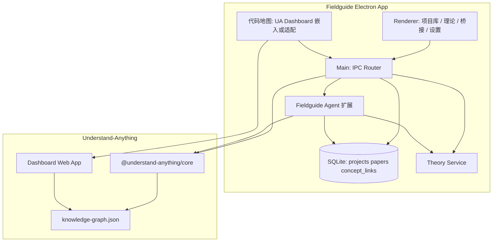

# Understand-Anything 集成规格

> 版本：v0.1 | 状态：设计定稿（Phase 0 修订）  
> 上游：[Egonex-AI/Understand-Anything](https://github.com/Egonex-AI/Understand-Anything)（MIT License）

---

## 一、决策摘要

Fieldguide **基于 [Understand-Anything](https://github.com/Egonex-AI/Understand-Anything)（以下简称 UA）构建代码地图能力**，不再自研 Tree-sitter 解析管线、多 Agent 索引流水线与图谱 Dashboard。

| 层级 | 负责方 |
|------|--------|
| 代码索引、知识图谱、Tour、语义搜索、diff 分析 | **UA**（`@understand-anything/core` 及 Dashboard） |
| Electron 桌面壳、项目库、首次引导 | **Fieldguide** |
| 理论学习（arXiv、PDF、RAG） | **Fieldguide** |
| 概念桥接（论文 ↔ 代码节点） | **Fieldguide** |
| 跨模块 Agent（论文 + 图谱联合上下文） | **Fieldguide**（扩展 UA 工具集） |

**产品关系**：UA 是成熟的 IDE/CLI 插件；Fieldguide 是 **独立桌面学习工作台**，在 UA 代码理解能力之上扩展「理论 ↔ 实现」闭环。二者不是竞品关系，而是 **上游引擎 + 垂直产品**。

---

## 二、UA 提供的能力（复用，不重复实现）

来源：UA README 与多 Agent 流水线文档。

### 2.1 索引与图谱

- **Tree-sitter + LLM 混合**：结构解析确定性，摘要/分层/Tour 语义化
- **多 Agent 流水线**：`project-scanner`、`file-analyzer`、`architecture-analyzer`、`tour-builder`、`graph-reviewer`、`domain-analyzer`
- **输出**：`{projectRoot}/.understand-anything/knowledge-graph.json`
- **增量索引**：指纹 hash，仅重分析变更文件
- **语言**：26+ 文件类型（远超 Fieldguide 原计划的 Go + TS 首发）

### 2.2 交互能力

- 交互式 Dashboard（`/understand-dashboard`）
- 结构视图 + 业务域视图
- 引导 Tour、模糊/语义搜索
- `/understand-chat` 代码问答
- `/understand-diff` 变更影响分析
- `/understand-domain` 业务域提取
- 多语言输出：`--language zh` / `zh-TW` / `en` / `ja` / `ko` / `ru`

### 2.3 核心包

UA 为 pnpm monorepo，测试命令引用 `@understand-anything/core`：

```bash
pnpm --filter @understand-anything/core test
```

Fieldguide 实现期以 **npm/pnpm 依赖 `@understand-anything/core`** 为首选；若 API 不稳定，采用 **git submodule** 将 UA 纳入 `vendor/Understand-Anything/` 并以 workspace 引用。

---

## 三、Fieldguide 自建能力（UA 不覆盖）

| 模块 | 说明 |
|------|------|
| **项目库** | 多项目管理、Git clone、索引状态、stale badge |
| **首次引导** | 语言、projectsRoot、Demo 三选一 |
| **理论学习** | arXiv 搜索、PDF 导入、阅读器、论文 RAG |
| **概念桥接** | `concept_links`：论文段落 ↔ 代码节点 |
| **统一 Agent** | 扩展工具：`search_arxiv`、`query_paper`、`link_concept`；上下文绑定论文 + 节点 + Tour |
| **桌面集成** | Electron IPC、%APPDATA% 配置、安装包、无 IDE 依赖 |

---

## 四、集成架构



### 4.1 索引触发

Main Process 调用 UA core API（**非**依赖用户安装 Claude Code / Cursor 插件）：

```
project:index
  → 设置 UA 工作目录为 projects.root_path
  → 调用 UA pipeline（等价于 /understand）
  → 监听进度 → index:progress IPC
  → 完成后 syncGraphToDb()（可选）+ 通知 Renderer 刷新
```

**就地索引**：图谱产物写在 `{root_path}/.understand-anything/`，与 UA 插件行为一致，便于用户用 IDE 插件与 Fieldguide 交叉查看同一图谱。

### 4.2 图谱数据流

| 存储 | 内容 | 权威源 |
|------|------|--------|
| `{root_path}/.understand-anything/knowledge-graph.json` | UA 完整图谱 | **代码地图运行时权威源** |
| `%APPDATA%/Fieldguide/app.db` | 项目元数据、论文、概念桥接、聊天 | Fieldguide 扩展数据权威源 |
| `%APPDATA%/Fieldguide/projects/{id}/` | 可选：图谱缓存、同步副本 | 仅加速查询时使用 |

**原则**：不重复定义与 UA 冲突的 graph schema。Fieldguide `src/shared/graph.ts` **对齐 UA 的 `KnowledgeGraph` 类型**（从 `@understand-anything/core` 导出或 re-export），仅扩展 Fieldguide 专有字段（如 `conceptLinks` 查询结果）。

### 4.3 Dashboard 集成策略

按优先级评估（Phase 1 动工第一周做 spike）：

| 方案 | 做法 | 优点 | 风险 |
|------|------|------|------|
| **A. 嵌入** | Electron `BrowserView` / iframe 加载 UA Dashboard 静态资源 | 功能完整、迭代快 | 样式与 Fieldguide shell 统一需额外工作 |
| **B. 组件移植** | 将 UA Dashboard React 组件迁入 renderer | UI 一致性好 | 上游升级合并成本高 |
| **C. 薄封装** | Fieldguide 三栏壳 + 中央加载 UA Dashboard dev server 构建产物 | 平衡 | 需处理 asset path |

**暂定决策**：Phase 1 采用 **方案 A（嵌入）** 验证；Phase 2 视体验决定是否部分移植（方案 B）。

中央「代码地图」区域展示 UA Dashboard；Fieldguide 左栏可叠加 Tour 列表、图例（通过 postMessage / IPC 与嵌入页通信）。

### 4.4 LLM 配置桥接

UA 与 Fieldguide 共用 OpenAI 兼容 API。`%APPDATA%/Fieldguide/config.json` 为 **单一配置源**，索引前同步到 UA 运行时配置：

```json
{
  "llm": { "baseUrl", "apiKey", "chatModel", "embedModel" },
  "locale": "zh-CN",
  "ua": {
    "language": "zh",
    "incremental": true
  }
}
```

**locale 映射**：

| Fieldguide `locale` | UA `--language` |
|---------------------|-----------------|
| `zh-CN` | `zh` |
| `zh-TW` | `zh-TW` |
| `en-US` | `en` |

---

## 五、仓库结构（实现期）

```
Fieldguide/
├── package.json              # pnpm workspace root
├── pnpm-workspace.yaml
├── vendor/
│   └── Understand-Anything/  # git submodule（若未发布 npm 包）
├── electron.vite.config.ts
├── src/
│   ├── shared/
│   │   ├── ipc.ts
│   │   ├── graph.ts          # re-export UA types + Fieldguide extensions
│   │   └── errors.ts
│   ├── main/
│   │   ├── index.ts
│   │   ├── ipc/
│   │   ├── ua/               # ★ UA 集成层（新建）
│   │   │   ├── client.ts     # 封装 core pipeline 调用
│   │   │   ├── graph-reader.ts  # 读 .understand-anything/
│   │   │   ├── config-bridge.ts
│   │   │   └── dashboard.ts  # 嵌入 Dashboard 资源路径
│   │   ├── db/               # Fieldguide 扩展表 only
│   │   ├── theory/
│   │   └── agent/            # Fieldguide 扩展工具
│   ├── preload/
│   └── renderer/
│       ├── App.tsx
│       ├── views/
│       │   ├── ProjectLibrary/
│       │   ├── CodeMap/      # 嵌入 UA Dashboard
│       │   ├── Theory/
│       │   └── Bridge/
│       └── components/
└── docs/
```

**删除**（相对 v0.2 架构）：自研 `engine/parser/`、`llm/agents/file-analyzer` 等——改由 UA 提供。

---

## 六、与 UA 的边界：禁止重复实现

以下能力 **必须调用 UA**，不得在 Fieldguide 重写：

- Tree-sitter 多语言 parser
- `project-scanner` / `file-analyzer` / `architecture-analyzer` / `tour-builder` / `graph-reviewer` / `domain-analyzer`
- `knowledge-graph.json` schema 的主结构
- 增量 hash 检测与 patch 逻辑
- Dashboard 内的图谱布局、LOD、Tour 播放器（Phase 1–2）

以下能力 **由 Fieldguide 实现**：

- 项目库 CRUD、Git clone、`projects` 表
- 论文 / arXiv / `concept_links`
- 顶栏「理论 | 桥接」Tab 与统一导航
- 扩展 Agent 工具（跨论文与代码）
- Electron 打包、首次引导、%APPDATA% 布局

---

## 七、上游跟踪与许可证

| 项 | 说明 |
|----|------|
| UA 许可证 | MIT（© Yuxiang Lin and Infinite Universe, Inc.） |
| Fieldguide 许可证 | 建议 MIT 或 Apache-2.0；实现阶段定稿，保留 UA 版权声明 |
| 上游更新 | 锁定 UA 版本（package.json / submodule commit）；每月评估合并 |
| 贡献回流 | Fieldguide 对 UA core 的通用修复，优先 PR 回上游 |

**归因**：关于页与 README 注明「代码地图能力基于 Understand-Anything」。

---

## 八、风险与缓解

| 风险 | 缓解 |
|------|------|
| `@understand-anything/core` 未正式发布 | git submodule + workspace；动工前 spike 验证 API |
| UA API 面向 CLI/插件，非 Electron | 封装 `ua/client.ts` 适配层；必要时 fork 最小补丁 |
| Dashboard 嵌入样式割裂 | Phase 1 接受；Phase 2 统一顶栏/主题 token |
| UA 与 Fieldguide locale 不一致 | `config-bridge.ts` 统一映射；单测覆盖 |
| 图谱路径在 `.understand-anything/` | 文档告知用户；与 UA 生态兼容 |
| 上游 breaking change | 锁定版本；集成测试读 fixture graph |

---

## 九、动工前 Spike（Phase 1 第 0 周）

在 Electron 脚手架之前，用 1–2 天验证：

- [ ] clone UA 仓库，`pnpm install && pnpm --filter @understand-anything/core test` 通过
- [ ] 在 Node 脚本中调用 pipeline，对 `tiny-go` fixture 生成 `knowledge-graph.json`
- [ ] 确认 Dashboard 构建产物可静态 serve 并在 Electron `BrowserWindow` 加载
- [ ] 确认 `--language zh` 输出中文摘要
- [ ] 记录 UA 版本号 / commit hash 写入 `package.json` 的 `resolutions`

Spike 失败则回退方案：submodule fork + 薄 CLI 包装（`node ua-cli understand <path>`）——仍不自研 parser。

---

## 十、相关文档

| 文档 | 变更要点 |
|------|----------|
| [architecture.md](./architecture.md) | 架构图、技术栈、Index Engine 改为 UA 集成层 |
| [doc-index.md](./doc-index.md) | 文档地图、一致性检查 |
| [product-spec.md](./product-spec.md) | 竞品关系、非目标、功能归属 |
| [getting-started.md](./getting-started.md) | 动工清单增加 UA spike |
| [roadmap.md](./roadmap.md) | Phase 1/2 任务重排，周期缩短 |
| [spike-ua.md](./spike-ua.md) | Spike 记录 |
| [fieldguide-demo-spec.md](./fieldguide-demo-spec.md) | Demo 仓库 |
| [fixtures-tiny-go-spec.md](./fixtures-tiny-go-spec.md) | 测试 fixture |
